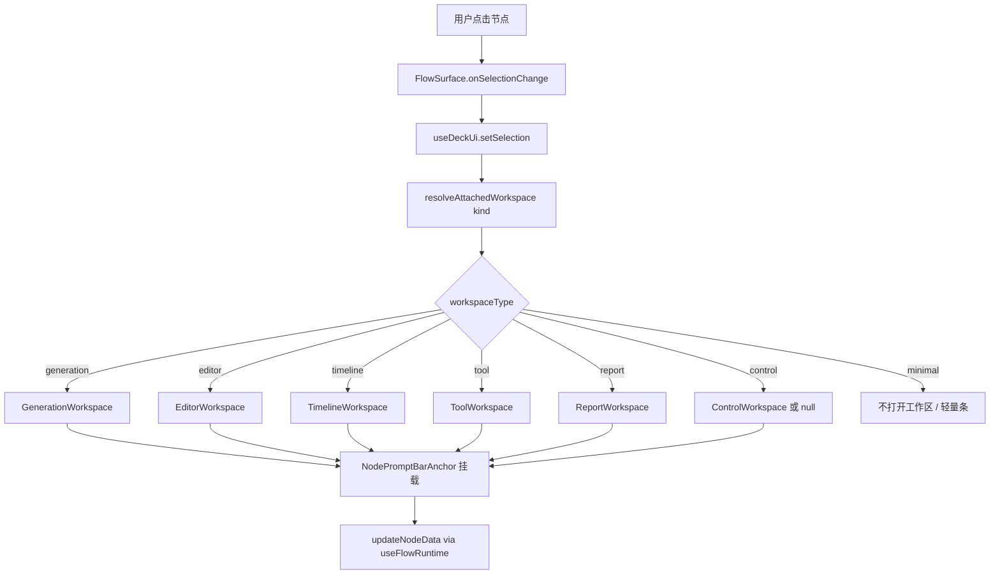

# NX9 节点交互与节点工作区重构规范（V1 · 实现版）

> **文档性质**：产品规范 + 工程实施手册 + AI 编码约束  
> **版本**：V1.1  
> **状态**：待实施（基于当前仓库事实，非空想）  
> **关联文档**：[NX9-NODE-INTERACTION-REGISTRY.md](./NX9-NODE-INTERACTION-REGISTRY.md)（100 节点现状表）  
> **最后更新**：2026-07-10  
>
> **V1.1 定位约束**：Prompt Bar **必须保持节点跟随**（挂载在节点下方、可拖拽偏移）；**仅工作区内部内容**可重构为十种类型。禁止改为屏幕固定底部栏。

---

## 0. 阅读指南

| 读者 | 建议阅读顺序 |
|------|-------------|
| 产品 / 设计 | §1 目标 → §2 原则 → §5 工作区类型 → §7 节点总表 → §12 使用说明 |
| 前端工程师 | §3 现状差距 → §4 目标架构 → §8 代码落点 → §9 分阶段实施 → §10 验收 |
| AI 编码助手 | §4.3 强制约束 → §7 节点总表（逐 kind 查表）→ §8 文件清单 → §10 检查清单 → §11 Bug 修复 |

**本文档中的 MUST / MUST NOT / SHOULD 具有强制力。**  
实现时不得自行发明与表冲突的交互；若有冲突，先改本文档再改代码。

---

## 1. 设计目标（Why）

### 1.1 要解决的问题

当前 NX9 Workflow 存在三类分裂：

1. **节点内塞满表单**：48 个可 spawn 节点仍使用完整 Block UI，卡片高度不可控。
2. **交互入口分裂**：20 个 Prompt Bar 白名单 + 80 个完整 UI + 右侧 Inspector，用户不知道去哪编辑。
3. **能力误伤风险**：把复杂节点（角色设定、剪辑、对白表）压成单一 Prompt 输入会丢失功能。

### 1.2 V1 目标（What）

| # | 目标 | 验收一句话 |
|---|------|-----------|
| G1 | 统一编辑入口 | 任意需要编辑的节点 → 节点下方跟随工作区；不再依赖右侧 Inspector |
| G2 | 节点减负 | 节点卡片 ≤ 8 个可交互控件；无长文本框、无多层折叠面板 |
| G3 | 按职责分工作区 | 10 种工作区内容类型，按 kind 自动路由，禁止人工切换 |
| G4 | 保留专属能力 | 角色/对白/配音/剪辑/3D 等使用专属工作区，禁止硬塞通用 Prompt 框 |
| G5 | 画布不变 | Infinite Canvas 仍是组织层；工作区跟随节点，是画布延伸而非新页面 |
| G6 | 可扩展 | 新增节点只需登记：功能类 + 工作区类型 + 画布摘要字段 |
| G7 | **跟随定位不变** | Prompt Bar 壳层继续 `NodePromptBarAnchor` 节点跟随 + 可拖拽；只改内部 |

### 1.3 V1 明确不做（Out of Scope）

- 不重写各 Block 的业务逻辑 / API 调用（只迁移 UI 承载位置）
- 不删除 deprecated 节点代码（仅冻结交互，不出现在 spawn 菜单）
- 不恢复 Storyboard 为第一入口
- 不把素材库改回侧边 Rail（继续用大弹窗 `assetLibraryModal`）
- 不在 V1 实现全部 10 种工作区的完整 UI（分阶段，见 §9）

---

## 2. 交互总原则

### 2.1 三层职责（V1 最终态）

```
┌─────────────────────────────────────────────────────────────┐
│  Infinite Canvas（项目结构、连线、编排）                      │
│  ┌──────────┐         ┌──────────┐                          │
│  │ 紧凑节点  │         │ 紧凑节点  │                          │
│  └────┬─────┘         └──────────┘                          │
│       │ 单击选中                                              │
│       ▼                                                      │
│  ┌─────────────────────────────┐  ← 跟随节点，可拖拽偏移       │
│  │ 节点工作区（Prompt Bar 壳层） │                             │
│  │ [标题栏][主编辑区][素材][运行] │                             │
│  └─────────────────────────────┘                             │
└─────────────────────────────────────────────────────────────┘
```

| 层 | 职责 | MUST | MUST NOT |
|----|------|------|----------|
| **Canvas 节点** | 展示、状态、连接、摘要、运行入口 | 标题、图标、状态、摘要、运行按钮、端口 | 长 Prompt、多组 Select、大预览编辑器、分析报告 |
| **节点工作区（Prompt Bar）** | 编辑、输入、配置、分析、预览、运行 | 跟随选中节点下方；内部按 kind 切换十种内容 | 改为屏幕固定底栏；承担画布编排 |
| **Infinite Canvas** | 流程关系、节点布局 | 保持现有 React Flow 能力 | 在节点内恢复「一切表单」 |

### 2.2 壳层 vs 内容（V1.1 核心约束）

| 维度 | **壳层（不可改）** | **内容（随便改）** |
|------|-------------------|-------------------|
| 挂载位置 | 节点正下方，`NodePromptBarAnchor` | — |
| 拖拽 | 握把拖动，偏移存 `useDeckUi.promptBarOffsets` | — |
| 显隐 | 选中打开 / 切换 kind 切换内容 / Escape 折叠 | — |
| 内部 UI | — | Generation / Editor / Table / Timeline 等十种 |
| 组件边界 | `NodeAttachedPromptBar` 外壳 + 标题栏 + 折叠 | `AttachedWorkspaceRouter` 路由子面板 |
| CSS | `overflow: visible` 防裁剪（`nx9-node-with-prompt`） | 内部 scroll、max-height 可调 |

**参考实现**：`Reference_Projects/infinite-canvas-main` 的节点跟随编辑条；NX9 壳层保持同款交互，内部换成 NX9 设计系统。

### 2.3 与旧架构的关键差异

| 维度 | 当前代码（2026-07） | V1 目标 |
|------|---------------------|---------|
| 编辑区位置 | 节点下方跟随式 Prompt Bar | **继续节点跟随**；扩展为十种工作区内容 |
| 编辑区内部 | 仅 Generation 类 Prompt 编辑器 | 按 kind 路由 Editor / Tool / Report 等 |
| 右侧 Inspector | `inspectorRail: true`，承载高级配置 | **MUST 关闭**（`inspectorRail: false`） |
| 节点 UI | 20 紧凑 + 80 完整 Block | **全部**可 spawn 节点统一紧凑卡片（控制类除外可更轻） |
| 分类依据 | `NodeInteractionClass`（input/config/logic/output/ai） | **功能六类** + **工作区十型** |
| 白名单 | `PROMPT_BAR_KINDS`（20） | `ATTACHED_WORKSPACE_REGISTRY`（按 kind 映射 workspaceType） |

### 2.4 节点卡片最小信息（所有 kind 通用）

每个可 spawn 节点卡片 **MUST** 包含：

- 节点名称（可 alias）
- 类型图标
- 运行状态：`idle | ready | running | success | error | waiting | disabled`
- 关键摘要（见 §7 按类定义）
- 运行按钮或等效入口（若该 kind 可运行）
- 输入/输出连接端口

**MUST NOT** 在节点内放置：

- 高度 > 3 行的文本输入
- 超过 2 个并排 Select
- 可展开的多层 Accordion 配置
- 表格型批量编辑
- 视频时间线 / 3D 视口 / 大报告正文

---

## 3. 现状差距分析（As-Is）

> 事实来源：`docs/NX9-NODE-INTERACTION-REGISTRY.md`、`packages/shared/src/catalog/node-interaction.ts`

### 3.1 当前代码行为

| 条件 | 画布 UI | 选中后 |
|------|---------|--------|
| `kind ∈ PROMPT_BAR_KINDS`（20） | `CanvasNodeBody` 紧凑卡片 | 节点下方跟随 Prompt Bar + Inspector |
| 其他 kind（80） | 完整 Block UI | Inspector（生产模式可双击展开） |

### 3.2 已知问题清单

| ID | 问题 | 严重度 | V1 修复方式 |
|----|------|--------|------------|
| P1 | Inspector 与 Prompt Bar 职责重叠 | 高 | 关闭 Inspector，配置迁入节点工作区内容区 |
| P2 | 工作区内容仅支持 Generation，其他 kind 无专属面板 | 高 | 扩展 `AttachedWorkspaceRouter`，壳层仍用 `NodePromptBarAnchor` |
| P3 | 80 节点仍完整 UI，画布拥挤 | 高 | 全部改 `CanvasNodeBody` + 节点跟随专属工作区 |
| P4 | `PROMPT_BAR_KINDS` 与功能类不一致 | 中 | 用 `ATTACHED_WORKSPACE_REGISTRY` 替代 |
| P5 | 复杂节点（character-sheet 等）无专属工作区 | 高 | Phase 3 实现 Editor/Table/Timeline 工作区 |
| P6 | 7 个 kind 在白名单但非输入型 | 低 | 重新映射 workspaceType，移出 generation 误分类 |

### 3.3 可复用资产（Do Not Rewrite）

| 模块 | 路径 | 复用方式 |
|------|------|----------|
| 紧凑节点体 | `apps/web/src/blocks/shared/CanvasNodeBody.tsx` | 扩展摘要字段，所有 kind 共用 |
| 节点跟随壳层 | `NodePromptBarAnchor.tsx`, `NodeAttachedPromptBar.tsx` | **保留**；仅扩展内部路由 |
| Prompt 编辑器 | `apps/web/src/engine/stage-deck/chrome/prompt-bar/*` | 迁入 `attached-workspace/generation/*` |
| Mention / 素材引用 | `PromptComposer`, `PromptBarAssetStrip` | Generation / Editor 工作区共用 |
| 生成参数 | `PromptBarGenFooter`, `InspectorGenFields` | 合并进 Generation 工作区内容底部 |
| 拖拽偏移 | `useDeckUi.promptBarOffsets` | 继续使用，禁止改回屏幕固定 |
| 节点状态工具 | `@nx9/shared` `resolveNodePromptText` 等 | 继续用于画布摘要 |
| 文档生成脚本 | `scripts/gen-node-interaction-doc.mjs` | 扩展生成 workspace 列 |

---

## 4. 目标架构（To-Be）

### 4.1 数据流



### 4.2 核心类型（MUST 在 shared 定义）

**文件**：`packages/shared/src/catalog/attached-workspace.ts`（新建；或 `bottom-workspace.ts` 但语义为节点跟随）

```typescript
/** 节点跟随工作区内容类型 — 新增节点 MUST 择一（壳层定位不在此列） */
export type AttachedWorkspaceType =
  | 'generation'   // Prompt + 素材 + 生成参数 + 运行
  | 'editor'       // 结构化编辑（角色、参考板等）
  | 'config'       // 模型/导出/预处理等配置
  | 'tool'         // 单次处理任务
  | 'report'       // 分析报告只读 + 修复入口
  | 'preview'      // 媒体/3D 预览
  | 'timeline'     // 视频时间线
  | 'board'        // 参考板 Mood Board
  | 'table'        // 对白表、配音表
  | 'task'         // 批处理任务队列
  | 'control'      // 轻量流程控制
  | 'none';        // 无节点工作区（纯路由节点）

/** 功能六类 — 决定画布摘要样式 */
export type NodeFunctionalClass =
  | 'generation'      // A. AI 生成
  | 'resource-editor' // B. 资源编辑
  | 'media-editor'    // C. 媒体编辑
  | 'processing-tool' // D. 工具处理
  | 'analysis-report' // E. 分析报告
  | 'pipeline-control'; // F. 流程控制

export interface AttachedWorkspaceSpec {
  kind: string;
  functionalClass: NodeFunctionalClass;
  workspaceType: AttachedWorkspaceType;
  /** 是否挂载节点跟随 Prompt Bar 壳层（MUST true 当 workspaceType !== 'none'） */
  attachToNode: boolean;
  /** 画布是否强制紧凑（MUST true 除 control/none 外） */
  compactCanvas: boolean;
  /** 是否展示运行按钮 */
  showRun: boolean;
  /** 是否展示结果预览入口 */
  showPreview: boolean;
  /** 实施阶段 P1|P2|P3|P4 */
  phase: 'P1' | 'P2' | 'P3' | 'P4' | 'frozen';
  /** 备注 */
  note?: string;
}
```

**MUST**：`resolveAttachedWorkspace(kind: string): AttachedWorkspaceSpec | null`  
**MUST**：从 `ATTACHED_WORKSPACE_REGISTRY: Record<string, AttachedWorkspaceSpec>` 查表，禁止在 UI 层写 `if (kind === 'xxx')` 散落逻辑。

### 4.3 强制工程约束（AI 编码 MUST 遵守）

1. **MUST NOT** 在新代码中调用 `useContextRailUi.requestTab('inspector')` 打开编辑区。
2. **MUST** 设置 `PRODUCT_SURFACE.inspectorRail = false`（Phase 1 完成时）。
3. **MUST NOT** 在 `Block` 组件内新增超过 8 个可编辑控件的 UI（legacy 迁移完成前可临时豁免，但 MUST 标注 `// TODO(workspace-migration)`）。
4. **MUST** 所有工作区内容通过 `AttachedWorkspaceRouter` 单入口渲染，**挂载点必须是** `CanvasNodeShell` → `NodePromptBarAnchor` → `NodeAttachedPromptBar` 内部。
5. **MUST NOT** 将工作区改为屏幕固定底部栏；**MUST NOT** 在 `FlowSurface` 底部再挂一份全局编辑条。
6. **MUST** 保留节点跟随能力：`NodePromptBarAnchor` 拖拽、`promptBarOffsets`、事件 `stopPropagation` 隔离画布。
7. **MUST** 节点数据读写仍走 `useFlowRuntime().updateNodeData`，禁止新建平行状态源。
8. **MUST** 新增 kind 时同时更新：`block-catalog.ts` + `attached-workspace.ts` + 运行 `node scripts/gen-attached-workspace-doc.mjs`。
9. **SHOULD** 工作区内容区高度默认 `max-h-[min(320px,40vh)]`（与现 `NodeAttachedPromptBar` 一致），壳层内可滚动；**禁止**改壳层定位逻辑。
10. **MAY** 自由重构 Prompt Bar 内部：标题栏、素材条、AI 工具、十种子面板布局均可调整。

---

## 5. 十种节点工作区内容规格

> 以下均为 **Prompt Bar 壳层内部** 的内容布局；壳层本身（跟随节点、拖拽、折叠）见 §2.2，**不在本章改动范围**。

### 5.1 Generation Workspace（生成工作区）

**适用**：文本/素材驱动 AI 生成。

**布局（自上而下）**：

| 区域 | 内容 | 组件来源 |
|------|------|----------|
| 标题栏 | 节点名、状态、折叠按钮 | 新建 `WorkspaceHeader` |
| 主编辑区 | MentionEditor 多行 Prompt | 迁移 `PromptComposer` |
| 素材区 | 角色/场景/镜头/情绪/声音/风格 + 「引用」「素材库」 | `PromptBarAssetStrip` |
| 参数区 | 模型、比例、数量、seed（仅 gen kinds） | `PromptBarGenFooter` |
| AI 区 | 优化 / 补全 / 重写 / 翻译 | 新建 `WorkspaceAiTools` |
| 运行区 | 运行、重试、Ctrl+Enter | 现有 run 逻辑 |
| 结果区 | 缩略图条、输出计数、错误摘要 | `CanvasNodeBody` 预览逻辑扩展 |

**快捷键 MUST**：

- `Ctrl+Enter` → 运行
- `Ctrl+/` → AI 优化
- `Escape` → 折叠工作区（不取消选中）

---

### 5.2 Editor Workspace（编辑工作区）

**适用**：`character-sheet`、`director-desk`（镜头列表部分）等结构化资源。

**MUST 具备（character-sheet）**：

- Tab：基础信息 | 设定图 | 三视图 | 表情 | 动作 | Prompt | 一致性
- 每项支持上传 / 重新生成 / 锁定
- 底部：保存 + 从素材库导入 + 导出 Character Bible Prompt

**实现策略**：

- Phase 3 前：底部工作区嵌入现有 Block 的「编辑面板」子组件（抽离自 `CharacterSheetBlock`），不是 iframe 整个 Block。
- **MUST NOT** 压缩为单一 Prompt 框。

---

### 5.3 Board Workspace（参考板工作区）

**适用**：`reference-board`

**MUST**：拖拽多图、风格/情绪标签、说明文本、一键生成约束 Prompt。

---

### 5.4 Table Workspace（表格工作区）

**适用**：`dialogue-sheet`、`voice-cast`

**MUST**：

- 虚拟滚动表格
- 行内编辑：文本、角色绑定、情绪、音色
- 批量操作：导出、批量 TTS、失败重试
- 底部：保存 + 运行选中行

---

### 5.5 Timeline Workspace（时间线工作区）

**适用**：`clip-editor`

**MUST**：轨道、片段、剪切/拼接、转场、音频/字幕绑定、预览播放。

**注意**：此工作区高度 SHOULD 默认 `min(520px, 55vh)`。

---

### 5.6 Preview Workspace（预览工作区）

**适用**：`mesh-viewer`、`preview-sink`、`director-3d`（预览部分）

**MUST**：大预览区 + 快照导出 + 缩放/旋转（3D）。

---

### 5.7 Tool Workspace（工具工作区）

**适用**：`bg-remove`、`grid-split`、`upscale-lite` 等处理型节点。

**布局**：

| 区域 | 内容 |
|------|------|
| 输入区 | 上游文件列表 / 手动上传 |
| 参数区 | 该工具专属 1–5 个参数 |
| 运行区 | 运行、重试 |
| 输出区 | 输出文件、下载、替换上游 |
| 日志区 | 最近 20 行摘要 |

**MUST NOT**：长 Prompt 输入（除非该工具确实需要 prompt，如 local-enhance 可选描述）。

---

### 5.8 Config Workspace（配置工作区）

**适用**：`export-pack`、`subtitle-burn`、`audio-mix`、`comfy-workflow`、`model-market` 等。

**MUST**：表单式配置 + 运行/应用；无 Prompt 主编辑区。

---

### 5.9 Report Workspace（报告工作区）

**适用**：`continuity-check`、`reference-analyze`、`prompt-diff`、`review-gate`（有结果时）

**MUST**：

- 结论摘要置顶
- 问题列表（可展开详情）
- Diff 视图（若适用）
- 一键修复 / 导出（若 Block 已支持）

**MUST NOT**：以空白 Prompt 框为主界面。

---

### 5.10 Control Workspace / None（控制型）

**适用**：`iterator`、`picker`、`passthrough`、`variant-fork`、`recipe-spawn`、`frame-endpoints`、`text-chunker`、`link-parser`、`asset-watch`、`memo`

**规则**：

- `workspaceType: 'control'` → 节点下方弹出**轻量条**（高度 ≤ 120px）：当前规则 + 1–3 个参数 + 应用
- `workspaceType: 'none'` → **不挂载** `NodePromptBarAnchor`；单击仅选中，双击打开已有 Block 内联弹层（若有）

---

## 6. 功能六类与画布摘要规范

| 功能类 | 画布摘要 MUST 显示 | 双击行为 |
|--------|-------------------|----------|
| A. AI 生成 | 模型名、Prompt 前 40 字、引用素材数、输出张数 | 聚焦节点下方 Prompt Bar |
| B. 资源编辑 | 条目数、完成度%、最近修改 | 打开 Editor/Board/Table 工作区 |
| C. 媒体编辑 | 片段数/镜头数、时长、预览缩略 | 打开 Timeline/Preview 工作区 |
| D. 工具处理 | 输入来源、输出状态、上次运行时间 | 打开 Tool 工作区 |
| E. 分析报告 | 问题数、结论一行、状态 | 打开 Report 工作区 |
| F. 流程控制 | 当前规则、分支数、队列状态 | 轻量 Control 或 none |

---

## 7. 全量节点映射表（48 可 spawn + 策略）

> **图例**：WS = AttachedWorkspaceType · FC = NodeFunctionalClass · 画布 = compact|full|minimal  
> **挂载**：凡 WS ≠ `none` 的 kind，选中后在节点下方显示 Prompt Bar 壳层，内部路由到对应 WS。  
> **Phase**：P1 交互收敛 · P2 生成+工具 · P3 专属编辑器 · P4 收尾 · frozen 不改造

### 7.1 AI 生成类 → Generation Workspace

| kind | 中文名 | WS | FC | 画布 | Phase | 备注 |
|------|--------|----|----|------|-------|------|
| `prompt` | 提示词 | generation | generation | compact | P1 | 已有 PromptComposer |
| `picture-gen` | 图像生成 | generation | generation | compact | P1 | 含 gen footer |
| `clip-gen` | 视频生成 | generation | generation | compact | P1 | 含 gen footer |
| `motion-story` | 动效分镜 | generation | generation | compact | P1 | |
| `photo-speak` | 照片说话 | generation | generation | compact | P1 | |
| `sound-gen` | AI 配音 | generation | generation | compact | P1 | |
| `music-gen` | BGM 生成 | generation | generation | compact | P2 | 隐藏节点 |
| `inpaint-edit` | 局部重绘 | generation | generation | compact | P2 | |
| `shot-script` | 镜头脚本 | generation | generation | compact | P2 | 结构化 prompt |
| `scene-card` | 场景设定卡 | generation | generation | compact | P2 | |
| `style-lab` | 风格实验室 | generation | generation | compact | P2 | |
| `story-grid` | 分镜网格 | generation | generation | compact | P2 | |
| `prompt-studio` | Prompt 工作室 | generation | generation | compact | P2 | |
| `grid-prompt-reverse` | 宫格反推 | generation | generation | compact | P2 | 结果区偏重 |
| `chat-model` | 对话模型 | generation | generation | compact | P2 | 流式对话 UI |
| `seedance-chain` | Seedance 连续 Clip | generation | generation | compact | P2 | |
| `bridge-clip` | Bridge 续拍 | generation | generation | compact | P2 | 逻辑+生成混合 |
| `caption-asr` | 语音转字幕 | generation | generation | compact | P2 | 输入媒体+语言 |
| `director-desk` | 导演台 | editor | generation | compact | P3 | 多镜头，Editor 为主 |
| `thumbnail-maker` | 封面制作 | generation | generation | compact | P3 | 隐藏；偏输出整理 |

### 7.2 资源编辑类 → Editor / Board / Table

| kind | 中文名 | WS | FC | 画布 | Phase | 备注 |
|------|--------|----|----|------|-------|------|
| `character-sheet` | 角色设定 | editor | resource-editor | compact | P3 | **禁止**压成 Prompt |
| `reference-board` | 参考板 | board | resource-editor | compact | P3 | |
| `dialogue-sheet` | 对白表 | table | resource-editor | compact | P3 | |
| `voice-cast` | 多角色配音 | table | resource-editor | compact | P3 | 可复用 table 壳 |

### 7.3 媒体编辑类 → Timeline / Preview

| kind | 中文名 | WS | FC | 画布 | Phase | 备注 |
|------|--------|----|----|------|-------|------|
| `clip-editor` | 视频剪辑 | timeline | media-editor | compact | P3 | **禁止**压成 Prompt |
| `director-3d` | 3D 导演台 | preview | media-editor | compact | P3 | 预览+机位 |
| `mesh-viewer` | 3D 预览 | preview | media-editor | compact | P3 | |
| `preview-sink` | 结果预览 | preview | media-editor | compact | P2 | |
| `blocking-stage` | 场面调度 | editor | media-editor | compact | P4 | |
| `panorama-sphere` | 3D 全景 | preview | media-editor | compact | P4 | 隐藏 |

### 7.4 工具处理类 → Tool Workspace

| kind | 中文名 | WS | FC | 画布 | Phase |
|------|--------|----|----|------|-------|
| `bg-remove` | 抠图 | tool | processing-tool | compact | P2 |
| `upscale-lite` | 放大 | tool | processing-tool | compact | P2 |
| `grid-split` | 宫格切分 | tool | processing-tool | compact | P2 |
| `grid-compose` | 宫格编辑 | tool | processing-tool | compact | P2 |
| `frame-endpoints` | 首尾帧 | tool | processing-tool | compact | P2 |
| `text-chunker` | 文本切分 | tool | processing-tool | compact | P2 |
| `link-parser` | 素材采集 | tool | processing-tool | compact | P2 |
| `scale-fit` | 尺寸调整 | tool | processing-tool | compact | P2 |
| `picture-merge` | 图像合并 | tool | processing-tool | compact | P2 |
| `picture-diff` | 图像对比 | tool | processing-tool | compact | P2 |
| `local-enhance` | 本地增强 | tool | processing-tool | compact | P2 |
| `watermark-clean` | 去 AI 水印 | tool | processing-tool | compact | P2 |
| `asset-import` | 素材导入 | tool | processing-tool | compact | P2 |
| `mesh-import` | 3D 导入 | tool | processing-tool | compact | P2 |
| `sketch-pad` | 画板 | tool | processing-tool | compact | P4 |

### 7.5 配置类 → Config Workspace

| kind | 中文名 | WS | FC | 画布 | Phase |
|------|--------|----|----|------|-------|
| `export-pack` | 交付打包 | config | processing-tool | compact | P2 |
| `subtitle-burn` | 字幕烧录 | config | processing-tool | compact | P2 |
| `audio-mix` | 音频混音 | config | processing-tool | compact | P2 |
| `comfy-workflow` | Comfy 工作流 | config | processing-tool | compact | P4 |
| `model-market` | 模型超市 | config | processing-tool | compact | P4 |
| `color-grade` | 调色 | config | processing-tool | compact | P4 |
| `control-preprocess` | ControlNet 预处理 | config | processing-tool | compact | P4 |
| `depth-pass` | 深度通道 | config | processing-tool | compact | P4 |
| `light-rig` | 灯光方案 | config | processing-tool | compact | P4 |
| `lipsync-pass` | 口型同步 | config | processing-tool | compact | P4 |

### 7.6 分析报告类 → Report Workspace

| kind | 中文名 | WS | FC | 画布 | Phase |
|------|--------|----|----|------|-------|
| `continuity-check` | 连贯性检查 | report | analysis-report | compact | P2 |
| `reference-analyze` | 参考片反推 | report | analysis-report | compact | P2 |
| `prompt-diff` | Prompt 对比 | report | analysis-report | compact | P2 |
| `review-gate` | 审阅关卡 | report | pipeline-control | compact | P2 | 无结果时用 control |

### 7.7 流程控制类 → Control / None

| kind | 中文名 | WS | FC | 画布 | Phase | 备注 |
|------|--------|----|----|------|-------|------|
| `iterator` | 迭代器 | control | pipeline-control | minimal | P2 | |
| `picker` | 选取器 | control | pipeline-control | minimal | P2 | |
| `passthrough` | 透传 | none | pipeline-control | minimal | P2 | |
| `variant-fork` | 方案分叉 | control | pipeline-control | minimal | P2 | |
| `recipe-spawn` | 配方一键 | control | pipeline-control | minimal | P2 | |
| `batch-runner` | 批量处理 | task | pipeline-control | compact | P2 | |
| `asset-watch` | 素材监听 | control | pipeline-control | minimal | P2 | 隐藏 |
| `beat-sync` | 节拍对齐 | control | pipeline-control | minimal | P4 | 隐藏 |
| `memo` | 备忘 | none | pipeline-control | minimal | P4 | 双击内联编辑 |

### 7.8 Deprecated（32）→ frozen

**MUST NOT** 为新交互投入开发。若画布存在历史节点：

- 画布：保持 `CardShell` 或最小占位
- 选中：节点工作区显示「此节点已废弃，请使用 XXX 替代」
- 不出现在 spawn 菜单（已由 catalog `deprecated: true` 控制）

完整列表见 [NX9-NODE-INTERACTION-REGISTRY.md §2.2](./NX9-NODE-INTERACTION-REGISTRY.md#22-已废弃deprecated32)。

---

## 8. 代码落点与文件清单

### 8.1 新建文件（Phase 1 起）

| 文件 | 职责 |
|------|------|
| `packages/shared/src/catalog/attached-workspace.ts` | 类型 + `ATTACHED_WORKSPACE_REGISTRY` + `resolveAttachedWorkspace` |
| `apps/web/src/engine/stage-deck/chrome/attached-workspace/AttachedWorkspaceRouter.tsx` | 按 workspaceType 路由（渲染在 Prompt Bar 内部） |
| `apps/web/src/engine/stage-deck/chrome/attached-workspace/WorkspaceHeader.tsx` | 统一标题栏（或合并进 `NodeAttachedPromptBar`） |
| `apps/web/src/engine/stage-deck/chrome/attached-workspace/generation/GenerationWorkspace.tsx` | Generation 内容面板 |
| `apps/web/src/engine/stage-deck/chrome/attached-workspace/tool/ToolWorkspace.tsx` | 工具类内容面板 |
| `apps/web/src/engine/stage-deck/chrome/attached-workspace/report/ReportWorkspace.tsx` | 报告类内容面板 |
| `apps/web/src/engine/stage-deck/chrome/attached-workspace/control/ControlWorkspace.tsx` | 轻量控制内容 |
| `scripts/gen-attached-workspace-doc.mjs` | 生成 `docs/NX9-ATTACHED-WORKSPACE-REGISTRY.md` |

### 8.2 修改文件

| 文件 | 改动 |
|------|------|
| `packages/shared/src/index.ts` | export attached-workspace API |
| `packages/shared/src/catalog/node-interaction.ts` | `PROMPT_BAR_KINDS` → 转发到 `resolveAttachedWorkspace`（`attachToNode: true`） |
| `apps/web/src/config/product-surface.ts` | `inspectorRail: false`；保留 `promptBar: true` |
| `apps/web/src/engine/stage-deck/stores/deck-ui.ts` | 保留 `promptBarVisible` / `promptBarOffsets`；扩展 `workspaceType` 字段（可选） |
| `apps/web/src/engine/FlowSurface.tsx` | 移除 Inspector 跳转；**不**在底部挂载全局工作区 |
| `apps/web/src/layout/AppShell.tsx` | 条件渲染：隐藏 `ContextRail` 当 `!inspectorRail` |
| `apps/web/src/engine/stage-deck/canvas/stage-deck-node-types.tsx` | 非 deprecated spawn kind → `CanvasNodeShell` |
| `apps/web/src/blocks/shared/CanvasNodeShell.tsx` | **保留** `NodePromptBarAnchor`；扩展挂载条件为 `attachToNode` |
| `apps/web/src/engine/stage-deck/chrome/NodeAttachedPromptBar.tsx` | 内部改用 `AttachedWorkspaceRouter`；壳层 UI 可自由改 |
| `apps/web/src/engine/stage-deck/chrome/NodePromptBarAnchor.tsx` | **保留**拖拽与定位逻辑 |
| `apps/web/src/styles/global.css` | **保留** `nx9-node-with-prompt` 的 `overflow: visible` |

### 8.3 删除 / 废弃（Phase 1 完成后）

| 文件 | 动作 |
|------|------|
| `NodePromptBarAnchor.tsx` | **禁止删除** — 壳层定位核心 |
| `NodeAttachedPromptBar.tsx` | **保留外壳**；内部编辑器迁到 `attached-workspace/*` |
| `prompt-bar/PromptBarRouter.tsx` | 重命名为 `AttachedWorkspaceRouter` 或作为其子模块 |
| `ComposerDeck.tsx` | 已 deprecated，保持空组件 |

---

## 9. 分阶段实施计划

### Phase 1 — 交互收敛（MUST 最先完成）

**目标**：扩展节点跟随 Prompt Bar 内部内容 + 关闭 Inspector；**壳层定位不变**。

| 任务 ID | 任务 | 完成标准 |
|---------|------|----------|
| P1-1 | 新建 `attached-workspace.ts` registry（48 kind 全登记） | typecheck 通过 |
| P1-2 | 实现 `AttachedWorkspaceRouter`，嵌入 `NodeAttachedPromptBar` | 选中 generation kind，节点下方出现工作区 |
| P1-3 | 迁移 7 个核心 generation kind | 可编辑+运行+结果；拖拽偏移仍有效 |
| P1-4 | `inspectorRail: false`；删除所有 `requestTab('inspector')` 用于编辑的路径 | 右侧无 Inspector |
| P1-5 | **保留** `NodePromptBarAnchor`；扩展 `CanvasNodeShell` 挂载条件 | 节点下跟随条正常；缩放画布时条随节点移动 |
| P1-6 | 验证 `promptBarOffsets` 跨 kind 切换不丢失 | 切换选中再切回，偏移仍在 |

**Phase 1 未完成前**：禁止开始 Phase 3 专属编辑器。

---

### Phase 2 — 生成扩展 + 工具/报告/配置

| 任务 ID | 任务 | kinds |
|---------|------|-------|
| P2-1 | 补全 Generation WS | §7.1 剩余 |
| P2-2 | Tool WS + 各 Block 参数面板抽离 | §7.4 |
| P2-3 | Report WS | continuity-check, reference-analyze, prompt-diff, review-gate |
| P2-4 | Config WS | export-pack, subtitle-burn, audio-mix |
| P2-5 | Control / None | §7.7 |
| P2-6 | Preview WS 基础 | preview-sink, mesh-viewer |

---

### Phase 3 — 专属编辑器（不可压缩）

| 任务 ID | 任务 | 风险 |
|---------|------|------|
| P3-1 | Editor WS：`character-sheet` | 高 — 字段最多 |
| P3-2 | Board WS：`reference-board` | 中 |
| P3-3 | Table WS：`dialogue-sheet`, `voice-cast` | 高 |
| P3-4 | Timeline WS：`clip-editor` | 高 |
| P3-5 | Preview WS：`director-3d` | 中 |

**每个 P3 任务 MUST 有「功能对照清单」**：列出迁移前 Block 内全部能力，逐项勾选迁移后仍可用。

---

### Phase 4 — 收尾

- 隐藏节点、spatial 节点 Config/Preview
- deprecated 占位 UI
- 删除 legacy Block 内联大表单（保留 `expanded` 兼容只读）
- 文档与脚本同步

---

## 10. 验收标准与测试清单

### 10.1 全局验收（V1 最终）

| ID | 标准 | 测试方法 |
|----|------|----------|
| AC-1 | 任意可 spawn 节点选中后，节点工作区行为可预测（打开对应 WS 或 none） | 遍历 §7 表每个 kind 点击一次 |
| AC-2 | 节点卡片高度 ≤ 180px（工作区在节点外，不计入卡片高度） | 目视 + DOM 测量 |
| AC-3 | 节点内可编辑控件 ≤ 8 | 代码审查 + e2e 计数 |
| AC-4 | 无右侧 Inspector（`inspectorRail: false`） | 配置检查 + UI 目视 |
| AC-5 | Generation 节点可在节点工作区完成输入+运行 | picture-gen 端到端跑图 |
| AC-6 | character-sheet / clip-editor 功能不丢失 | P3 对照清单 100% |
| AC-7 | 切换节点时工作区随新节点出现在其下方，内容正确切换 | 快速连续点击 5 个不同 kind |
| AC-8 | Ctrl+Enter 在 Generation WS 触发运行 | 键盘测试 |
| AC-9 | 画布缩放/平移时工作区**随节点移动**（非屏幕固定） | 缩放后工作区仍在节点下方 |
| AC-10 | 拖拽握把后偏移持久，`promptBarOffsets[blockId]` 生效 | 拖移 → 切节点 → 切回验证 |
| AC-11 | 屏幕底部**无**全局固定编辑条 | 目视 + DOM 查询无 fixed bottom shell |
| AC-12 | 新增 kind 只需改 registry + 一个 WS 内容组件 | 文档 §13 走通 |

### 10.2 Phase 1 冒烟测试（每次 PR MUST 跑）

```
1. 启动 dev → 打开 Workflow 画布
2. 放置 prompt 节点 → 单击 → 节点下方出现 Generation 工作区
3. 输入 prompt → Ctrl+Enter → 运行状态变化
4. 放置 picture-gen → 切换选中 → 工作区出现在新节点下方，prompt 不串节点
5. 拖拽工作区握把 → 切走再切回 → 偏移保留
6. 缩放画布 → 工作区仍锚定在节点下方（随节点移动）
7. 放置 iterator → 单击 → Control 轻量条或 none（符合 §7.7）
8. 确认右侧无 Inspector 面板
9. 确认屏幕底部无全局固定编辑条
10. pnpm --filter @nx9/shared build && pnpm --filter web typecheck
```

### 10.3 自动化测试（SHOULD 补充）

| 测试 | 路径建议 | 断言 |
|------|----------|------|
| registry 完整性 | `packages/shared/src/catalog/attached-workspace.test.ts` | 每个非 deprecated spawn kind 有 spec |
| resolve 路由 | 同上 | `resolveAttachedWorkspace('picture-gen').workspaceType === 'generation'` |
| 无 Inspector 跳转 | `FlowSurface.test.tsx` | selection 不调用 requestTab('inspector') |

### 10.4 功能完成度矩阵（PM 用）

在 `docs/NX9-ATTACHED-WORKSPACE-REGISTRY.md`（脚本生成）中增加列：

- `implemented: ✅|🚧|❌|frozen`
- `qa-passed: ✅|❌|—`

**规则**：`implemented: ✅` 且 `qa-passed: ✅` 才算该 kind 完成。

---

## 11. Bug 修复与排查手册

### 11.1 常见问题

| 现象 | 可能原因 | 修复 |
|------|----------|------|
| 选中节点下方无工作区 | kind 未登记 registry 或 `workspaceType: 'none'` | 查 §7 表，补 `ATTACHED_WORKSPACE_REGISTRY` |
| 工作区内容空白 | `AttachedWorkspaceRouter` 无对应组件 | 添加 WS 内容组件或 `FallbackWorkspace` |
| 编辑内容串节点 | `updateNodeData` 用了错误 blockId | WS 内用 `NodePromptBarAnchor` 传入的 `blockId` |
| 运行后节点摘要不更新 | 未订阅 node data 变化 | `CanvasNodeBody` 订阅 `useFlowRuntime` |
| 右侧 Inspector 仍出现 | `inspectorRail: true` 或 Block 内 requestTab | 全局搜 `requestTab('inspector')` 删除 |
| 工作区被节点裁剪 | 缺少 overflow visible | 检查 `nx9-node-with-prompt` 与 `.react-flow__node` CSS |
| 角色设定只剩 Prompt 框 | 误用 Generation WS | 改 `workspaceType: 'editor'`，Phase 3 组件 |
| 拖拽无效 | 未 stopPropagation | 检查 `NodeAttachedPromptBar` 的 pointer/wheel 隔离 |
| 缩放后工作区不跟节点 | 错误挂到 FlowSurface 固定层 | **必须**在 `CanvasNodeShell` 内用 `NodePromptBarAnchor` |
| 出现屏幕底部固定条 | 误建全局 `BottomWorkspaceShell` / `ComposerDeck` | 删除 FlowSurface 底栏，只保留 `NodePromptBarAnchor` |

### 11.2 调试步骤（AI / 开发者）

1. 控制台：`resolveAttachedWorkspace('<kind>')` 打印 spec
2. React DevTools：查 `useDeckUi` → `selectedBlockId`, `promptBarVisible`, `promptBarOffsets`
3. 查 `CanvasNodeShell` 是否渲染 `NodePromptBarAnchor`
4. 查 `stage-deck-node-types.tsx` 是否仍走完整 `Block` 分支
5. 运行 `node scripts/gen-attached-workspace-doc.mjs` 核对表与代码一致

### 11.3 回滚策略

- Feature flag：`PRODUCT_SURFACE.promptBar = false` → 隐藏节点工作区（仅 emergency，MUST 记录 issue）
- Inspector 回滚：`inspectorRail: true`（不推荐，与 V1 目标冲突）
- **禁止**回滚为屏幕固定底栏（与 V1.1 产品决策冲突）

---

## 12. 用户使用说明

### 12.1 基本流程

1. 在画布上放置或点击节点
2. **节点下方**自动弹出工作区（Prompt Bar），显示该节点对应的编辑界面
3. 可拖拽握把调整工作区位置（相对节点偏移）
4. 在工作区内完成输入、配置或查看报告
5. 点击「运行」或按 `Ctrl+Enter`（生成类）执行
6. 节点卡片上查看状态与结果摘要；平移/缩放画布时工作区跟随节点

### 12.2 不同节点类型的体验

| 你放的节点 | 节点下方会出现什么 |
|------------|-------------------|
| 提示词 / 图像生成 / 视频生成 | 大 Prompt 框 + 素材引用 + 模型参数 |
| 角色设定 | 分 Tab 角色编辑器（不是简单 Prompt） |
| 对白表 / 配音 | 可编辑表格 |
| 视频剪辑 | 时间线 |
| 抠图 / 切图 / 放大 | 文件列表 + 少量参数 + 运行 |
| 连贯性检查 | 分析报告 |
| 迭代器 / 选取器 | 底部轻条或仅选中 |

### 12.3 快捷键

| 快捷键 | 作用 | 适用范围 |
|--------|------|----------|
| `Ctrl+Enter` | 运行 | Generation WS |
| `Ctrl+/` | AI 优化 Prompt | Generation WS |
| `Escape` | 折叠节点工作区 | 全局 |
| 双击节点 | 聚焦主编辑区 | Generation / Editor / Table |

### 12.4 与素材库的关系

- 节点工作区内的「素材库」按钮 → 打开全局素材库弹窗（`assetLibraryModal`）
- 「引用」→ 插入 `@角色` `@场景` 等到 Prompt
- 项目制 / 公共素材规则不变

---

## 13. 扩展指南（新增节点 MUST 流程）

### 13.1 新增一个 kind 的 6 步

1. **定义职责**：属于 §6 六类中的哪一类？
2. **选择工作区**：从 §5 十型中择一（禁止 invent 第 11 种，除非先修订本文档）
3. **登记 registry**：在 `attached-workspace.ts` 添加 `AttachedWorkspaceSpec`（含 `attachToNode: true`）
4. **实现 WS 内容面板**：在 `attached-workspace/<type>/` 添加或复用组件
5. **画布摘要**：在 `CanvasNodeBody` 或 kind 专用 summary 组件添加字段
6. **挂载**：在 `CanvasNodeShell` 确保 `attachToNode` 时渲染 `NodePromptBarAnchor`
7. **更新文档**：运行 `node scripts/gen-attached-workspace-doc.mjs`

### 13.2 示例：新增 `foo-gen` 图像生成 variant

```typescript
// attached-workspace.ts
'foo-gen': {
  kind: 'foo-gen',
  functionalClass: 'generation',
  workspaceType: 'generation',
  attachToNode: true,
  compactCanvas: true,
  showRun: true,
  showPreview: true,
  phase: 'P1',
},
```

```typescript
// NodeAttachedPromptBar.tsx — 内部路由，壳层不变
<AttachedWorkspaceRouter blockId={blockId} kind={kind} />
```

### 13.3 扩展性约束

| 允许 | 禁止 |
|------|------|
| 在 Generation WS 增加新 asset slot 类型 | 在 Block 内新增大表单 |
| 新增 Report WS 子模板 | 新增右侧 Inspector 编辑 tab |
| 为 Table WS 增加新列类型 | 改为屏幕固定底部栏 |
| Prompt Bar 内部布局、样式、分区自由调整 | 删除 `NodePromptBarAnchor` 或拖拽能力 |
| 工作区内容区 max-height / 内部 scroll 调整 | 在 FlowSurface 底部挂第二套编辑 UI |

---

## 14. 与旧文档 / 代码的对照

| 旧概念 | V1 概念 |
|--------|---------|
| Prompt Bar 壳层 | **保留** — `NodePromptBarAnchor` + `NodeAttachedPromptBar` |
| Prompt Bar 内部 | `AttachedWorkspaceRouter` + 十种内容面板 |
| `PROMPT_BAR_KINDS` | `ATTACHED_WORKSPACE_REGISTRY`（`attachToNode: true` 的子集） |
| `opensPromptBar` | `attachToNode === true` |
| Inspector 高级配置 | 迁入节点工作区内容（Generation footer + Config 等） |
| Canvas First + Inspector Third | Canvas First + 节点工作区 Second（无 Inspector） |
| 屏幕固定底栏 | **禁止**（V1.1 明确不做） |

---

## 15. 附录 A — Phase 1 实施 Checklist（可打印）

```
[ ] attached-workspace.ts 创建，48 kind 登记
[ ] resolveAttachedWorkspace exported from @nx9/shared
[ ] AttachedWorkspaceRouter 嵌入 NodeAttachedPromptBar
[ ] NodePromptBarAnchor 保留，拖拽/偏移正常
[ ] GenerationWorkspace 迁移 PromptComposer
[ ] inspectorRail = false
[ ] ContextRail 不渲染 Inspector
[ ] FlowSurface 底部无全局工作区
[ ] stage-deck-node-types 统一 CanvasNodeShell（compact）
[ ] global.css 保留 nx9-node-with-prompt overflow
[ ] 冒烟测试 §10.2 全过
[ ] gen-attached-workspace-doc.mjs 可运行
[ ] NX9-ATTACHED-WORKSPACE-REGISTRY.md 生成
```

---

## 16. 附录 B — 文档维护

| 操作 | 命令 |
|------|------|
| 重新生节点交互表（旧） | `node scripts/gen-node-interaction-doc.mjs` |
| 重新生节点工作区表（新，待建） | `node scripts/gen-attached-workspace-doc.mjs` |
| 类型检查 | `pnpm --filter @nx9/shared build && pnpm --filter web typecheck` |

**MUST**：每次修改 `ATTACHED_WORKSPACE_REGISTRY` 后运行生成脚本，保持 `docs/NX9-ATTACHED-WORKSPACE-REGISTRY.md` 与代码一致。

---

## 17. 结论

V1 的本质不是「把所有节点变成一个 Prompt 框」，而是：

1. **画布只负责看和连**
2. **节点下方跟随工作区负责做**（壳层定位不变，内部随便改）
3. **复杂编辑用专属工作区内容**，不要硬塞通用 Prompt 框
4. **彻底去掉 Inspector 这个第三入口**
5. **禁止屏幕固定底栏**，工作区必须随节点走

按 §9 分阶段实施，以 §10 验收，以 §7 查表，可在不丢失现有能力的前提下，把 NX9 Workflow 收敛为可扩展到 100+ 节点仍保持干净的 Infinite Canvas 产品。

---

*文档结束 · 实施问题请对照 §11 排查，或更新本文档 §7 映射后重新生成 registry。*
