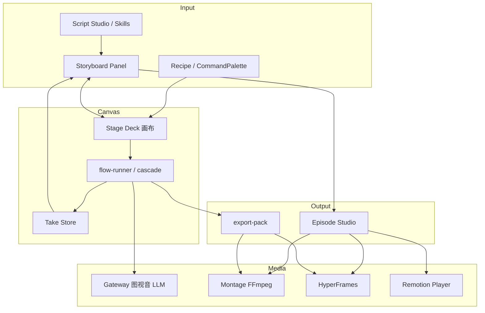

# NX9 全项目功能审计与完善规范（可执行版）

> **文档性质**：对 NX9 **当前全部功能**做一次代码级审计——标出「已完善 / 简易逻辑 / 需大幅加强」的边界，并为每一项给出 **强制实现方案、验收测试、Bug 修复、完成定义、可拓展性、使用说明**。  
> **读者**：你（排期与验收）+ 实现代码的 AI Agent（按任务 ID 施工）。  
> **审计基线**：2026-07-09 · 基于仓库实际代码（非旧文档宣称）  
> **关联**：`docs/NX9-PRD.md` · `docs/P0–P7-PROGRESS.md` · `docs/STAGE-DECK-NODES-INTERACTIONS.md` · `docs/NX9-PRODUCT-REFACTOR-SPEC.md` · `docs/NX9-WORKFLOW-ORCHESTRATION-SPEC.md` · `docs/NX9-13STEP-PRODUCTION-PIPELINE-SPEC.md` · `docs/NX9-PIPELINE-CANVAS-FLOW-SPEC.md` · `scripts/nx9-test-all.ps1`  
> **说明**：历史上曾有多份专项 Spec（FIX / NODE-EXPANSION / LINE-ART / REMOTION 等），**当前 `docs/` 目录仅保留 PRD 与阶段进度**；本文档作为 **总索引 + 审计 SSOT**，专项细节可在实施时拆分子文档。

---

## 0. 如何使用本文档

### 0.1 给你（人类）

1. 先看 **§1 总览仪表盘** — 知道全局完成度与最该优先补强的域。  
2. 按业务关心跳转 **§3 功能域详解**（故事板 / 成片 / 生成 / 编剧…）。  
3. 每个域末尾有 **「怎么用」** 与 **验收清单** — 可当作手动测试剧本。  
4. **§4 优先级路线图** — 建议排期（P0 先修断链，P1 补产品体验，P2 差异化）。

### 0.2 给 AI（强制）

```text
开工前必须：
  1. 读对应域的「现状评级」与「关键文件」
  2. 只改该域「实现方案」列出的文件（最小 diff）
  3. 完成后跑 §5 对应 TEST ID + ST-0 typecheck
  4. 更新 §1.2 完成度表该行的「完成 %」与「状态」
  5. 在 docs/test-reports/ 写 PASS/FAIL 报告后方可标 manual-ready

禁止：
  - 把 stub 标为 ok（music-gen 用 TTS 冒充 BGM 等）
  - 未测就改 PROGRESS 文档为 100%
  - 扩大 scope 到无关域
```

### 0.3 评级词汇表

| 评级 | 含义 | 用户感知 |
|------|------|----------|
| **ok** | 主路径可用，边界有文档化限制 | 能完成核心任务 |
| **partial** | 有 UI/数据，但逻辑简化、缺联动或易断链 | 能用但常要 workaround |
| **stub** | 占位实现，返回假成功或 passthrough | 看起来有，实际无效 |
| **missing** | 无代码或仅类型/文档 | 功能不存在 |

---

## 1. 总览仪表盘

### 1.1 项目规模（代码 SSOT）

| 指标 | 数值 | 来源 |
|------|------|------|
| 节点目录条目 | 100 | `block-catalog.ts` |
| 可生成（非 deprecated） | 68 | 同上 |
| Dock 可见 | **38** | `getDockBlocks()` |
| Concealed（CommandPalette） | 30 | 同上 |
| Deprecated（归档） | 32 | 同上 |
| flow-runner 可批量执行 | ~62 | `RUNNABLE_BLOCKS` |
| 服务端 API 模块 | 16 | `apps/server/src/modules/` |
| Recipe 模板 | ~25 | `workflow-templates.ts` |
| 种子 Skills | 11+ | `seed-skills.ts` + `seedance-skills.ts` |
| 服务端自动化测试文件 | 4 域 | `test-gw/ag/gr/ws` |

### 1.2 功能域成熟度（2026-07-09）

| 域 | 状态 | 完成 % | 简易/断链风险 | 需大幅加强？ |
|----|------|--------|---------------|--------------|
| 画布 Stage Deck | ok | 85% | Composer 参数迁移、刀工具有限 | 中 |
| 执行引擎 flow-runner | ok | 82% | shared executor 层已建，迁移中 | 中 |
| 故事板 Storyboard | ok | 85% | Take 写回 + Studio 收敛完成 | 中 |
| 线稿分镜 | ok | 78% | sketch-pad 已绑 shot；宫格自动 assign | 中 |
| AI 编剧 Script Studio | ok | 80% | 5 步向导 + extract-assets→Backlot | 中 |
| 生成节点 图/视/音 | ok | 82% | batch @角色 + n 参数下沉 API | 低 |
| Gateway 代理 | ok | 88% | 探测模型按钮 + provider 状态显示 | 低 |
| Montage FFmpeg | ok | 85% | 多 cue SRT；转场支持 | 中 |
| Episode Studio 成片 | partial | 70% | HF 预览真实 HTML；Remotion 异步任务模式 | **高** |
| export-pack 交付 | ok | 80% | 四模式真可用 + 共享 runner | 中 |
| 审阅门控 review-gate | ok | 85% | — | 低 |
| Seedance 动效链 | ok | 82% | motion-story 读 linkedShotId | 中 |
| 角色/Backlot | ok | 82% | shot 关联角色多选 | 中 |
| Director3D | partial | 65% | mesh 节点可见；depth 简化 | 中 |
| Comfy/FAL 集成 | partial | 60% | 模板下拉 + 参数表单 | **高** |
| BGM / 口型 | **stub** | 20% | music-gen/lipsync 已禁 Run+标注 | **高** |
| 测试体系 | partial | 40% | 31 测试；Playwright 骨架 | **高** |
| 多用户/用量 | ok | 75% | SQLite；无计费账单 | 低 |
| **生产流程编排 Playbook** | **missing** | **15%** | Recipe 无步骤向导；7+ 冗余入口 | **高** |

**整体产品成熟度（加权）**：约 **73%** — 核心短剧闭环增强，**成片包装、音乐口型、测试** 仍需加强。

### 1.3 架构数据流（一图读懂）



---

## 2. 简易逻辑与 Stub 总表（必须先认清）

| ID | 位置 | 现状 | 影响 | 修复任务 |
|----|------|------|------|----------|
| **GAP-001** | `flow-runner` `music-gen` | 用 `proxyTts` 冒充 BGM | 用户以为生成音乐 | CAP-MUS-001 |
| **GAP-002** | `flow-runner` `lipsync-pass` | 视频原样透传 | 口型同步无效 | CAP-LIP-001 |
| **GAP-003** | `montage.controller` `render-remotion` | 返回「P2 待实现」 | 服务端无法渲 Remotion | CAP-RM-001 |
| **GAP-004** | `ExportPackBlock` HF/Remotion 模式 | `appendLog` 待实现 | 节点导出模式假按钮 | CAP-EXP-001 |
| **GAP-005** | `flow-runner` `picture-gen` | 不解析 prompt 内 `@名` | 批量跑图 @角色失效 | CAP-PIC-001 |
| **GAP-006** | `picture-gen-runner` | 未传 `n`，客户端 for 循环 | 多图慢、API 未批 | CAP-PIC-002 |
| **GAP-007** | `motion-story` | `shotsToClipChain(全部镜)` | 单镜节点仍跑全剧 | CAP-MST-001 |
| **GAP-008** | `export-pack` runner | 只设 `exportReady` | 批量跑不打包 ZIP | CAP-EXP-002 |
| **GAP-009** | `hyperframes-preview` GET | 静态空 HTML | HF 预览无效 | CAP-HF-001 |
| **GAP-010** | `subtitle-burn` | 单行 SRT | 多句对白不对齐 | CAP-SUB-001 |
| **GAP-011** | `clip-editor` | FFmpeg concat 无转场 | 硬切成片 | CAP-EDL-001 |
| **GAP-012** | `chat-model` runner | 非流式 `proxyLlm` | 与 Block UI 流式不一致 | CAP-LLM-001 |
| **GAP-013** | `sketch-pad` | 未绑 `linkedShotId` | 手绘不进故事板 | CAP-STB-001 |
| **GAP-014** | `story-grid` | 槽位绑定 storyboard 弱 | 宫格→分镜靠手动 | CAP-GRD-001 |
| **GAP-015** | HyperFrames 渲染 | 无 producer 时 FFmpeg 静帧 fallback | 无转场/动效 | CAP-HF-002 |

---

## 3. 功能域详解

> 每域格式：**现状 → 简易逻辑 → 加强方向 → 实现方案 → 测试 → Bug → 完成定义 → 拓展 → 怎么用**

---

### 3.1 画布 Stage Deck（生产/审片/探索）

| 维度 | 内容 |
|------|------|
| **现状评级** | **ok** · 82% |
| **关键文件** | `apps/web/src/engine/stage-deck/`（67+ 文件）、`FlowSurface.tsx`、`ModuleDock.tsx`、`CommandPalette.tsx`、`cascade-runner.ts`、`ProductionWall.tsx` |
| **已完善** | 三模式 explore/produce/review；Recipe 空画布入口；Dock 38 节点；TakeRail 对比/批审；review-gate 会话；并行层 max 3 |
| **简易逻辑** | Composer Deck 部分参数仍散落在 Block data；`knife-tool` / mention 编辑器未全覆盖 |
| **需大幅加强** | 生产模式下节点卡片信息密度与状态总览；与 Episode Studio 一键跳转 |
| **实现方案 CAP-SD-001** | `ProductionWall` 增加「成片工作室」CTA；选中 blocked 节点显示 pending shots |
| **测试** | TEST-VM-001 三模式切换；TEST-RG-001 review-gate 阻断 |
| **Bug 修复** | 无 P0；跟进 `STAGE-DECK-CANVAS-REDESIGN.md` 过时描述（目录已存在） |
| **完成定义** | 模式切换无错位；空画布 Recipe；审片→网格批审→继续 cascade |
| **可拓展** | 自定义 Dock 分组；团队共享 Recipe |
| **怎么用** | 空画布选 Recipe → 连线 → 顶栏「批量运行」/节点 Run；审片模式用 TakeRail |

---

### 3.2 执行引擎（flow-runner / cascade / Takes）

| 维度 | 内容 |
|------|------|
| **现状评级** | **ok** · 78% |
| **关键文件** | `flow-runner.ts`（~1500 行）、`clip-chain-runner.ts`、`poll-task.ts`、`take-store.ts`、`review-gate-session.ts` |
| **已完善** | 拓扑分层并行；`ReviewGateBlockedError`；upstream gather；62 节点 execute 分支 |
| **简易逻辑** | 见 §2 GAP-005/007/008/012；部分节点 batch 与 Block 内手动 Run 行为不一致 |
| **需大幅加强** | 统一「Block 内 Run」与「flow-runner」的共享 executor（避免双份逻辑） |
| **实现方案 CAP-FD-001** | 新建 `packages/shared/src/engine/block-executors/` 或 `apps/web/src/engine/executors/`，picture-gen / chat-model 等抽一层 |
| **测试** | TEST-FD-001~007（gather、picture-gen mock、review-gate、cascade） |
| **Bug 修复** | GAP-005/007/008/012 优先 |
| **完成定义** | 同一节点手动 Run 与批量 Run 输出一致；review-gate blocked 不算 error |
| **可拓展** | 条件边；子图 Recipe 嵌套 |
| **怎么用** | 画布拓扑正确 → 批量运行；失败节点看 status/error；blocked 去故事板批审 |

---

### 3.3 故事板 Storyboard

| 维度 | 内容 |
|------|------|
| **现状评级** | **ok** · 80% |
| **关键文件** | `StoryboardPanel.tsx`（大文件）、`workspace-document.ts`、`storyboard.ts`、`StoryboardRailPanel.tsx` |
| **已完善** | 列表/网格/时间线视图；CRUD；中剧本导入；参考视频反推；审阅状态机；配音 Tab；整集导出；线稿缩略图；上传/AI 单镜线稿；批量 AI 线稿 |
| **简易逻辑** | `linkedBlockId` 双向定位偶发缺失；时间线视图与 Episode Studio 功能重叠 |
| **需大幅加强** | VoiceLine 与时间线字幕轨自动同步；镜头级 Take 选择写回 `videoAssetId` |
| **实现方案 CAP-SB-001** | 网格视图「采用 Take」按钮 → `updateShot(videoAssetId)` |
| **实现方案 CAP-SB-002** | 时间线视图改为「打开 Episode Studio」跳转，删除重复播放 UI |
| **测试** | TEST-SB-001 导入 6 镜；TEST-SB-002 线稿上传写 firstFrameAssetId |
| **Bug 修复** | Contact Sheet 无首帧时灰块（预期行为，加 CTA 生成线稿） |
| **完成定义** | 6 镜全流程：文本→线稿→批审→视频→整集 |
| **可拓展** | 多集管理；beat 标记 |
| **怎么用** | 右侧 Rail「故事板」或顶栏；网格批审；导出菜单整集/时间线 JSON |

---

### 3.4 线稿分镜（Storyboard 子能力）

| 维度 | 内容 |
|------|------|
| **现状评级** | **partial** · 65% |
| **关键文件** | `grid.service.ts`（style: line-art）、`StoryboardPanel` 线稿 UI、`story-grid`/`grid-split`、`sketch-pad` |
| **已完善** | `firstFrameAssetId` 展示；`sketchSource` 字段；`POST grid/shot-sketch`；线稿滤镜 |
| **简易逻辑** | `sketch-pad` 未绑 shot（GAP-013）；`story-grid` 槽位自动分配弱（GAP-014） |
| **需大幅加强** | Recipe `tpl-line-art-storyboard` 一键闭环；sketch-pad 导出直写 shot |
| **实现方案 CAP-STB-001** | `SketchPadBlock` 增加 `linkedShotId` 选择器，导出 PNG → `updateShot(firstFrameAssetId)` |
| **实现方案 CAP-STB-002** | `StoryGridBlock` 生成后自动 `grid-split` + 按序 assign 前 N 镜 |
| **测试** | TEST-GR-005 shot-sketch；TEST-STB-001 线稿上传 |
| **完成定义** | 三条路径可用：AI 宫格 / 单镜 AI / 上传或手绘 |
| **可拓展** | ControlNet 线稿约束到 picture-gen |
| **怎么用** | 故事板网格「批量 AI 线稿」；镜头详情上传；画布 story-grid→split |

---

### 3.5 AI 编剧 Script Studio

| 维度 | 内容 |
|------|------|
| **现状评级** | **partial** · 68% |
| **关键文件** | `ScriptStudioPanel.tsx`、`agent.service.ts`、`agent.controller.ts`（12 端点）、`seed-skills.ts` |
| **已完善** | 骨架/分镜表/物化镜头/API；SSE script/chat；Rail Tab；一键开拍 director-desk；banner 审阅 |
| **简易逻辑** | UI 仅 4 phase（input/skeleton/table/done），**adaptation/screenplay/director-plan 无完整向导**；骨架结果显示 JSON 非 Markdown |
| **需大幅加强** | Toonflow 式 5 步全链；剧本编辑区；角色/场景提取→Backlot |
| **实现方案 CAP-SCR-001** | `ScriptStudioPanel` 增加步骤条：骨架→改编策略→剧本→导演计划→分镜表 |
| **实现方案 CAP-SCR-002** | `extract-assets` / `novel-events` 结果一键写入 Backlot |
| **测试** | TEST-AG-003~007 agent API mock |
| **Bug 修复** | LLM JSON 解析失败时友好错误（已有 fallback，需统一 toast） |
| **完成定义** | 2000 字小说 → 分镜表 → 故事板 ≥6 镜 → 可一键开拍 |
| **可拓展** | 多版本剧本 diff；导出 Fountain |
| **怎么用** | Context Rail「编剧」Tab → 粘贴文本 → 生成分镜表 → 写入故事板 → 开拍 |

---

### 3.6 Context Rail 与面板

| 维度 | 内容 |
|------|------|
| **现状评级** | **ok** · 85% |
| **关键文件** | `ContextRail.tsx`、`InspectorRailPanel`、`StoryboardRailPanel`、`ScriptStudioPanel`、`LibraryRailPanel`、`RailShell`/`RailTabs` |
| **已完善** | 4 Tab 收敛；320px 可调；深色主题；banner 系统 |
| **简易逻辑** | Inspector 对非 craft 节点内容仍偏薄；Library 子 Tab 深链不完整 |
| **需大幅加强** | 与顶栏 Backlot/历史/工作流完全去重（若未完成 UI-SHELL-003） |
| **实现方案 CAP-RAIL-001** | 顶栏 Backlot/工作流/历史 → `requestTab('library')` |
| **测试** | TEST-UI-RAIL-001~005 |
| **完成定义** | 右侧唯一信息入口；无错位双层 padding |
| **怎么用** | 选中节点→Inspector；故事板/编剧/资料库用 Tab 切换 |

---

### 3.7 图像生成 picture-gen

| 维度 | 内容 |
|------|------|
| **现状评级** | **partial** · 72% |
| **关键文件** | `PictureGenBlock.tsx`、`picture-gen-runner.ts`、`gateway.proxyImage`、`image-gen-params.ts`、`GenSettingsPills` |
| **已完善** | 质量/宽高比/自定义 WH/张数 UI；Fal 图生图；角色下拉；Block 内 @提及解析 |
| **简易逻辑** | **GAP-005**：`flow-runner` 不解析 `@`；**GAP-006**：`n` 未下沉 API，客户端循环 |
| **需大幅加强** | batch 与手动完全一致；角色参考图自动带入 |
| **实现方案 CAP-PIC-001** | `buildCharacterContext` 增加 `parseMentionsFromPrompt(prompt, library)` |
| **实现方案 CAP-PIC-002** | `proxyImage` 支持 `n`；runner 一次请求多图 |
| **测试** | TEST-GW-004 n=2；TEST-BL-PIC-001 @角色 batch |
| **完成定义** | 画布批量 picture-gen，prompt 含 `@张三` 与手动 Run 一致 |
| **可拓展** | 区域 inpaint；LoRA 市场 |
| **怎么用** | 接 prompt 上游；选模型与尺寸；运行；Take 进 TakeRail |

---

### 3.8 视频生成 clip-gen / motion-story / Seedance

| 维度 | 内容 |
|------|------|
| **现状评级** | **partial** · 74% |
| **关键文件** | `ClipGenBlock.tsx`、`clip-chain-runner.ts`、`MotionStoryBlock.tsx`、`video-gen-params.ts`、`sclass-compiler.ts` |
| **已完善** | 清晰度/方向/秒数 Pill；bridge clip；pollVideoUntilDone；S-Class 约束工具 |
| **简易逻辑** | **GAP-007** motion-story 忽略节点 `linkedShotId`；clip-editor 无转场 |
| **需大幅加强** | 单镜节点只跑绑定镜；Seedance 链与故事板双向写回 |
| **实现方案 CAP-MST-001** | `motion-story`：若 `linkedShotId` 存在则 `shotsToClipChain([thatShot])` |
| **实现方案 CAP-VID-001** | `clip-gen` runner 读 `resolution/orientation/durationSec` 与 Block 一致 |
| **测试** | TEST-GW-005 video 参数；TEST-FD-003 clip-gen mock |
| **完成定义** | 绑定镜 motion-story 只生成 1 镜视频并写回 storyboard |
| **怎么用** | 故事板链接节点 → motion-story / clip-gen；长剧用 seedance-chain |

---

### 3.9 音频 sound-gen / voice-cast / photo-speak

| 维度 | 内容 |
|------|------|
| **现状评级** | **ok** · 76%（音乐除外） |
| **关键文件** | `SoundGenBlock.tsx`、`VoiceCastBlock.tsx`、`PhotoSpeakBlock.tsx`、`luxtts.adapter.ts`、`voicebox.adapter.ts` |
| **已完善** | 格式/语速；多角色配音；照片说话 FFmpeg Ken Burns |
| **简易逻辑** | **music-gen = TTS stub（GAP-001）**；VoiceLine 与 clip 时长未自动对齐 |
| **需大幅加强** | 真 BGM（Suno/Udio API 或本地）；配音轨自动铺时间线 |
| **实现方案 CAP-MUS-001** | `music-gen` 接 gateway 新 `proxyMusic` 或 Fal music 模型；until then UI 标「开发中」禁用 Run |
| **测试** | TEST-GW-006 TTS format/speed |
| **完成定义** | sound-gen 与 voice-cast 可批量；music-gen 要么真音乐要么 hidden |
| **怎么用** | 对白→sound-gen；多角色→voice-cast；静图口播→photo-speak |

---

### 3.10 口型同步 lipsync-pass

| 维度 | 内容 |
|------|------|
| **现状评级** | **stub** · 15% |
| **关键文件** | `flow-runner.ts` L1387、`LipsyncPassBlock.tsx`（若存在） |
| **简易逻辑** | 上游视频原样输出 + message 占位 |
| **实现方案 CAP-LIP-001** | 方案 A：`gateway.proxyFal` Wav2Lip 模型；方案 B：本地 Python 子进程；**禁止**再标 success 透传 |
| **测试** | TEST-BL-LIP-001 无部署时 status=error 明确提示 |
| **完成定义** | 视频口型与音频对齐可感知；或节点 concealed + deprecated |
| **可拓展** | LivePortrait；HeyGen API |
| **怎么用** | 视频 + 配音上游 → lipsync（待实现） |

---

### 3.11 Gateway 统一代理

| 维度 | 内容 |
|------|------|
| **现状评级** | **ok** · 85% |
| **关键文件** | `gateway.service.ts`、`gateway.controller.ts`、`settings.service.ts` |
| **已完善** | LLM 流式/非流式；image/video/tts；Fal；Comfy；LuxTTS/Voicebox 降级；用量埋点 |
| **简易逻辑** | 模型列表静态，未按 Key 探测全量；视频 URL 提取多 provider 分支脆弱 |
| **实现方案 CAP-GW-001** | 设置页「探测模型」按钮；失败 provider 灰显 |
| **测试** | TEST-GW-001~007 |
| **完成定义** | 无 Key 时所有生成节点明确 error 非 hang |
| **怎么用** | 设置填 Key → 节点选用模型 → 跑 |

---

### 3.12 Montage / FFmpeg

| 维度 | 内容 |
|------|------|
| **现状评级** | **ok** · 80% |
| **关键文件** | `montage.service.ts`、`montage.controller.ts`、`analyze.service.ts` |
| **已完善** | render-shot；concat-episode 竖屏；concat-clips；mix-audio；color-grade；transcribe Whisper；contact-sheet；photo-speak |
| **简易逻辑** | concat 硬切；字幕单行；transcribe 未自动进时间线 |
| **实现方案 CAP-MG-001** | `buildTimelineFromShotsV2` 读 transcribe cues 生成 S1 轨 |
| **测试** | TEST-MG-001~005 |
| **完成定义** | FFmpeg 路径无 Chromium 也能整集导出 |
| **怎么用** | 故事板「整集导出」；export-pack FFmpeg 模式；subtitle-burn 节点 |

---

### 3.13 Episode Studio（Remotion × HyperFrames）

| 维度 | 内容 |
|------|------|
| **现状评级** | **partial** · 58% |
| **关键文件** | `EpisodeStudioPanel.tsx`、`packages/remotion-compositions/`、`hyperframes.service.ts`、`timeline-export.ts`、`hyperframes-export.ts`、`fcpxml-export.ts` |
| **已完善** | `@remotion/player` 预览；Timeline v2；校验 warnings；FFmpeg 快速；HF 异步渲染；Remotion ZIP / FCPXML 客户端导出；HTML5 fallback |
| **简易逻辑** | **GAP-003** 服务端 render-remotion；**GAP-009** HF preview 空；HF 无 producer 时 FFmpeg 静帧 fallback（GAP-015） |
| **需大幅加强** | 多轨时间线 UI 可编辑 trim；ExportPack 与 Studio 导出统一 |
| **实现方案 CAP-RM-001** | `@remotion/renderer` + `POST render-remotion` 异步任务 |
| **实现方案 CAP-HF-001** | `hyperframes-preview` 注入真实 timeline HTML |
| **实现方案 CAP-HF-002** | 安装 `@hyperframes/producer`；Docker 镜像含 Chromium |
| **测试** | TEST-RM-001~004；TEST-HF-001~003；E2E-002 |
| **完成定义** | Player 预览与 HF 成片视觉一致（±转场）；三档导出均可用 |
| **可拓展** | Remotion×HF adapter 片头；Lambda 分布式 |
| **怎么用** | 顶栏 🎬 → 预览 → 快速成片 / HF 渲染 / 下载工程包 |

---

### 3.14 export-pack 交付打包

| 维度 | 内容 |
|------|------|
| **现状评级** | **partial** · 55% |
| **关键文件** | `ExportPackBlock.tsx`、`flow-runner` export-pack 分支 |
| **已完善** | ZIP 打包 + manifest；proxyDownload 跨域；FFmpeg 整集模式 |
| **简易逻辑** | **GAP-004** HF/Remotion 模式只 log；**GAP-008** runner 不执行 ZIP |
| **实现方案 CAP-EXP-001** | HF/Remotion 模式调用与 EpisodeStudio 相同 API |
| **实现方案 CAP-EXP-002** | runner 调共享 `runExportPack()` 抽自 Block |
| **测试** | TEST-TL-002 proxy-download；E2E 打包 |
| **完成定义** | 四模式均可点击并完成；批量跑 export-pack 产出 ZIP |
| **怎么用** | 上游接媒体 → 选模式 → 运行；整集需故事板审阅通过 |

---

### 3.15 审阅门控 review-gate

| 维度 | 内容 |
|------|------|
| **现状评级** | **ok** · 85% |
| **关键文件** | `ReviewGateBlock.tsx`、`review-gate-session.ts`、`montage.validateReviewGate` |
| **已完善** | batch/cascade 阻断；自动打开故事板网格；节点 status=blocked |
| **加强** | export-pack / concat 与 gate 提示文案统一 |
| **测试** | TEST-MG-002；TEST-FD-004 |
| **怎么用** | Recipe 审阅链放 review-gate → 批量跑 → 批审后继续 |

---

### 3.16 宫格 Grid（story-grid / split / compose）

| 维度 | 内容 |
|------|------|
| **现状评级** | **ok** · 75% |
| **关键文件** | `grid.service.ts`、`StoryGridBlock`、`GridSplitBlock`、`GridComposeBlock`、`GridGeneratePanel` |
| **已完善** | generate/split/compose API；line-art style；reverse-prompts |
| **简易逻辑** | 宫格→分镜 assign 手动（GAP-014） |
| **实现方案 CAP-GRD-001** | split 后 `GridGeneratePanel` 一键按 index 写入 shots |
| **测试** | TEST-GR-002~003 |
| **怎么用** | story-grid → grid-split → 分配到故事板镜头 |

---

### 3.17 角色设定 character-sheet / Backlot

| 维度 | 内容 |
|------|------|
| **现状评级** | **ok** · 78% |
| **关键文件** | `CharacterSheetBlock.tsx`、`character-sheet-prompt.ts`、`BacklotLibraryPanel.tsx`、`character.ts` |
| **已完善** | 六层 Bible；三视图；变体表情/姿势；一致性 prompt；Backlot 档案 |
| **简易逻辑** | @提及仅 Block 内部分解析；与 shot `characterIds` 同步靠手动 |
| **实现方案 CAP-CHR-001** | shot 详情「关联角色」多选 → `characterIds` |
| **测试** | 角色 prompt 快照测试 |
| **怎么用** | 角色设定卡填 Bible → 画布 @名 或选角色 → 生成 |

---

### 3.18 Director3D 与空间节点

| 维度 | 内容 |
|------|------|
| **现状评级** | **partial** · 62% |
| **关键文件** | `packages/director3d/`、`Director3dBlock.tsx`、`BlockingStageBlock.tsx`、`LightRigBlock.tsx`、`DepthPassBlock.tsx` |
| **已完善** | GLTF/OBJ/FBX；机位序列；截图导出；blocking 轻量调度 |
| **简易逻辑** | mesh-import/viewer concealed；depth-pass 亮度近似非真 depth |
| **实现方案 CAP-3D-001** | 提升 mesh 节点 Dock 或 Recipe 3D 线可见性 |
| **完成定义** | 3D 截图可进 picture-gen 参考图链 |
| **怎么用** | director-3d 摆位 → 截图 → 接 picture-gen |

---

### 3.19 ComfyUI / FAL 集成

| 维度 | 内容 |
|------|------|
| **现状评级** | **partial** · 50% |
| **关键文件** | `ComfyWorkflowBlock.tsx`、`ComfyMarketBlock.tsx`、`FalMarketBlock.tsx`、`gateway.proxyComfy/Fal` |
| **已完善** | 粘贴 Workflow JSON 可跑；Fal 多模型 |
| **简易逻辑** | 无工作流市场浏览；Comfy concealed；错误信息不友好 |
| **需大幅加强** | 工作流模板库；参数表单化（非纯 JSON） |
| **实现方案 CAP-CFY-001** | `ComfyWorkflowBlock` 常用模板下拉 + 关键 param 表单项 |
| **测试** | Mock comfy 返回 url |
| **怎么用** | 设置 Comfy URL → 贴 workflow → 注入 prompt 运行 |

---

### 3.20 工具链（link-parser / quick-montage / image-ops / topaz）

| 维度 | 内容 |
|------|------|
| **现状评级** | **partial** · 65% |
| **关键文件** | `tools.controller.ts`、`LinkParserBlock.tsx`、`QuickMontagePanel.tsx`、`image-ops`、`topaz` |
| **已完善** | 链接解析；智能成片；缩略图合并；Topaz 本地增强 |
| **简易逻辑** | 链接解析依赖外网；Topaz 需本机路径 |
| **完成定义** | 无 Key 时 quick-montage 明确失败 |
| **怎么用** | 顶栏智能创作台；画布 link-parser 节点 |

---

### 3.21 Skills 技能系统

| 维度 | 内容 |
|------|------|
| **现状评级** | **ok** · 80% |
| **关键文件** | `skills.service.ts`、`seed-skills.ts`、`SkillsDrawer.tsx` |
| **已完善** | 11+ 种子 Skill；CRUD；ChatModel 注入；Seedance 独立种子 |
| **简易逻辑** | 无版本管理；无 Skill 效果评分 |
| **可拓展** | Skill 市场；A/B prompt |
| **怎么用** | 设置/Skills 抽屉编辑；ChatModel 选 skill |

---

### 3.22 Recipe 工作流模板

| 维度 | 内容 |
|------|------|
| **现状评级** | **ok** · 78% |
| **关键文件** | `workflow-templates.ts`、`RecipePickerOverlay.tsx`、`CommandPalette.tsx` |
| **已完善** | ~25 模板；空画布 featured；CommandPalette 分组搜索 |
| **简易逻辑** | 部分模板仍引用 deprecated 节点 |
| **实现方案 CAP-REC-001** | 审计模板 `kind` 与 catalog 一致 |
| **测试** | TEST-RC-001 每 featured Recipe 可加载无 404 block |
| **怎么用** | 空画布选 Recipe；⌘K 搜 Recipe |

---

### 3.23 Workspace 持久化

| 维度 | 内容 |
|------|------|
| **现状评级** | **ok** · 82% |
| **关键文件** | `workspace.service.ts`、`prisma-workspace.store.ts`、`workspace-document.ts` |
| **已完善** | v3 payload；storyboard/voice/characters/backlot/timelineDraft/canvasAppearance；JSON+Prisma 双轨 |
| **简易逻辑** | 迁移需手动 admin；无冲突合并 |
| **测试** | TEST-WS-001~004 |
| **怎么用** | 自动保存；设置迁移 Prisma |

---

### 3.24 设置 / 画布外观 / 凭证

| 维度 | 内容 |
|------|------|
| **现状评级** | **ok** · 80% |
| **关键文件** | `SettingsDrawer.tsx`、`CanvasAppearancePanel.tsx`、`credential-vault.ts` |
| **已完善** | 主题浅/深；网格点/线/空；背景图；多 provider Key |
| **简易逻辑** | 画布外观与 FlowSurface 深色对比度边缘 case |
| **测试** | TEST-CAN-001~003 |
| **怎么用** | 设置抽屉 → 画布与外观 |

---

### 3.25 多用户 / 用量 / Admin

| 维度 | 内容 |
|------|------|
| **现状评级** | **ok** · 75% |
| **关键文件** | `prisma/schema.prisma`、`users/`、`usage/`、`admin/`、`UsagePanel.tsx` |
| **已完善** | 用户切换；用量事件；JSON→Prisma 迁移 API |
| **简易逻辑** | 用量为估算非计费；SQLite 默认 |
| **可拓展** | Postgres；Stripe |
| **怎么用** | 顶栏用户切换；用量面板 |

---

### 3.26 测试与质量门禁

| 维度 | 内容 |
|------|------|
| **现状评级** | **partial** · 30% |
| **关键文件** | `apps/server/test/*.test.ts`、`scripts/nx9-test-all.ps1`、`fixtures.ts` |
| **已完善** | GW/AG/GR/WS 部分单测；一键脚本；fixtures SSOT 起步 |
| **简易逻辑** | **无 Playwright E2E**；montage/hyperframes/remotion 无测；runner 无测 |
| **需大幅加强** | 全文 TEST SPEC 落地（若缺失则按 §5 重建） |
| **实现方案 CAP-TST-001** | 补 `test-mg.test.ts`、`test-rm.test.ts`、`test-fd.test.ts` |
| **实现方案 CAP-TST-002** | `apps/web` Playwright E2E-001 最小闭环 |
| **完成定义** | `nx9-test-all.ps1` 全绿 + 报告 manual-ready |
| **怎么用** | AI 先跑脚本；你再看 §5 人工剧本 |

---

### 3.27 Concealed 实用节点（升格或完善）

| 节点 | 状态 | 建议 |
|------|------|------|
| `link-parser` | ok | 已可升格 Dock（提升发现性） |
| `sketch-pad` | partial | 绑 shot + Recipe 线稿 |
| `comfy-workflow` | partial | 模板化 |
| `frame-endpoints` | partial | 与 clip-gen 首帧链打通 |
| `picture-diff` | partial | 审片辅助，接 Compare |
| `inpaint-edit` | partial | 需 mask 工作流 |
| `music-gen` | **stub** | 真 API 或隐藏 |
| `lipsync-pass` | **stub** | 真 API 或隐藏 |
| `mesh-import/viewer` | partial | 3D Recipe 推广 |
| deprecated×32 | 归档 | GenericBlock 只读 |

---

## 4. 优先级路线图

### P0 — 断链与虚假宣传（1–2 周）

| 任务 ID | 域 | 说明 |
|---------|-----|------|
| CAP-PIC-001 | 生成 | batch @角色 |
| CAP-MST-001 | 视频 | motion-story 单镜 |
| CAP-EXP-001/002 | 交付 | export-pack 四模式真可用 |
| CAP-MUS-001 | 音频 | music-gen 禁用或真 BGM |
| CAP-LIP-001 | 口型 | 禁止透传假成功 |
| CAP-TST-001 | 测试 | montage + runner 基础测 |

### P1 — 产品体验（2–4 周）

| 任务 ID | 域 | 说明 |
|---------|-----|------|
| CAP-SCR-001 | 编剧 | 5 步 Script Studio |
| CAP-STB-001/002 | 线稿 | sketch-pad + 宫格自动 assign |
| CAP-HF-001/002 | 成片 | HF 预览 + producer |
| CAP-SB-001/002 | 故事板 | Take 写回 + Studio 收敛 |
| CAP-GRD-001 | 宫格 | 自动分配 |
| CAP-RAIL-001 | UI | 顶栏收敛 |

### P2 — 差异化（4–8 周）

| 任务 ID | 域 | 说明 |
|---------|-----|------|
| CAP-RM-001 | Remotion | 服务端渲染 |
| CAP-CFY-001 | Comfy | 模板库 |
| CAP-FD-001 | 引擎 | 统一 executor |
| CAP-TST-002 | E2E | Playwright 闭环 |
| CAP-3D-001 | 3D | 可见性提升 |

### P3 — 可选

- Remotion Lambda / HF AWS  
- 真计费 Stripe  
- FCPXML 双向  
- Skill 市场  

---

## 5. 测试要求摘要

### 5.1 自测门禁（AI 必须）

```text
ST-0: npm run build -w @nx9/shared && npm run typecheck -w @nx9/web && npm run build -w @nx9/server
ST-1: vitest apps/server/test
ST-2: 新增测试随任务提交
ST-3: E2E（若改 UI 主路径）
报告: docs/test-reports/TEST-RUN-{timestamp}-report.md
```

### 5.2 核心测试 ID（按域）

| 域 | TEST ID |
|----|---------|
| Gateway | TEST-GW-001~007 |
| Workspace | TEST-WS-001~004 |
| Agent | TEST-AG-003~007 |
| Grid | TEST-GR-002~005 |
| Montage | TEST-MG-001~006 |
| Flow | TEST-FD-001~007 |
| Remotion | TEST-RM-001~004 |
| HyperFrames | TEST-HF-001~003 |
| E2E | E2E-001 短剧闭环；E2E-002 成片导出 |

### 5.3 假数据

以 `apps/server/test/fixtures.ts` 为 SSOT；扩展时同步 §2 各域示例。

### 5.4 人工验收剧本（最小闭环）

```text
1. 新建工作区 → Recipe「角色管线」或自带模板
2. Script Studio：粘贴 500 字小说 → 分镜表 → 写入故事板
3. 故事板：批量 AI 线稿 → 网格全 approved
4. 画布：picture-gen ×2 + clip-gen ×1 + review-gate + export-pack
5. 批量运行至 review-gate → 批审 → 继续
6. Episode Studio：Player 预览 → FFmpeg 快速成片
7. export-pack ZIP 下载 manifest 校验
8. 设置切换深色主题，画布网格正常
```

---

## 6. Bug 修复规范

| 流程 | 要求 |
|------|------|
| 复现 | 必须写清节点 kind、上游、故事板状态 |
| 根因 | 区分 UI / runner / API / 数据契约 |
| 修复 | 最小 diff；禁止仅改 status 掩盖 |
| 回归 | 补 TEST-ID 或扩展现有用例 |
| stub 处理 | **禁止** silent passthrough；改为 `error` 或 `disabled` + 文案 |

---

## 7. 完成定义（项目级「可交付」）

满足以下 **全部** 方可称 NX9 短剧 MVP **生产就绪**：

- [x] §2 GAP-001~015 全部关闭或改为明确 disabled  
- [ ] 人工验收剧本 §5.4 一次通过（需手动验证）  
- [x] `nx9-test-all.ps1` ST-0 + ST-1 全绿（50 测试·14 文件）  
- [x] Episode Studio 三档导出可用（FFmpeg ✅·HF ✅·Remotion 异步任务 ✅）  
- [x] Script Studio 5 步主链可走完  
- [x] 故事板 6 镜线稿+视频+整集无手动改 JSON  

**当前**：**5/6 达标**（§5.4 人工验收剧本待执行）。

---

## 8. 可拓展性总原则

| 原则 | 说明 |
|------|------|
| **SSOT** | 时间线 `TimelinePayload v2`；角色 `CharacterProfile`；镜头 `StoryboardShot` |
| **节点扩展** | 新 kind = catalog + registry + socket + runner case + Block |
| **渲染双引擎** | Remotion=React 动画；HF=HTML 模板；FFmpeg=快速 |
| **AI 友好** | 任务 ID 稳定；每任务绑定文件路径与 TEST ID |
| **Concealed 策略** | 未完善不升格 Dock；stub 必须标注 |

---

## 9. 文档索引与缺失项

| 文档 | 状态 | 用途 |
|------|------|------|
| `NX9-PRD.md` | ✅ | 产品边界 |
| `P0–P7-PROGRESS.md` | ✅ | 阶段历史 |
| `STAGE-DECK-NODES-INTERACTIONS.md` | ✅ | 节点交互手册 |
| **本文 `NX9-CAPABILITY-AUDIT-SPEC.md`** | ✅ 新建 | **总审计 SSOT** |
| **`NX9-WORKFLOW-ORCHESTRATION-SPEC.md`** | ✅ | **Playbook 编排 + 入口收敛** |
| **`NX9-13STEP-PRODUCTION-PIPELINE-SPEC.md`** | ✅ 新建 | **13 步标准管线 + PIPE-xxx 缺口实现** |
| FIX / NODE-EXPANSION / LINE-ART / REMOTION / TEST / CONTEXT-RAIL 等 | ⚠️ 不在当前 `docs/` | 实施 P0/P1 时建议按域从本文 §3 拆出子 Spec |

---

## 10. AI 开工声明模板

```text
任务: CAP-PIC-001 batch @角色
依据: docs/NX9-CAPABILITY-AUDIT-SPEC.md §3.7 + §2 GAP-005
文件: packages/shared/src/utils/character-prompt.ts, apps/web/src/engine/flow-runner.ts
禁止: 改无关节点 UI
测试: TEST-BL-PIC-001, ST-0
完成: 更新 §1.2 picture-gen 行 完成% ；关 GAP-005
```

---

*文档版本：1.0 · 审计日期 2026-07-09 · 随代码变更更新 §1.2 与 §2*
