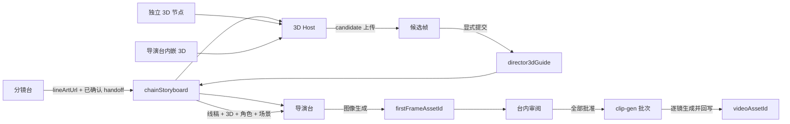

# NX9 导演台现状、未闭环项与 3D 导演台独立节点方案

> 审计日期：2026-08-12  
> 审计对象：当前工作树中的导演台、分镜台交接、彩色关键帧、关键帧审阅、视频生成交接、`@nx9/director3d`、3D 全屏与嵌入路径。  
> 证据来源：NX9 当前代码、`docs/` 内现有规格与审计文档、定向单元测试。  
> 说明：当前工作区已有未提交改动；本分析不回滚、不假定这些改动已经发布。

## 1. 结论先行

### 1.1 对三个核心问题的直接回答

1. **分镜台交给导演台的应当是线稿，导演台应当生成新的彩色关键帧。**
   - `lineArtUrl` 是分镜构图参考。
   - `director3dGuide` 是 3D 构图和机位参考。
   - `firstFrameAssetId` 才是导演台生成并审阅后的关键帧。
   - 3D 截图不能直接冒充最终关键帧。

2. **“线稿 → 导演台 → 彩色关键帧”主路径已可验收；像素级质检已落地且禁止静默失败。**
   - 已有：导演台把线稿作为参考图，调用真实图像生成 runner，成功后把新 URL 写入 `firstFrameAssetId`，并记录 `director-color-keyframe` provenance。
   - 已修：拆镜转换与宫格线稿分配只写 `lineArtUrl`，不占用关键帧字段。
   - 已修：handoff hash 只投影上游字段，导演写回不再自失效。
   - 已修：`directorKeyframeBatch` 写入 clip-gen 后按批逐镜消费并回写；交付区回读「待消费 / 已消费 / 过期」。
   - 已修：像素级彩色质检写入 `keyframeProvenance.colorCheck`；`suspect-monochrome` 强制进审阅并提示，**不得**标 `failed`。

3. **3D 已是独立画布节点，并与导演台嵌入共用同一 host。**
   - 已有独立包：`packages/director3d`。
   - 目录可创建 `director-3d`；`Director3dHostController` 是唯一解析器。
   - `DIRECTOR_3D_ENABLED = true`。
   - commit 只写 `director3dGuide`，要求持久化 `imageUrl`，禁止 Data URL / failed candidate。

### 1.2 总体判断

| 能力 | 当前判断 |
|---|---|
| 导演台按上游 chain、按集读取镜头 | 已完成 |
| 线稿作为生成参考 | 已接通 |
| 新图生成并写回关键帧 | 已接通；provenance 已记录 |
| “生成结果一定是彩色关键帧”的产品契约 | 契约 + 像素级质检已闭环（疑似黑白只审阅警告） |
| 台内批准、打回、重出、回滚 | 基本完成 |
| 导演台画布级运行 / Cascade | 已接通同一 `resolveDirectorRunContext` |
| 关键帧批次交给视频生成并被实际消费 | 薄闭环；交付区可回读消费状态 |
| 3D 每镜状态与提交 adapter | 已完成主要守卫 |
| 独立 3D 导演台节点 | 已完成 |
| 同一 3D 实现同时支持独立节点和导演台嵌入 | 已完成 |

当前口径：

> 导演台主链（线稿参考 → 彩色关键帧 → 审阅 → 结构化批次消费）与独立/嵌入 3D、像素级彩色质检、3D 切镜守卫、成片音量关键帧均已在代码落地。真实供应商链验收为 opt-in（见 `REAL-PROVIDER-VALIDATION.md`），不阻断本主链。

---

## 2. 正确的产品职责与数据契约

### 2.1 四类媒体必须严格分离

| 字段 | 生产者 | 含义 | 不允许的行为 |
|---|---|---|---|
| `lineArtUrl` | 分镜台 | 当前镜头线稿、构图参考 | 不得据此把镜头标成已有导演关键帧 |
| `director3dGuide` | 3D 导演台，经 host adapter 提交 | 3D 截图、相机、角色摆位、提交版本 | 不得写 `firstFrameAssetId`，不得自动批准 |
| `firstFrameAssetId` | 导演台彩色批出 | 经生成模型得到的最终候选关键帧 | 分镜台和 3D 节点不得占用 |
| `videoAssetId` | 视频生成 | 以已批准关键帧为首图生成的视频 | 不得把线稿或 3D 截图当成已批准关键帧消费 |

### 2.2 目标主链



关键原则：

- 线稿、3D 截图都是参考，不是最终彩色帧。
- 3D 节点只提交 `director3dGuide`。
- 只有导演台彩色批出路径可以写 `firstFrameAssetId`。
- `clip-gen` 必须消费结构化关键帧批次，不能靠“某个节点当前 previewUrl”猜首图。

---

## 3. 当前已经完成或基本完成的能力

以下内容在旧审计后已有实质进展，不应重复造第二套。

### 3.1 导演台 chain 与集范围

- `DirectorDeskBlock` 已通过 `resolveStoryboardDeskInput` 解析明确连接的上游分镜台。
- 当前集优先使用 `lastHandoff.episodeId` / chain active episode。
- handoff 集不存在时不再静默扩大到整条 chain。
- 批出、批准、打回通过 `patchUpstreamShot` 写回上游 chain。
- `patchUpstreamShot` 已支持从最新节点状态做函数式更新，现有并发风格测试能证明两个顺序 patch 不互相覆盖。

这意味着旧文档中的 D-01、D-02、D-05 主体已经修复。

### 3.2 导演台彩色图生成骨架

`buildShotPrompt` 和 `runDirectorDeskBatch` 当前已经做到：

- 可选使用 `director3dGuide.captureUrl`。
- 可选使用 `lineArtUrl` / `lastHandoff.lineArtFrames`。
- 线稿存在时加入：

```text
[Match the line-art composition and camera framing; colorize consistently]
```

- 注入角色、服装、道具、场景、镜头库、构图模板和风格锁。
- 通过 `runPictureGenJob` 请求新的图片。
- 成功后把新 URL 写到 `firstFrameAssetId`。
- 手动模式写 `keyframeStatus: 'review'`，自动模式可直接批准。
- 重出前保留一档 `keyframePreviousUrl`。

因此，导演台本身并不是直接把线稿 URL 原样复制成关键帧；它具备“以线稿为参考再生成新图”的实现。

### 3.3 批出与审阅体验

当前已有：

- 缺帧、失败、已选、仅 3D、全部筛选。
- 多选、全选可见、清空选择、单镜批出。
- 并发、失败重试、停止领取新任务、`AbortSignal` 下传。
- 批出中关闭台和刷新提醒。
- 线稿、关键帧、3D、对比预览。
- 台内批准、全部通过、打回、打回并重出、撤回批准、恢复上一版。
- 未确认本集二次确认。
- 强制推视频二次确认。
- 明确连接的 picture-gen / clip-gen 查找，不再回落到画布任意节点。

### 3.4 3D 基础架构

以下能力已经存在：

- `@nx9/director3d` 独立 package。
- `Director3dShell` / `StageDeckShell`。
- `Director3dShotState`：每镜对象、相机、候选帧、dirty 状态。
- `Director3dCandidate` 与 `Director3dCommitPayload`。
- `sceneByShot` 节点级持久化。
- 构图、镜头、对比、诊断四种视口。
- 线稿叠加、角色占位、相机位置/目标/FOV、Transform Controls。
- WebGL 不可用提示、后台降 DPR、renderer dispose。
- `createDirector3dCommitAdapter` 通过 `patchUpstreamShot` 只写 `director3dGuide`。
- adapter 明确不写 `firstFrameAssetId`，且已有单元测试守卫。

这些代码是独立节点和嵌入模式应共同复用的基础。

---

## 4. P0：当前必须先修的主链断点

> **2026-08-12 收口复核**：下列 P0 多数已在代码落地；本文保留原诊断，状态列已改。

### DD-P0-01：分镜线稿仍会污染关键帧字段

**状态：✅ 主路径已修**（`storyboardShotsFromScriptBreakdown` 只写 `lineArtUrl`；`migrateLegacyLineArtShot`；宫格线稿分配走 `buildLineArtShotPatch`）。

### DD-P0-02：导演台自己的写回会使 handoff hash 失效

**状态：✅ 已修**（`chainStoryboardHash` 仅投影上游字段；测例覆盖下游写回不失效）。

### DD-P0-03：画布“运行导演台”当前会空跑成功

**状态：✅ 已修**（`resolveDirectorRunContext` + flow-runner 共用；无上下文返回 `blocked`）。

### DD-P0-04：导演台“推送关键帧”没有形成真实视频消费闭环

**状态：✅ 薄闭环**（`directorKeyframeBatch` 写入 clip-gen；执行路径按批逐镜消费并回写；交付区 / clip-gen 卡面回读「待消费 / 已消费 / 过期」）。成片深编排仍可加深。

### DD-P0-05：`director-3d` 不是可用的独立节点

**状态：✅ 已修**（目录可创建、`Director3dBlock`、registry 映射、历史节点恢复；`DIRECTOR_3D_ENABLED = true`）。

### DD-P0-06：独立 3D 旧打开路径仍把关键帧字段当线稿

**状态：✅ 已修**（`director3d-open` 读 `shot.lineArtUrl`，不从 `firstFrameAssetId` 推断）。

---

## 5. P1：功能存在但仍未闭环

### DD-P1-01：彩色结果只有 prompt 约束，没有稳定产物契约

**状态：✅ 已修（契约 + 像素质检）**

- `StoryboardKeyframeProvenance` 写入 `role: 'director-color-keyframe'`，并记录 `model` / `promptHash` / `batchId` / `usedRefs` / `negativePromptApplied` / `colorCheck`。
- `buildShotPrompt` 明确要求 full-color cinematic keyframe（有线稿 / 无线稿两条措辞）。
- `assessKeyframeColorFromRgb` / `POST /api/image-ops/keyframe-color-check`：`suspect-monochrome` 强制 `review` + UI 警告，永不因质检标 `failed`；读图失败记 `unknown` 不阻断 auto-approve。

### DD-P1-02：主预览 URL 是节点级全局值，可能与当前镜头错位

**状态：✅ 已修**

- 台内 `DirectorMainPanel` 预览改为 `currentShot?.firstFrameAssetId`。
- 节点级 `previewUrl` 仅作画布封面 / 批出收尾封面。

### DD-P1-03：宫格外审仍混用全局 active episode

**状态：✅ 已修**

- `openReviewAfterDirectorBatch` / `openReviewGateSession` 接受显式 `shots` + `episodeId` + `sourceChainDeskId` + `succeededShotIds`。
- 导演台批出、画布 runner、交付 Tab「打开宫格审阅」均传入当前集镜头，不再回猜全局 active episode（无显式 shots 时才走迁移兼容路径）。

### DD-P1-04：3D candidate 的失败与持久化边界不安全

**状态：✅ 已修**

- commit adapter：禁止 `failed`、禁止缺持久化 `imageUrl`、禁止 Data URL 写入 chain；`captureUrl` 只取 `imageUrl`。
- `StageDeckShell`：提交按钮要求 `status === 'ready'|'committed'` 且非 Data URL；失败帧胶片条标「失败·勿提交」。

### DD-P1-05：3D 的“放弃修改”并没有放弃

**状态：✅ 已修**

- 切镜提示为「草稿已自动保存」+「保留草稿并切换 / 恢复已提交版本并切换 / 取消」。
- 提交时写入 `committedSnapshot`；恢复会深拷贝环境、物体与相机，再切镜。
- 从未提交过的镜头禁用恢复，避免假装丢弃草稿。

### DD-P1-06：3D revision 校验大多没有有效 revision

**状态：✅ 已修**

- `StoryboardShot.sourceRevision` 与 handoff 投影同一组上游字段；`patchChainShot` / 拆镜合并时递增。
- 导演关键帧、3D guide、视频写回不递增 `sourceRevision`。
- commit adapter 用**当前 chain 镜头**的 `sourceRevision` 与 3D 状态里记录的版本比较；过期时拒绝提交，UI 提供「重新对齐上游版本」。

### DD-P1-07：3D commitId 没有做到幂等

**状态：✅ 已修**

- adapter 对当前 guide 的 `commitId` 与节点 `consumedCommitIds` 做幂等判断。
- 相同 commit 重放返回成功且不再写 chain；同一已提交候选再次点击复用 commitId。

### DD-P1-08：候选帧管理只完成了“记录、选择、提交”

**状态：✅ 已修**

胶片条已分离查看 / 采用 / 提交，并支持重试上传、删除、重命名、提交时间与 commitId 展示。失败帧不可提交。

### DD-P1-09：场景模板写入工作区后缺少回读入口

**状态：✅ 已修**

- 模板保存在 3D 节点 `sceneTemplates`（随工作区持久化）。
- 环境抽屉列出已保存模板，应用时深拷贝环境与道具，并按当前镜头重绑定角色。

### DD-P1-10：3D 有多条宿主路径，解析逻辑仍有漂移

**状态：✅ 已修**

- `Director3dHostController` 是唯一 chain / shot / storage / 上传 / 模板 / commit 解析器。
- `Director3dPanel`、`Director3dStageEmbed`、`Director3dBlock` 只做容器。
- `StoryboardPreviewWorkspace` 打开 3D 也走 `openDirector3dStage` → 同一 resolver，不再把 2D 参考图当 panorama。

---

## 6. “线稿到彩色关键帧”闭环逐段判定

| 阶段 | 当前状态 | 判定 |
|---|---|---|
| 分镜生成线稿 | 有真实生成路径 | 已有 |
| 线稿只写 `lineArtUrl` | 拆镜转换 / 宫格线稿 / 迁移均已分离 | 已闭环 |
| handoff 携带本集线稿 | 已实现 lineArtFrames + hash/version | 已有 |
| 导演按 shotId 读取线稿 | 已实现 | 已有 |
| 线稿作为参考而非结果 | runner 中成立 | 已有 |
| 调用模型生成新 URL | 已实现 | 已有 |
| 新 URL 明确属于彩色关键帧 | provenance + full-color prompt + 像素级 colorCheck | 已闭环 |
| 写回、重开、再次批出 | handoff 只投影上游字段 | 已闭环 |
| 审阅批准 | 台内路径基本完成 | 基本闭环 |
| 推送后视频节点实际逐镜消费 | `directorKeyframeBatch` 逐镜消费并回读状态 | 薄闭环 |

最终结论：

> “分镜线稿绝不冒充关键帧，导演新图作为彩色关键帧，并被视频节点逐镜消费”主链已闭环。像素级彩色质检、双集/多链门禁、3D 长时间切镜守卫、成片音量关键帧已落地；真实供应商 E2E 为 opt-in 验收。

---

## 7. 3D 导演台正确的抽取与嵌入架构

### 7.1 对“先抽成独立节点，再嵌入导演台”的准确理解

不应在导演台内部再实现一套 3D，也不应在导演台弹窗中偷偷创建一个不可见 React Flow 节点。

正确结构是：

```text
@nx9/director3d
  纯 3D schema / store / renderer / workspace UI
             |
             v
Director3dHostController
  解析 chain、episode、shot、lineArt、sceneByShot
  处理上传、模板、commit、revision、持久化
             |
      +------+------+
      |             |
Director3dBlock   Director3dStageEmbed
独立节点容器       导演台内嵌容器
      |
Director3dPanel
全屏容器
```

三种容器必须复用同一个 `Director3dHostController` 和 `Director3dShell`。

### 7.2 独立节点模式

无上游时：

- 显示“独立场景模式”。
- 可导入模型/全景/工程。
- 可放角色占位、道具、相机。
- 可记录 candidate。
- 可保存/应用场景模板。
- 可导入导出 JSON。
- “提交到导演台”禁用。
- 绝不写任何 storyboard shot。

连接导演台或分镜 chain 后：

- 只读取连接关系可达的 chain。
- 只读取 host 指定 episode。
- 每镜加载独立 `sceneByShot[shotId]`。
- 线稿只取 `lineArtUrl`。
- commit 只写当前镜头 `director3dGuide`。

### 7.3 导演台嵌入模式

- 导演台的 `stage3d` Tab 直接挂载同一个 host。
- 当前 shot 由导演台选择状态控制。
- 当前集、确认态、线稿覆盖、3D 覆盖与导演台一致。
- 如果导演台通过 `exec-3d` 连接了外部 3D 节点：
  - 嵌入视图应使用该外部节点作为 `storageBlockId`。
  - 在独立节点和导演台内看到的是同一份 `sceneByShot`。
- 如果没有外部节点：
  - 可由导演台节点自己的 `director3d.sceneByShot` 命名空间保存内嵌草稿。
  - 后续连接外部节点时必须提供显式“复制/迁移到节点”，不能静默合并两份状态。

### 7.4 节点与 chain 的状态所有权

独立 3D 节点数据建议：

```ts
interface Director3dNodeData {
  schemaVersion: 2;
  standaloneProject?: DirectorProject;
  sceneTemplateId?: string | null;
  sceneByShot: Record<string, Director3dShotState>;
  activeShotId?: string | null;
  last3dCommit?: Director3dCommitPayload;
  consumedCommitIds?: string[];
}
```

chain 只保存对生产主链必要的提交快照：

```ts
shot.director3dGuide
```

不得把完整编辑器 store、未上传 Data URL、undo stack 写入 chain。

### 7.5 连接语义

推荐主入口：

```text
storyboard-desk -> director-desk -> clip-gen
                         |
                         +-- exec-3d attachment --> director-3d
```

- 普通左右数据边维持分镜到导演、导演到视频的生产顺序。
- `exec-3d` 表示导演台附加的 3D 工作区，不表示 3D 自动生成最终图片。
- 3D 提交后通过 chain 的 `director3dGuide` 被导演台观察到。
- 3D 不直接触发 picture-gen 或 clip-gen。

---

## 8. 建议施工顺序

### Phase 0：先修数据真相，禁止在脏字段上启用 3D

1. 修复 `previewImageUrl -> firstFrameAssetId`。
2. 为旧污染数据增加保守迁移。
3. 把 handoff hash 改为上游字段投影或显式 revision。
4. 抽出唯一 `resolveDirectorRunContext`，接通画布运行。
5. 建立 `DirectorKeyframeBatch`，让 clip-gen 真消费。
6. 增加主链集成测试。

这一步完成前，不建议把 `DIRECTOR_3D_ENABLED` 直接改成 true。

### Phase 1：恢复真正的独立 3D 节点

建议改动：

- `packages/shared/src/catalog/block-catalog.ts`
  - 增加可创建的 `director-3d`。
- `packages/shared/src/catalog/migrate-block-kinds.ts`
  - 移除 `director-3d -> director-desk`。
  - 增加带 schema version 的反迁移策略。
- `apps/web/src/blocks/core/Director3dBlock.tsx`
  - 新建独立摘要卡。
  - 展示独立/已连接、当前镜头、candidate 数、提交状态。
  - 双击或按钮打开全屏 3D。
- `apps/web/src/blocks/registry.tsx`
  - `director-3d` 映射到新组件。
- `apps/web/src/engine/director3d-feature.ts`
  - 验收后分阶段开启。
- `apps/web/src/engine/director3d-open.ts`
  - 改用统一 host resolver。
  - 彻底移除 `firstFrameAssetId` 作为 line art 的逻辑。

### Phase 2：抽唯一 host，再嵌入导演台

抽出：

- shot/episode/chain context resolver
- `sceneByShot` 读写
- 上传服务
- 模板服务
- commit adapter
- renderer lifecycle

随后：

- `Director3dPanel` 只做全屏容器。
- `Director3dStageEmbed` 只做导演台 Tab 容器。
- `Director3dBlock` 只做节点卡和打开入口。
- 三者不得各自解析 line art、角色、全景和上游 chain。

### Phase 3：补齐 3D 事务与候选帧

1. candidate 记录、采用、提交三阶段分离。
2. 上传失败可重试、可删除。
3. commit 只接受持久化 URL。
4. commitId 幂等。
5. source revision 真正生效。
6. dirty 的保留/恢复语义闭环。
7. 场景模板支持工作区保存和回读应用。
8. 模型/全景加载错误显示可操作重试。

### Phase 4：真实主链放行

1. 双集、多 chain、刷新持久化 E2E。
2. 真实图片供应商低成本验收。
3. 真实视频供应商逐镜首图验收。
4. 3D candidate 上传和刷新验收。
5. GPU 生命周期与长时间切镜回归。

---

## 9. 必须新增的测试

### 9.1 数据契约

- 分镜生成线稿后：
  - `lineArtUrl === generatedUrl`
  - `firstFrameAssetId == null`
  - `keyframeStatus` 不因线稿变成 `review`
- 已有导演关键帧时重生成线稿：
  - 新线稿更新
  - 既有关键帧不被覆盖
- 3D commit：
  - 只写 `director3dGuide`
  - 永不写 `firstFrameAssetId`
  - 永不把 Data URL 写进 chain
- 重复 commitId：
  - 第二次为幂等 no-op

### 9.2 handoff

- 导演写关键帧后 handoff 仍有效。
- 批准/打回后 handoff 仍有效。
- 3D 提交后 handoff 仍有效。
- 上游镜头描述、顺序、线稿改变后 handoff 必须失效。
- episode 不存在时必须阻断。

### 9.3 导演运行

- UI 手动批出与画布 Run 使用同一队列。
- Cascade 不得以空队列伪成功。
- 并发 2–3 镜交错完成后刷新，所有 URL 和状态均存在。
- 停止后不再领取新镜；在飞请求按 provider 能力取消或明确完成。

### 9.4 彩色关键帧

- line art URL 与 director result URL 必须不同。
- 图片请求正文包含 full-color/keyframe 约束和线稿构图约束。
- 写回记录 director 生成 provenance。
- E2E 不只断言按钮文案，要读取 chain 字段。

### 9.5 Director → clip-gen

- 推送 4 镜后，clip 节点保存 4 条结构化 shot input。
- 运行 clip-gen 必须产生 4 个对应视频请求。
- 每个请求 `imageUrl` 与同 shot 的 approved keyframe 完全一致。
- gate 从当前 chain 读取，不读全局 storyboard。
- 成功后 4 个 `videoAssetId` 写回原 chain。
- 批次显示“已消费”，不是只有“已写入”。

### 9.6 独立与嵌入 3D

- 可从目录创建 `director-3d`，保存刷新后类型不变。
- 无上游时可保存项目/模板，但不能 commit。
- 同节点两个 shot 的 state 不串。
- 外部节点和导演台嵌入打开同一 shot 时状态一致。
- candidate 上传失败后不能 commit，可重试。
- 切镜“放弃”会真的恢复，或 UI 明确采用草稿自动保存。
- 3D commit 只影响当前 shot。
- 关闭后 renderer、texture、geometry 生命周期被正确释放。

---

## 10. 旧数据迁移风险

### 10.1 线稿污染迁移

不能用“所有 firstFrame 都清空”的粗暴迁移。

安全判定建议：

- 若 `firstFrameAssetId === previewImageUrl`，并且同 shot 没有 director generation provenance、没有关键帧审阅历史：
  - 移到 `lineArtUrl`
  - 清空 `firstFrameAssetId`
  - 重置 keyframe 状态
- 若已经有 `lineArtUrl` 且与 `firstFrameAssetId` 相同：
  - 可判为高置信污染
- 若存在导演生成记录或 URL 来源无法判断：
  - 标记 `mediaRoleMigrationNeeded`
  - 不自动删除

### 10.2 已被合并的 3D 节点

历史 `director-3d` 已可能被迁移成：

```text
type: director-desk
data.migratedFrom: director-3d
```

恢复独立节点时需要 migration version：

- 仅对明确 `migratedFrom === 'director-3d'` 且仍保留 3D scene 数据的节点反迁移。
- 若该节点后来已经承载真实导演关键帧数据，必须提示用户选择：
  - 保持导演台
  - 拆成导演台 + 3D 节点
- 禁止静默改变现有生产节点身份。

### 10.3 Data URL 与体积

- 升级前扫描 `director3dGuide.captureUrl` 是否为 `data:`。
- 能上传则迁移到持久化媒体 URL。
- 无法上传则保留在节点草稿并标记待修复，不能继续放在 chain 交付字段。

---

## 11. 放行标准

只有同时满足以下条件，才能称为“导演台彩色关键帧与 3D 主链已闭环”：

1. 分镜线稿只存在于 `lineArtUrl` / 分镜预览字段。
2. 分镜出线稿不会创建或批准关键帧。
3. 导演台 missing 队列能正确看到这些镜头。
4. 导演生成新图片，并记录为彩色关键帧角色。
5. 导演写回不会让有效 handoff 自失效。
6. 手动运行、画布 Run、Cascade 使用同一执行上下文。
7. 台内批准后的结构化批次被 clip-gen 实际逐镜消费。
8. 视频结果写回同一 chain、同一 episode、同一 shot。
9. `director-3d` 可独立创建、保存、刷新和打开。
10. 独立节点与导演台嵌入共用同一 3D host，不存在两套提交逻辑。
11. 3D 只写 `director3dGuide`，永不冒充最终关键帧。
12. candidate 上传失败、revision 冲突、重复 commit、断链均有明确且可恢复的状态。
13. 双集、多 chain、刷新持久化和真实供应商验收通过。

---

## 12. 本次核验结果

> 2026-08-12 加深收口后：P0 / P1 与加深项（像素质检、多链门禁、3D 切镜守卫、音量关键帧、opt-in 真实供应商脚手架）均已在代码落地；本节不再把已修断点写成当前缺口。

已覆盖的定向测试包括：

```text
director-desk-runner.test.ts
director-keyframe-batch-runner.test.ts
director3d-commit-adapter.test.ts
director3d-state.test.ts
director3d-node.test.ts
keyframe-color-check.test.ts（web + server）
timeline-v3.test.ts（音量关键帧 / split）
real-provider-e2e.test.ts（默认 skip，需 NX9_REAL_PROVIDER=1）
StoryboardDeskBlock.test.ts（线稿不污染关键帧 / sourceRevision）
```

这些测试覆盖：线稿/关键帧字段分离、handoff 上游投影、画布 Run 共用上下文、结构化批次消费与回读文案、3D commit 守卫、候选失败禁止提交、committedSnapshot 恢复、过期上传忽略、`suspect-monochrome` 强制审阅且不标失败、DD-R-01 链隔离、音量关键帧采样与分割。

加深项落地锚点：

- 像素级彩色质检：`packages/shared/.../keyframe-color-check.ts` + `image-ops.assessKeyframeColor` + runner 写 `colorCheck`。
- 真实供应商 E2E：`docs/REAL-PROVIDER-VALIDATION.md` + `apps/server/scripts/real-provider-smoke.mjs` + opt-in vitest。
- 3D 长时间切镜：`applyCandidateUploadResult` 忽略过期 shot；`webglcontextlost` 提示重开舞台。
- 成片人工精剪：`TimelineVolumeKeyframe` + Inspector「播放头打音量点」+ Remotion `sampleClipVolume`。

---

## 13. 最终实施建议

P0 / P1 / 加深项施工顺序已完成。后续仅维护与放行：

```text
（已完成）像素级彩色质检（禁止静默失败）
（已完成）双集 / 多链 / 刷新持久化 + DD-R-01
（已完成）真实图片与视频供应商 E2E 脚手架（opt-in）
（已完成）3D GPU 长时间切镜守卫
（已完成）成片人工精剪 · 音量关键帧
  -> 账号侧按 REAL-PROVIDER-VALIDATION.md 手工放行
```

最终产品口径应保持：

> 分镜台负责线稿和构图确认；3D 导演台负责每镜 3D 构图、机位和候选参考；导演台是彩色关键帧唯一生成与审阅入口；视频生成只消费已批准的导演关键帧。
