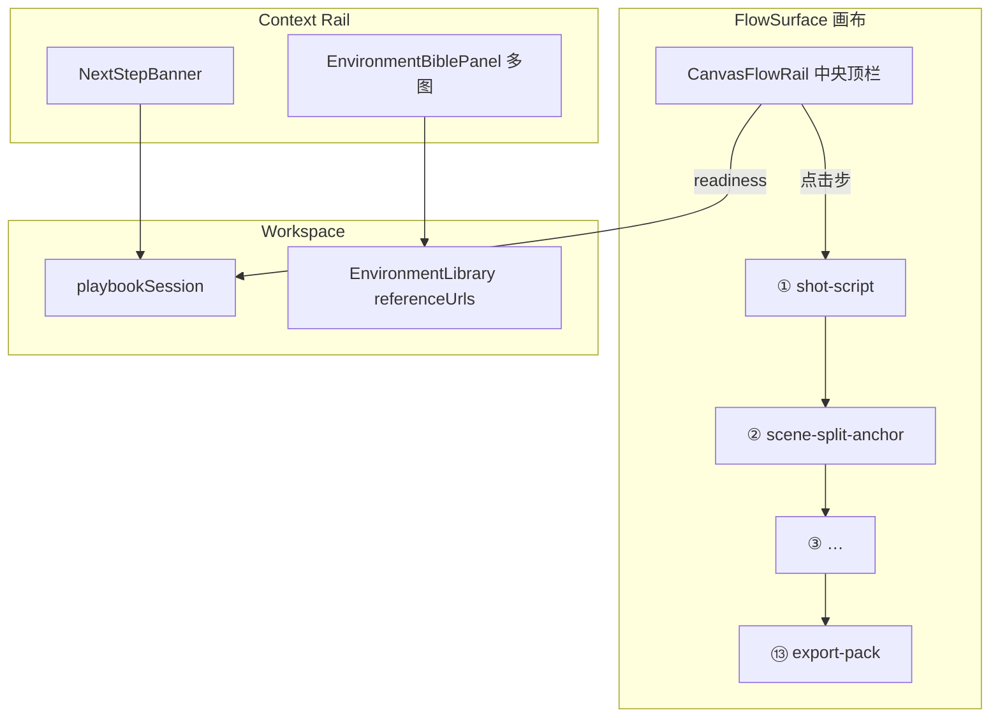

# NX9 画布流程导航 · 环境库多参考图 · 13 步有序管线规范（可执行版）

> **文档性质**：针对 `需求.txt` 三项反馈，给出 **强制实现方案、测试、Bug 修复、完成定义、可拓展性、使用说明**。  
> **读者**：你（验收体验）+ 实现代码的 AI（按 `PIPE-UX-xxx` 任务 ID 施工）。  
> **审计基线**：2026-07-10 · 基于仓库实际代码  
> **关联**：`docs/NX9-13STEP-PRODUCTION-PIPELINE-SPEC.md` · `docs/NX9-WORKFLOW-ORCHESTRATION-SPEC.md` · `packages/shared/src/data/playbook-definitions.ts` · `packages/shared/src/data/workflow-templates.ts`

---

## 0. 需求映射（你提出的 3 点）

| # | 你的原话 | 本文对应章节 | 任务 ID 前缀 |
|---|----------|--------------|--------------|
| **R1** | 场景库也需要上传参考图（多个） | §3.1 环境库多参考图 | `PIPE-UX-ENV-*` |
| **R2** | 流程条移到画布中间顶部；选什么模式展示对应流程；每步对应节点；检测完成状态，未完成打感叹号；自由模式展示自由模式 | §3.2 画布中央流程轨 `CanvasFlowRail` | `PIPE-UX-RAIL-*` |
| **R3** | 13 步使用不连贯；连接线有的没通；节点顺序乱，没有 1→13 依次向后 | §3.3 13 步有序画布模板 + 步骤-节点绑定 | `PIPE-UX-TPL-*` |

### 0.1 给你（人类）— 读完本文你会得到什么

1. **环境库**：每个场景可上传 **最多 6 张**参考图，和角色库、scene-card 节点一致。  
2. **画布顶栏**：选「AI 漫剧 · 真人」后，画布 **正上方中央** 出现 **①–⑬** 步骤条；当前步高亮，已完成打勾，**缺条件显示黄色 `!`**；点步骤可聚焦对应节点。  
3. **13 步画布**：启动 Playbook 后画布上出现 **一条从左到右的 13 节点链**，边全部连通，编号 ①→⑬，不再 merge 三个配方导致重复 `shot-script` 和断链。

### 0.2 给 AI（强制施工守则）

```text
开工前：
  1. 读 §2 现状诊断 — 确认根因与禁止方案
  2. 只改 §5 该 PIPE-UX-xxx 列出的文件（最小 diff）
  3. 新增 readinessKey 必须注册 playbook-readiness.ts + 单测
  4. 改 playbook-definitions / workflow-templates 后同步 §4 对照表
  5. ST-0 typecheck + TEST-PIPE-UX-xxx PASS → docs/test-reports/

禁止：
  - 继续用 bootstrapTemplates merge 3 个 tpl 冒充 13 步管线（根因 BUG-UX-003）
  - PlaybookStepBar 留在 StudioTopBar 占窄条而不迁画布（违反 R2）
  - 环境库只保留单张 referenceImageUrl 不迁移（违反 R1）
  - 步骤完成态只靠 session.completedStepIds，不跑 readiness 实时检测（违反 R2）
```

---

## 1. 现状诊断（代码级）

### 1.1 R1 · 环境库参考图

| 项 | 现状 | 问题 |
|----|------|------|
| 类型 | `EnvironmentProfile.referenceImageUrl?: string`（单张） | 无法表达多角度/日夜/氛围参考 |
| UI | `EnvironmentBiblePanel.tsx` 单 slot 上传，新图 **覆盖**旧图 | 与 `SceneCardBlock.referenceUrls[]`（最多 6 张）不一致 |
| readiness | `has_environment_bibles` 只检查 `envs.length >= 1` | 不检查参考图是否齐全 |
| prompt | `compileScenePrompt` 已支持 `referenceUrls[]` | 环境库未接入数组字段 |

**关键文件**：`packages/shared/src/types/environment.ts` · `EnvironmentBiblePanel.tsx` · `scene-card-prompt.ts`

### 1.2 R2 · 流程条位置与模式展示

| 项 | 现状 | 问题 |
|----|------|------|
| 位置 | `PlaybookStepBar` 嵌在 `StudioTopBar` → `PipelineCapsule` | 在全局顶栏左侧品牌与右侧按钮之间，**不是画布中央** |
| 模式 | 有 Playbook 显示 StepBar；无 Playbook 显示 5 阶段 `PipelineCapsule` | 自由模式与 13 步 **视觉语言不统一** |
| 节点映射 | `PlaybookStepDef` 无 `canvasNodeKinds` / `focusNodeKind` | 步骤与画布节点 **无双向绑定** |
| 感叹号 | 旧 `PipelineCapsule` 五阶段有 `!`；`PlaybookStepBar` **没有** | 用户看不到哪步缺什么 |
| 完成检测 | StepBar 用 `completedStepIds` + `currentIdx` | **不实时**调用 `readinessRegistry` |

**关键文件**：`PlaybookStepBar.tsx` · `PipelineCapsule.tsx` · `StudioTopBar.tsx` · `FlowSurface.tsx`

### 1.3 R3 · 13 步画布不连贯

**根因 `BUG-UX-003`**：`pb-ai-comic-3d` / `pb-ai-comic-live` 的 `bootstrapTemplates` 一次 merge **3 个独立配方**：

```typescript
// playbook-definitions.ts — 当前（有问题）
bootstrapTemplates: [
  { templateId: 'tpl-shot-script-desk', mode: 'merge' },  // shot-script → director-desk → motion-story → export
  { templateId: 'tpl-3d-preview', mode: 'merge' },        // shot-script → director-3d → review-gate → …（重复 shot-script）
  { templateId: 'tpl-sclass-seedance', mode: 'merge' },     // 又一次 shot-script 链
]
```

| 后果 | 说明 |
|------|------|
| 节点重复 | 画布出现 **2–3 个** `shot-script`，用户不知用哪个 |
| 顺序混乱 | `relocateNodeGroup` 把每组模板 **平移堆叠**，不是 ①→⑬ 单链 |
| 边断裂 | 组与组之间 **没有边**；同类型节点跨组不相连 |
| 步骤错位 | Playbook 步 ⑥ 要 `director-3d`，步 ⑨ 要 `motion-story`，但它们在 **不同子链** 上 |
| 批量运行失败 | `run_cascade fromKind: motion-story` 可能命中 **错误实例** 或找不到上游 |

**关键文件**：`playbook-definitions.ts` · `workflow-templates.ts` · `FlowSurface.tsx`（`loadWorkflowTemplate` merge）

### 1.4 三项需求的目标架构



---

## 2. 目标体验（验收标准摘要）

### 2.1 环境库多参考图（R1）

- 每张环境卡：**0–6 张**参考图，网格缩略图，可单张删除。  
- 保存后 `workspace.environments.environments[i].referenceUrls` 持久化。  
- spawn `scene-card` 时带入全部 `referenceUrls`。  
- Playbook 步 ⑤ readiness 升级：至少 1 个环境有 `descriptionZh` **且** `referenceUrls.length >= 1`（可配置为可选，默认 **至少 1 张**）。

### 2.2 画布中央流程轨（R2）

| 模式 | 顶栏展示 | 行为 |
|------|----------|------|
| `pb-ai-comic-3d` / `pb-ai-comic-live` | 13 步胶囊条，居中浮在画布上沿 | 每步：序号 + 短标签 + 状态图标 |
| `pb-viral-short` 等 | 该 Playbook 的 N 步 | 同上 |
| `pb-blank-advanced` / 无 session | **自由模式** 条：`探索 · 从 Dock 拖节点` + 可选 5 阶段迷你点 | 不显示 13 步 |

**状态图标规则**（强制）：

| 状态 | 视觉 | 判定 |
|------|------|------|
| `done` | 绿底 ✓ | `readinessRegistry[step.readinessKey](ctx) === true` |
| `current` | 品牌色圈 + 当前序号 | `step.id === session.currentStepId` |
| `blocked` | 灰圈 + **黄色 `!` 角标** | 序号 ≤ 当前步索引 且 readiness 为 false |
| `future` | 灰圈 + 低透明度 | 序号 > 当前步且前序未全 done |

**交互**：
- 点击 `done` 步 → `focusStepNodes(step)` 平移视口到绑定节点。  
- 点击 `blocked` 步 → 展开 tooltip：缺什么 + 「去修复」执行 `primaryAction`。  
- 点击 `current` 步 → 打开 Rail `NextStepBanner` 对应 CTA。

### 2.3 13 步有序画布（R3）

- 启动 `pb-ai-comic-3d`：**只加载 1 个**模板 `tpl-pipeline-13-3d`（`replace` 空画布）。  
- 画布上 **恰好 13 个节点**（或 13 个逻辑槽位，见 §3.3），`position.x` 按 `stepIndex * 320` 递增，`y` 恒定。  
- **12 条边** 串联，无孤立节点。  
- 每个节点 `data.playbookStepId` + `data.playbookStepIndex`（1–13）写入。  
- `CanvasFlowRail` 与节点双向高亮：hover 步骤 → 对应节点描边；选中节点 → 步骤条闪烁。

---

## 3. 详细设计方案

### 3.1 环境库多参考图（R1）

#### 3.1.1 类型契约（强制）

```typescript
// packages/shared/src/types/environment.ts
export interface EnvironmentProfile {
  id: string;
  sceneCode?: string;
  name: string;
  descriptionZh: string;
  consistencyPrompt?: string;
  era?: string;
  lighting?: string;
  props?: string[];
  /** @deprecated 迁移用，读取时合并到 referenceUrls */
  referenceImageUrl?: string | null;
  /** 多张场景参考图，最多 6 张 */
  referenceUrls?: string[];
  hdriUrl?: string | null;
  meshUrl?: string | null;
}

export const MAX_ENV_REFERENCE_IMAGES = 6;
```

**迁移**（`workspace-document.ts` 或 import v3）：

```typescript
function migrateEnvironmentProfile(env: EnvironmentProfile): EnvironmentProfile {
  const urls = [...(env.referenceUrls ?? [])];
  if (env.referenceImageUrl?.trim() && !urls.includes(env.referenceImageUrl)) {
    urls.unshift(env.referenceImageUrl);
  }
  return { ...env, referenceUrls: urls.slice(0, MAX_ENV_REFERENCE_IMAGES), referenceImageUrl: urls[0] ?? null };
}
```

#### 3.1.2 UI（对齐 SceneCardBlock）

| 组件 | 改动 |
|------|------|
| `EnvironmentBiblePanel.tsx` | 用 `ImageUploadSlot` + 3 列网格；`addRef` / `removeRef`；达 6 张禁用上传 |
| `BacklotLibraryPanel`（若有环境 Tab） | 同步多图 UI |

#### 3.1.3 readiness 升级

```typescript
// playbook-readiness.ts
export function has_environment_bibles(ctx: PlaybookReadinessContext): boolean {
  const envs = (ctx.environments ?? []) as EnvironmentProfile[];
  if (envs.length < 1) return false;
  // 至少 1 条有描述 + 至少 1 张参考图
  return envs.some(
    (e) => (e.descriptionZh?.trim() ?? '') !== '' && (e.referenceUrls?.length ?? 0) >= 1,
  );
}
```

`has_environment_bibles` 增加 **软模式** 参数（可拓展）：`requireReferenceImages?: boolean` 默认 `true`。

#### 3.1.4 下游注入

| 消费方 | 改动 |
|--------|------|
| `EnvironmentBiblePanel.handleSpawnSceneCard` | `referenceUrls: env.referenceUrls ?? []` |
| `flow-runner` / `picture-gen` 场景 prompt | 从 `environments` 按 `shot.sceneCode` 取 `referenceUrls[0]` 作 img2img |
| `agent extract-environments` | 返回 `referenceUrls: []`，由用户上传 |

---

### 3.2 画布中央流程轨 `CanvasFlowRail`（R2）

#### 3.2.1 组件职责

| 组件 | 位置 | 职责 |
|------|------|------|
| `CanvasFlowRail.tsx` | `FlowSurface` 内 `absolute top-3 left-1/2 -translate-x-1/2 z-20` | 模式步骤条 + 状态 + `!` |
| `PlaybookStepBar.tsx` | **废弃** 或薄包装调用 `CanvasFlowRail` | 避免双份 UI |
| `PipelineCapsule.tsx` | 仅 `!session` 时由 `CanvasFlowRail` 内嵌「自由模式」子视图 | 不再占 `StudioTopBar` |
| `StudioTopBar.tsx` | 移除 `<PipelineCapsule />` | 顶栏只保留 ModeCapsule + ProductionWall |

#### 3.2.2 PlaybookStepDef 扩展

```typescript
// playbook-definitions.ts
export interface PlaybookStepDef {
  id: string;
  label: string;
  shortLabel?: string;           // 顶栏用，如「剧本」「场次」
  description: string;
  readinessKey: string;
  primaryAction: PlaybookStepAction;
  /** 本步绑定的画布节点 kind（用于聚焦/高亮/校验） */
  canvasNodeKinds?: string[];
  /** 本步在 13 步模板中的序号 1–13 */
  stepIndex?: number;
  verifyHint: string;
  optional?: true;
}
```

#### 3.2.3 步骤状态引擎 `evaluateStepVisualState`

```typescript
// packages/shared/src/utils/playbook-step-visual.ts（新建）
export type StepVisualState = 'done' | 'current' | 'blocked' | 'future';

export function evaluateStepVisualState(
  step: PlaybookStepDef,
  index: number,
  session: PlaybookSession,
  ctx: PlaybookReadinessContext,
): StepVisualState {
  const ready = readinessRegistry[step.readinessKey]?.(ctx) ?? false;
  const currentIdx = session.currentStepId
    ? playbook.steps.findIndex((s) => s.id === session.currentStepId)
    : 0;

  if (ready) return 'done';
  if (index === currentIdx) return 'current';
  if (index < currentIdx) return 'blocked';  // 应显示 !
  return 'future';
}
```

#### 3.2.4 步骤 → 节点聚焦

```typescript
// apps/web/src/engine/playbook-focus.ts（新建）
export function focusStepNodes(step: PlaybookStepDef, runtime: FlowRuntime): void {
  const kinds = step.canvasNodeKinds ?? [];
  const nodes = runtime.getNodes().filter(
    (n) => kinds.includes(n.type ?? '') || n.data?.playbookStepId === step.id,
  );
  if (nodes.length === 0) {
    // fallback: execute primaryAction 里 focus_block / open_rail
    return;
  }
  runtime.fitViewToNodes(nodes.map((n) => n.id));
  runtime.highlightNodes(nodes.map((n) => n.id), { durationMs: 1200 });
}
```

#### 3.2.5 自由模式 UI

当 `playbookId === 'pb-blank-advanced'` 或 `session === null`：

```text
┌─────────────────────────────────────────────────────┐
│  自由模式 · 从左侧 Dock 拖入节点，或 ⌘K 搜索命令      │
│  ○剧本 ○分镜 ○生成 ○配音 ○导出  （5 阶段迷你，可选）   │
└─────────────────────────────────────────────────────┘
```

复用 `computeStageReadiness` + 迷你 `!` 逻辑，**宽度与 13 步条一致**，保持视觉统一。

#### 3.2.6 样式 Token

```css
/* apps/web/src/styles/canvas-flow-rail.css 或 tailwind @layer */
--nx9-flow-rail-top: 12px;
--nx9-flow-rail-max-width: min(960px, 92vw);
--nx9-flow-rail-bg: rgba(255,255,255,0.92);
--nx9-flow-rail-shadow: 0 4px 24px rgba(0,0,0,0.08);
--nx9-step-warn: #D97706;  /* ! 角标 */
```

---

### 3.3 13 步有序画布模板（R3）

#### 3.3.1 新模板 SSOT（禁止再 merge 三配方）

新增 **唯一** 引导模板，Playbook `bootstrapTemplates` 改为：

```typescript
// pb-ai-comic-3d
bootstrapTemplates: [{ templateId: 'tpl-pipeline-13-3d', mode: 'replace' }],

// pb-ai-comic-live
bootstrapTemplates: [{ templateId: 'tpl-pipeline-13-live', mode: 'replace' }],
```

#### 3.3.2 `tpl-pipeline-13-3d` 节点链（强制顺序）

| 步 | stepIndex | 节点 kind | 说明 | 出边 → |
|----|-----------|-----------|------|--------|
| ① | 1 | `shot-script` | 剧本文本入口 | ② |
| ② | 2 | `text-chunker` | 场次拆分锚点（Rail SceneSplit 写回 scriptPlan） | ③ |
| ③ | 3 | `story-grid` | 分镜表/故事板网格 | ④ |
| ④ | 4 | `character-sheet` | 角色 Bible | ⑤ |
| ⑤ | 5 | `scene-card` | 环境 Bible（多参考图） | ⑥ |
| ⑥ | 6 | `director-3d` | 3D 机位 | ⑦ |
| ⑦ | 7 | `picture-gen` | 关键帧生成 | ⑧ |
| ⑧ | 8 | `review-gate` | 关键帧审阅（`data.gateMode: 'keyframe'`） | ⑨ |
| ⑨ | 9 | `motion-story` | Seedance 视频 | ⑩ |
| ⑩ | 10 | `continuity-check` | 连贯修复 | ⑪ |
| ⑪ | 11 | `clip-editor` | Episode Studio 时间线锚点 | ⑫ |
| ⑫ | 12 | `review-gate` | 成片审阅（`data.gateMode: 'video'`） | ⑬ |
| ⑬ | 13 | `export-pack` | 导出 | — |

**布局常量**：

```typescript
const PIPELINE_DX = 280;
const PIPELINE_Y = 200;
// col = stepIndex - 1
position: { x: 80 + col * PIPELINE_DX, y: PIPELINE_Y }
```

每个节点 `data`：

```typescript
{
  playbookStepId: 'script' | 'scene-split' | ... ,
  playbookStepIndex: 1..13,
  status: 'idle',
  blockIndex: stepIndex,
}
```

#### 3.3.3 `tpl-pipeline-13-live` 差异（仅步 ⑥⑨）

| 步 | 3D | 真人 |
|----|-----|------|
| ⑥ | `director-3d` | `director-desk` |
| ⑨ | `motion-story`（`sclassEnabled: true`） | `clip-gen` |

其余 11 步节点 **完全相同**。

#### 3.3.4 边连接规范

```typescript
function pipelineEdge(source: FlowBlock, target: FlowBlock): FlowLink {
  return {
    id: uid('pipe-e'),
    source: source.id,
    target: target.id,
    sourceHandle: 'out',
    targetHandle: 'in',
  };
}
```

**强制**：`build()` 返回的 `links.length === blocks.length - 1`，且拓扑序与 `stepIndex` 一致。

#### 3.3.5 Playbook 步骤与节点 kind 对照表

在 `playbook-definitions.ts` 为 13 步逐步填入 `canvasNodeKinds` + `stepIndex`：

| step.id | canvasNodeKinds | stepIndex |
|---------|-----------------|-----------|
| `script` | `['shot-script']` | 1 |
| `scene-split` | `['text-chunker']` | 2 |
| `storyboard` | `['story-grid']` | 3 |
| `character-bible` | `['character-sheet']` | 4 |
| `environment-bible` | `['scene-card']` | 5 |
| `camera-3d` / `camera-live` | `['director-3d']` / `['director-desk']` | 6 |
| `keyframe-gen` | `['picture-gen']` | 7 |
| `keyframe-review` | `['review-gate']`（gateMode=keyframe） | 8 |
| `video-gen` | `['motion-story']` / `['clip-gen']` | 9 |
| `consistency` | `['continuity-check']` | 10 |
| `episode-studio` | `['clip-editor']` | 11 |
| `review-gate` | `['review-gate']`（gateMode=video） | 12 |
| `export` | `['export-pack']` | 13 |

#### 3.3.6 `review-gate` 双实例区分

同一画布两个 `review-gate` 必须通过 `data.gateMode` 区分：

```typescript
node('review-gate', 7, 0, { gateMode: 'keyframe', label: '关键帧审阅' })
node('review-gate', 11, 0, { gateMode: 'video', label: '成片审阅' })
```

`playbook-readiness` / `flow-runner` 按 `gateMode` 匹配步骤 ⑧ vs ⑫。

#### 3.3.7 启动流程改造

```typescript
// FlowSurface.tsx — onStartPlaybook
onStartPlaybook={(playbookId) => {
  const def = PLAYBOOK_DEFINITIONS.find((p) => p.id === playbookId);
  if (!def) return;
  useWorkspaceDocument.getState().startPlaybook(playbookId);
  if (def.bootstrapTemplates.length > 0) {
    // 只 load 第一个 replace 模板
    void loadWorkflowTemplate(def.bootstrapTemplates[0].templateId, 'replace');
  }
  setRecipePickerDismissed(true);
}}
```

**禁止**：对 `bootstrapTemplates` 做 `for` 循环 merge。

---

## 4. 13 步 · 逐步使用说明（人类）

> 配合画布中央步骤条 + 右侧 NextStepBanner 使用。

| 步 | 你要做什么 | 画布节点 | 右侧入口 |
|----|------------|----------|----------|
| ① | 粘贴剧本，点「保存并继续」 | `shot-script` | Rail › script |
| ② | AI 场次拆分，确认写入 | `text-chunker`（锚点） | script › 场次拆分 |
| ③ | 生成分镜表 → 故事板 | `story-grid` | storyboard |
| ④ | 提取角色，填六层 + 参考图 | `character-sheet` | library › character |
| ⑤ | 生成环境卡，**上传多张参考图** | `scene-card` | library › 环境 |
| ⑥ | 3D/导演台摆机位 | `director-3d` / `director-desk` | 3D 导演台 |
| ⑦ | 批量生成关键帧 | `picture-gen` | 批量运行 |
| ⑧ | 审阅静帧，全部 approve | `review-gate`（关键帧） | 审片模式 |
| ⑨ | Seedance/clip 出视频 | `motion-story` / `clip-gen` | 批量运行 |
| ⑩ | 连贯检查，处理 issues | `continuity-check` | Inspector |
| ⑪ | Episode Studio 预览时间线 | `clip-editor` | 成片面板 |
| ⑫ | 成片批审 + review-gate 通过 | `review-gate`（成片） | 审片模式 |
| ⑬ | export-pack 下载 | `export-pack` | 聚焦节点 |

**感叹号含义**：该步 readiness 未满足（例如步 ⑤ 缺参考图）— 点击看缺什么并跳转修复。

---

## 5. 任务清单（PIPE-UX-xxx）

| ID | 优先级 | 需求 | 任务 | 关键文件 | 状态 |
|----|--------|------|------|----------|------|
| **PIPE-UX-ENV-001** | P0 | R1 | `EnvironmentProfile.referenceUrls` + 迁移 | `environment.ts` · `workspace-document.ts` | pending |
| **PIPE-UX-ENV-002** | P0 | R1 | `EnvironmentBiblePanel` 多图 UI（≤6） | `EnvironmentBiblePanel.tsx` | pending |
| **PIPE-UX-ENV-003** | P0 | R1 | `has_environment_bibles` 检查 referenceUrls | `playbook-readiness.ts` | pending |
| **PIPE-UX-ENV-004** | P1 | R1 | spawn scene-card / prompt 注入多图 | `EnvironmentBiblePanel` · `flow-runner` | pending |
| **PIPE-UX-RAIL-001** | P0 | R2 | 新建 `CanvasFlowRail.tsx` | `stage-deck/chrome/CanvasFlowRail.tsx` | pending |
| **PIPE-UX-RAIL-002** | P0 | R2 | 迁入 `FlowSurface`，居中浮层 | `FlowSurface.tsx` | pending |
| **PIPE-UX-RAIL-003** | P0 | R2 | `evaluateStepVisualState` + `!` 角标 | `playbook-step-visual.ts` | pending |
| **PIPE-UX-RAIL-004** | P0 | R2 | `PlaybookStepDef` 扩展 canvasNodeKinds/stepIndex | `playbook-definitions.ts` | pending |
| **PIPE-UX-RAIL-005** | P0 | R2 | `focusStepNodes` 点击步聚焦节点 | `playbook-focus.ts` · `flow-runtime.ts` | pending |
| **PIPE-UX-RAIL-006** | P1 | R2 | 从 `StudioTopBar` 移除 PipelineCapsule | `StudioTopBar.tsx` | pending |
| **PIPE-UX-RAIL-007** | P1 | R2 | 自由模式条（pb-blank / 无 session） | `CanvasFlowRail.tsx` | pending |
| **PIPE-UX-TPL-001** | P0 | R3 | 新建 `tpl-pipeline-13-3d` 单链 13 节点 | `workflow-templates.ts` | pending |
| **PIPE-UX-TPL-002** | P0 | R3 | 新建 `tpl-pipeline-13-live` | `workflow-templates.ts` | pending |
| **PIPE-UX-TPL-003** | P0 | R3 | playbook bootstrap 改单模板 replace | `playbook-definitions.ts` | pending |
| **PIPE-UX-TPL-004** | P0 | R3 | 节点 `playbookStepId/Index` 写入模板 build | `workflow-templates.ts` | pending |
| **PIPE-UX-TPL-005** | P1 | R3 | `review-gate` gateMode 双实例 + runner | `flow-runner.ts` · `ReviewGateBlock` | pending |
| **PIPE-UX-TPL-006** | P1 | R3 | FlowSurface 启动只 load 一次 replace | `FlowSurface.tsx` · `CommandPalette.tsx` | pending |
| **PIPE-UX-TPL-007** | P2 | R3 | 步骤 hover ↔ 节点高亮联动 | `CanvasFlowRail` · `FlowSurface` | pending |

**建议施工顺序**：`TPL-001/002/003` → `RAIL-001~005` → `ENV-001~003` → 其余 P1/P2。

---

## 6. 测试要求（AI 自测 → 你才能手动测）

### 6.1 自测门禁

```text
ST-0: npm run build -w @nx9/shared && npm run typecheck -w @nx9/web
全部 TEST-PIPE-UX-xxx PASS 后，在 docs/test-reports/TEST-PIPE-UX-RUN-<date>.md 记录
```

### 6.2 用例表

| TEST ID | 覆盖 | 步骤（AI 执行） | 期望 |
|---------|------|-----------------|------|
| **TEST-PIPE-UX-ENV-001** | R1 | 创建 env，`referenceUrls` 3 张，save/load workspace | 往返 3 张不丢 |
| **TEST-PIPE-UX-ENV-002** | R1 | 上传第 7 张 | UI 拒绝或替换策略明确 |
| **TEST-PIPE-UX-ENV-003** | R1 | 0 参考图调用 `has_environment_bibles` | false |
| **TEST-PIPE-UX-RAIL-001** | R2 | mount `CanvasFlowRail`，mock session 步 ⑤ current | 步 ⑤ 品牌色，步 ①–④ 有 ! 或 ✓ 符合 readiness |
| **TEST-PIPE-UX-RAIL-002** | R2 | 点击步 ⑦ done | `fitViewToNodes` 被调用且 target kind=picture-gen |
| **TEST-PIPE-UX-RAIL-003** | R2 | `pb-blank-advanced` | 显示「自由模式」非 13 步 |
| **TEST-PIPE-UX-RAIL-004** | R2 | `StudioTopBar` 快照 | 无 PlaybookStepBar 文本 |
| **TEST-PIPE-UX-TPL-001** | R3 | `tpl-pipeline-13-3d.build()` | blocks=13, links=12, stepIndex 1..13 单调 |
| **TEST-PIPE-UX-TPL-002** | R3 | 启动 pb-ai-comic-3d | 仅 1 个 shot-script，无重复 |
| **TEST-PIPE-UX-TPL-003** | R3 | 拓扑排序 edges | 与 stepIndex 完全一致 |
| **TEST-PIPE-UX-TPL-004** | R3 | `run_cascade motion-story` | 命中步 ⑨ 节点，上游 picture-gen 已连 |
| **TEST-PIPE-UX-E2E-001** | 全流程 | Playwright：选真人 13 步 → 步条可见 → 画布 13 节点横排 | 截图比对 |

### 6.3 假数据 FIXTURE

```typescript
// apps/server/test/fixtures-pipe-ux.ts（新建）
export const FIXTURE_ENV_MULTI_REF = {
  id: 'env-cafe-night',
  name: '深夜咖啡厅',
  sceneCode: 'S01',
  descriptionZh: '霓虹反射的雨后街道，暖色室内光',
  referenceUrls: [
    '/media/images/fixture-env-cafe-1.png',
    '/media/images/fixture-env-cafe-2.png',
    '/media/images/fixture-env-cafe-3.png',
  ],
};

export const FIXTURE_PIPELINE_13_NODE_KINDS = [
  'shot-script', 'text-chunker', 'story-grid', 'character-sheet', 'scene-card',
  'director-3d', 'picture-gen', 'review-gate', 'motion-story', 'continuity-check',
  'clip-editor', 'review-gate', 'export-pack',
];
```

### 6.4 手动测试脚本（你一键走查）

```text
【手动 · 约 20 分钟冒烟】

1. 空画布 → 选「AI 漫剧 · 真人」
   ✓ 画布正上方出现 13 步条（不是顶栏 Logo 旁）
   ✓ 画布 13 个节点从左到右一排，箭头全连

2. 看步 ⑤「环境」带 !
   → Rail 打开环境库 → 生成环境卡 → 上传 3 张参考图 → 保存
   ✓ 步 ⑤ ! 消失变 ✓

3. 故意跳过步 ②，强行点步 ③
   ✓ 步 ② 显示 !，tooltip 提示「先完成场次拆分」

4. 选「自由模式」
   ✓ 步骤条变为「自由模式」文案，无 ①–⑬

5. 刷新页面
   ✓ 步骤条状态与参考图数量保持
```

---

## 7. Bug 修复清单

| Bug ID | 现象 | 根因 | 修复任务 | 回归 TEST |
|--------|------|------|----------|-----------|
| **BUG-UX-001** | 环境库只能一张图 | 单字段 `referenceImageUrl` | PIPE-UX-ENV-001/002 | TEST-PIPE-UX-ENV-001 |
| **BUG-UX-002** | 步骤条在顶栏挤成一团 | `PlaybookStepBar` 在 `StudioTopBar` | PIPE-UX-RAIL-001/002/006 | TEST-PIPE-UX-RAIL-004 |
| **BUG-UX-003** | 13 步画布重复 shot-script、无边 | merge 3 个 bootstrapTemplates | PIPE-UX-TPL-001~003 | TEST-PIPE-UX-TPL-002 |
| **BUG-UX-004** | 步骤无 ! 不知缺什么 | StepBar 不看 readiness | PIPE-UX-RAIL-003 | TEST-PIPE-UX-RAIL-001 |
| **BUG-UX-005** | 点步骤无法找到节点 | 无 canvasNodeKinds | PIPE-UX-RAIL-004/005 | TEST-PIPE-UX-RAIL-002 |
| **BUG-UX-006** | 两个 review-gate 混淆 | 无 gateMode | PIPE-UX-TPL-005 | TEST-PIPE-UX-TPL-004 |

---

## 8. 完成定义（DoD）

### 8.1 总完成（三项全满足才可标 **PIPE-UX-DONE**）

| # | 条件 | 验证 |
|---|------|------|
| 1 | 环境库多图 ≤6，持久化，spawn 带入 | TEST-PIPE-UX-ENV-* |
| 2 | `CanvasFlowRail` 在画布中央，13 步/自由模式切换，有 `!` | TEST-PIPE-UX-RAIL-* |
| 3 | 单模板 13 节点有序全连通 | TEST-PIPE-UX-TPL-* |
| 4 | `docs/test-reports/TEST-PIPE-UX-RUN-*.md` 全 PASS | 文件存在 |
| 5 | 更新 `NX9-13STEP` §2.1 备注「画布有序模板已落地」 | 文档一致 |

### 8.2 分项 DoD

**R1 环境库**：`has_environment_bibles` 在缺图时 false；Panel 与 SceneCard 交互一致。  
**R2 流程轨**：顶栏无步骤条；当前步/! /✓ 与 readiness 实时一致（≤2s 内随 workspace 更新）。  
**R3 有序管线**：`pb-ai-comic-3d` 启动后 `getNodes().filter(n=>n.type==='shot-script').length === 1`。

---

## 9. 可拓展性

| 方向 | 做法 |
|------|------|
| 新 Playbook（如 7 步短视频） | 在 `PLAYBOOK_DEFINITIONS` 加 steps + 可选 `tpl-pipeline-7-viral` 单链模板 |
| 步骤条样式主题 | `CanvasFlowRail` 读 `canvasAppearance.theme` |
| 环境 HDRI 预览 | `EnvironmentProfile.hdriUrl` 已在类型中，Panel 加 HDR 上传槽 |
| 步 ② 专用节点 | 将 `text-chunker` 换成 `scene-split-block`（未来节点）只需改模板 kind |
| 企业版多集 | `stepIndex` 不变，按 `activeEpisode` 过滤 Rail 数据，步骤条仍 13 步 |
| 移动端 | `CanvasFlowRail` 步标签折叠为仅序号，横向 scroll |

---

## 10. 文档索引与分工

| 文档 | 分工 |
|------|------|
| **本文** | R1 多参考图 + R2 画布流程轨 + R3 有序 13 节点模板 |
| `NX9-13STEP-PRODUCTION-PIPELINE-SPEC.md` | 每步业务逻辑、API、Rail 面板、readiness 细则 |
| `NX9-WORKFLOW-ORCHESTRATION-SPEC.md` | Playbook 体系、入口收敛、NextStepBanner |
| `NX9-CAPABILITY-AUDIT-SPEC.md` | 全局能力成熟度总表 |

---

## 11. 给 AI 的一页纸开工顺序

```text
Phase A — 止血（R3）
  PIPE-UX-TPL-001/002/003/004 → 单链模板 + replace 启动

Phase B — 可见（R2）
  PIPE-UX-RAIL-001~005 → CanvasFlowRail 居中 + ! + 聚焦

Phase C — 数据（R1）
  PIPE-UX-ENV-001~003 → 多参考图 + readiness

Phase D — 打磨
  PIPE-UX-TPL-005~007, PIPE-UX-RAIL-006/007, PIPE-UX-ENV-004

每项：改文件 → 单测 → typecheck → test-report → 更新 §5 状态列
```

---

*文档版本：2026-07-10 · 对应需求 `需求.txt` L1–L3*
