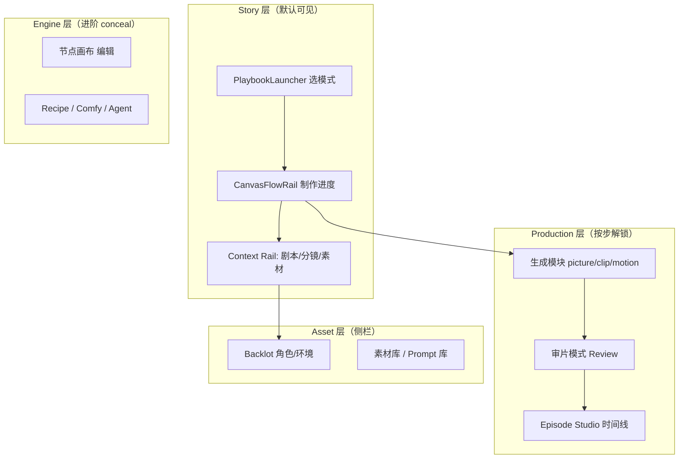

# NX9 产品重构总规范（Product Refactor · 可执行版）

> **文档性质**：将 `Product Optimization.md`（2321 行 PRD）提炼为 **AI 可施工 + 人类可验收** 的总 SSOT。每条需求绑定：**强制方案、测试、Bug 修复、完成定义、可拓展、用法**。  
> **读者**：你（定方向、验收体验）+ 实现代码的 AI（按 `PO-xxx` 任务 ID 施工）。  
> **审计基线**：2026-07-10 · 对照仓库实际代码 + `Product Optimization.md`  
> **源文档**：`Product Optimization.md`  
> **关联专项**：`docs/NX9-PIPELINE-CANVAS-FLOW-SPEC.md` · `docs/NX9-13STEP-PRODUCTION-PIPELINE-SPEC.md` · `docs/NX9-WORKFLOW-ORCHESTRATION-SPEC.md` · `docs/NX9-CAPABILITY-AUDIT-SPEC.md`

---

## 0. 如何使用本文档

### 0.1 给你（人类）

1. **§1 产品宪法** — 以后任何人改 NX9 都不能违反的红线。  
2. **§2 定位与心智** — 我们做的是「AI 漫剧创作工作室」，不是 Workflow 编辑器。  
3. **§3 问题对照表** — PRD 20 条问题 → 当前代码状态 → 还差什么。  
4. **§6 分阶段路线图** — 先 P0 闭环，再 P1 体验，P2+ 平台能力。  
5. **§8 手动走查脚本** — 20 分钟冒烟，验证「第一次进入 30 秒知道干什么」。

### 0.2 给 AI（强制）

```text
开工前：
  1. 读 §1 宪法 + §3 该域「现状」列
  2. 只改 §7 该 PO-xxx 列出的文件（最小 diff）
  3. 遵守 §12 代码质量上限（组件 ≤300 行、无页面直调 API）
  4. ST-0 typecheck + TEST-PO-xxx PASS → docs/test-reports/
  5. 更新 §3 完成度 % 与 §7 状态列

禁止：
  - 新增按钮不删旧入口（违反宪法 §1.2）
  - 步骤条/状态多处维护（违反 SSOT 原则）
  - 默认展开高级参数（违反渐进式展示）
  - 为展示能力增加 Dock 节点而不 conceal
```

---

## 1. 产品宪法（Product Constitution）

> 摘自 `Product Optimization.md` 末章，**具有最高优先级**，与所有 Spec 冲突时以本章为准。

### 1.1 🚫 永远不要

| # | 红线 | 验收方式 |
|---|------|----------|
| C1 | 为增加功能而增加按钮 | 每 PR 说明「删除了哪个入口」 |
| C2 | 默认展示高级选项（LoRA/Provider/Workflow 编辑） | 新用户首屏截图审计 |
| C3 | 让用户填写 AI 能推断的字段 | 角色/环境创建 ≤3 个必填项 |
| C4 | 超过三级操作路径完成主任务 | 剧本→导出 主路径 ≤3 层点击/步 |
| C5 | 两个入口做同一件事 | §3 入口收敛表无重复 |
| C6 | 单页承担两种不同任务（Story + Production 混排） | 页面职责表 PASS |
| C7 | 向用户暴露技术词（Node/Prompt/Execute/Dependency） | §2.2 用户词典覆盖 UI 文案 |
| C8 | 等待无反馈（仅 Loading…） | 生成任务必须有队列 UI |
| C9 | 让用户自己找下一步 | Playbook + CanvasFlowRail + NextStepBanner 三件套 |
| C10 | 硬编码模式/步骤/连线 | 必须走 `PlaybookDefinition` / 未来 `workflow.schema.json` |

### 1.2 ✅ 永远坚持

| # | 原则 | 实现锚点 |
|---|------|----------|
| P1 | 一个页面一个核心任务 | §5 四层 UI |
| P2 | 一个步骤一个明确目标 | `PlaybookStepDef.verifyHint` |
| P3 | AI 优先，用户确认 | Script Studio / 一键开拍 / Agent 预留 |
| P4 | 默认简单，按需高级 | `concealed: true` + Settings |
| P5 | 自动化 > 配置化 > 硬编码 | Playbook `primaryAction` |
| P6 | 每步即时反馈 | Take 缩略图 / Toast / 步完成动画 |
| P7 | 可中断、恢复、重试 | Queue + Retry（§7 PO-TASK） |
| P8 | 状态 SSOT | `workspace-document` + `playbook-readiness` |
| P9 | 流程可回溯 | Undo + Version（§7 PO-VER） |

**30 秒测试**：新用户空画布进入 → 能否只说「我在写一部漫剧的第 X 步」？否则重新设计。

---

## 2. 产品定位与用户心智

### 2.1 统一定位

```text
对外：AI 漫剧创作工作室（AI Story Studio）
对内：Story-first UI + Workflow Engine 底层
```

**Workflow / Node / API** 仅对进阶用户可见（CommandPalette、`pb-blank-advanced`）。

### 2.2 用户词典（UI 文案强制替换）

| 禁止 | 改为 | 适用范围 |
|------|------|----------|
| Node / 节点 | **步骤** / **模块** | 用户可见文案 |
| Workflow | **创作流程** | Launcher、设置 |
| Prompt | **AI 描述** | Block 标签 |
| Asset | **素材** | 库、导出 |
| Execute / Run | **开始生成** | 按钮 |
| Dependency | （不展示） | 仅开发者日志 |
| Provider | **AI 模型** | 设置抽屉 |
| Pipeline | **制作进度** | 顶栏/画布条 |

### 2.3 产品边界（新增功能必答）

| 域 | 职责 | 示例 |
|----|------|------|
| **Story** | 剧本、场次、分镜、角色、环境 | Script Studio、Storyboard |
| **Production** | 图/视/音生成、审阅、时间线 | picture-gen、Episode Studio |
| **Asset** | 素材库、Prompt 库、模型 | Backlot、Library Rail |
| **Engine** | 画布、Runner、Recipe | Stage Deck（进阶 conceal） |
| **Project** | 项目、版本、协作、额度 | Dashboard（待建） |

**不属于以上域 → 禁止默认上画布。**

### 2.4 数据心智（目标模型）

```text
Project → Story → Scene → Shot → Asset → Task → Output
```

| 层级 | 当前 NX9 映射 | 缺口 |
|------|---------------|------|
| Project | `workspace` + `WorkspacePayload` | 无 Draft/Generating/Exported 状态机 |
| Story | `storyboard.title` + `scriptPlan` | 弱绑定 |
| Scene | `SceneSplitRecord` + `EnvironmentProfile` | 画布非 Scene 分组 |
| Shot | `StoryboardShot` | ok |
| Asset | Take Store + `media` URLs | 无统一 Asset Manager |
| Task | flow-runner batch（内存） | 无 Task Center / 持久队列 |
| Output | export-pack + timeline | partial |

---

## 3. PRD 问题 → 代码现状 → 缺口（总对照表）

| PRD # | 问题摘要 | 现状评级 | 完成 % | 已有能力 | 缺口 / 任务 |
|-------|----------|----------|--------|----------|-------------|
| 1 | 像 Workflow 编辑器不像漫剧工具 | partial | 45% | PlaybookLauncher、CanvasFlowRail | Scene 中心画布、用户词典未全量替换 **PO-UI-001** |
| 2 | 无主流程/无视觉焦点 | partial | 55% | Playbook + NextStepBanner + CanvasFlowRail | 首屏仍信息过载；需渐进式首屏 **PO-FLOW-002** |
| 3 | 信息密度过高 | partial | 40% | Production 模式折叠卡片 | 默认应只显示当前步相关 **PO-UI-003** |
| 4 | 顶栏步骤不参与流程 | partial | 70% | CanvasFlowRail + readiness + `!` | 缺 6 态状态机、自动 advance、错误红态 **PO-FLOW-001** |
| 5 | 模式切换画布不变 | partial | 65% | `tpl-pipeline-13-*` 单链 | 动漫 11 步、模式动态 schema 未做 **PO-FLOW-003** |
| 6 | 非配置驱动 Workflow | partial | 50% | `playbook-definitions.ts` | 无统一 `workflow.schema.json`、画布动态生成 **PO-SCH-001** |
| 7 | 节点无依赖/门禁 | partial | 35% | review-gate、cascade 拓扑 | 无统一 Node Dependency Engine **PO-NODE-001** |
| 8 | 无完成感 | missing | 20% | Toast、部分 Take 预览 | 步完成动画、人物墙、瀑布流 **PO-UX-001** |
| 9 | 节点像后台表单 | partial | 45% | CharacterSheet 卡片化 | 环境/Prompt 仍表单风 **PO-UI-004** |
| 10 | 画布利用率低 | partial | 55% | pipeline 横排 13 节点 | Scene 分组布局、auto-fit **PO-LAY-001** |
| 11 | 非 Storyboard 中心 | partial | 40% | StoryboardPanel、Rail | 画布应 Scene 分组而非 node 链 **PO-STORY-001** |
| 12 | 缺时间轴 | partial | 55% | Timeline v2、Episode Studio | Scene Timeline UI、字幕/配音轨 **PO-TIME-001** |
| 13 | 状态管理差 | partial | 50% | block `data.status` | 统一 6 态 + SSOT **PO-STATE-001** |
| 14 | 无自动推进 | partial | 60% | `advancePlaybookStep` | 剧本完成未自动跳步 **PO-FLOW-004** |
| 15 | 无全局任务系统 | missing | 10% | ProductionWall 批量进度 | Task Center Rail **PO-TASK-001** |
| 16 | 检查中心无价值 | partial | 35% | NextStepBanner 缺什么 | 真检查：缺参考图/API 失败 **PO-CHK-001** |
| 17 | 缺自动保存 | ok | 80% | workspace persist debounce | 输入 300ms debounce 未全覆盖 **PO-VER-001** |
| 18 | 缺项目状态 | missing | 5% | — | Draft/Generating/Completed **PO-PROJ-001** |
| 19 | 生成过程不可视 | partial | 40% | batchProgress 顶栏 | 队列/剩余/失败数 **PO-TASK-002** |
| 20 | 无产品节奏 | missing | 15% | — | 分步高潮 UI **PO-UX-002** |

**加权整体（产品体验层）**：约 **42%** — 能力齐全，**体验与架构 SSOT 仍是大缺口**。

---

## 4. 目标架构（四层 UI + 五层状态）

### 4.1 四层 UI（页面职责）



**默认首屏（渐进式）**：仅 `PlaybookLauncher` 或 **当前步 1 个 CTA** + `CanvasFlowRail` + 收窄后的 Rail。

### 4.2 五层状态机（SSOT）

| 层 | 枚举 | 存储位置 | 任务 |
|----|------|----------|------|
| **Project** | `draft \| generating \| paused \| completed \| exported \| archived` | `WorkspacePayload.projectStatus` | PO-PROJ-001 |
| **Workflow** | `idle \| running \| blocked \| done \| error` | `playbookSession.workflowStatus` | PO-FLOW-001 |
| **Step** | `pending \| active \| done \| error \| waiting \| skipped` | `evaluateStepVisualState` 扩展 | PO-FLOW-001 |
| **Node** | `idle \| running \| success \| error \| waiting \| skip` | `block.data.executionStatus` | PO-STATE-001 |
| **Task** | `queued \| running \| failed \| cancelled \| done` | `task-queue.store`（新建） | PO-TASK-001 |

**禁止**：组件内 `useState` 维护与上表重复的「完成/进行中」。

### 4.3 配置驱动 Workflow Schema（Phase 2）

```typescript
// packages/shared/src/schema/workflow.schema.ts（目标）
export interface WorkflowSchemaV1 {
  workflowId: string;
  mode: 'live-13' | 'anime-11' | 'free';
  steps: Array<{
    id: string;
    title: string;
    icon: string;
    status: StepStatus;
    dependencies: string[];
    next?: string | null;
    allowSkip?: boolean;
    required?: boolean;
    component: string;        // Rail panel / canvas kind
    readinessKey: string;
  }>;
  nodes: Array<{ id: string; kind: string; stepId: string; col: number }>;
  edges: Array<{ from: string; to: string }>;
  validations: Record<string, string>;
}
```

**迁移路径**：`PLAYBOOK_DEFINITIONS` → 生成 `WorkflowSchemaV1` → 长期 SSOT 为 JSON（可热更新）。

---

## 5. 与现有专项文档的分工

| 文档 | 覆盖 PO 域 |
|------|------------|
| `NX9-PIPELINE-CANVAS-FLOW-SPEC.md` | PO-FLOW 画布步骤条、13 步单链、环境多参考图 **（大部分已落地）** |
| `NX9-13STEP-PRODUCTION-PIPELINE-SPEC.md` | 13 步每步 API/Rail/readiness |
| `NX9-WORKFLOW-ORCHESTRATION-SPEC.md` | Playbook、入口收敛、NextStepBanner |
| `NX9-CAPABILITY-AUDIT-SPEC.md` | 节点/网关/成片能力成熟度 |
| **本文** | PRD 全量产品重构总纲 + 未覆盖的平台能力（Task/Asset/Dashboard/Agent） |

---

## 6. 分阶段路线图

### Phase P0 — 一个完整闭环（4–6 周）

> PRD 原则：「剧本 → 分镜 → 图片 → 视频 → 导出」稳定 + 新手 30 秒上手。

| 优先级 | 目标 | 关键 PO 任务 |
|--------|------|--------------|
| P0-A | 主流程 SSOT + 6 态步骤条 | PO-FLOW-001, PO-FLOW-004 |
| P0-B | 首屏渐进式 + 删冗余入口 | PO-UI-002, PO-UI-003, WF-011 |
| P0-C | 检查中心真有用 | PO-CHK-001 |
| P0-D | 节点统一 status + 依赖门禁 | PO-STATE-001, PO-NODE-001（最小：上游未完成 disable Run） |
| P0-E | 生成队列可见 | PO-TASK-002（最小：Rail 任务列表） |
| P0-F | 用户词典替换 | PO-UI-001 |

**P0 完成定义**：§8 手动脚本 M1–M8 全 PASS。

### Phase P1 — Story 中心体验（4 周）

| 目标 | PO 任务 |
|------|---------|
| Scene 分组画布 / Storyboard 主视图 | PO-STORY-001, PO-LAY-001 |
| 角色/环境卡片化（非表单） | PO-UI-004 |
| 步完成反馈动画 | PO-UX-001 |
| Scene Timeline 基础 | PO-TIME-001 |
| 自动保存全覆盖 | PO-VER-001 |

### Phase P2 — 平台能力（6 周）

| 目标 | PO 任务 |
|------|---------|
| Task Center + 后台队列 | PO-TASK-001, PO-QUEUE-001 |
| Asset Manager | PO-ASSET-001 |
| Project Status + Dashboard | PO-PROJ-001, PO-HOME-001 |
| workflow.schema.json | PO-SCH-001 |
| Provider Adapter 统一 | PO-PROV-001 |

### Phase P3 — AI 自治（长期）

| 目标 | PO 任务 |
|------|---------|
| 零配置默认模型 | PO-AI-001 |
| 一键自动跑 13 步 | PO-AI-002 |
| AI 导演 Agent | PO-AI-003 |

### Phase P4 — 协作与商业化（预留）

权限、版本 Diff、模板市场、移动端 — 仅 Schema 预留，不阻塞 P0。

---

## 7. 任务清单（PO-xxx · 强制方案）

### 7.1 PO-FLOW · 流程与状态机

#### PO-FLOW-001 · 步骤六态 + 工作流状态 SSOT

**方案**：

```typescript
// packages/shared/src/types/step-status.ts
export type StepStatus = 'pending' | 'active' | 'done' | 'error' | 'waiting' | 'skipped';

// 扩展 evaluateStepVisualState → mapStepStatus
// error: readiness 依赖失败且 retry 耗尽 / API 4xx
// waiting: 队列中 / 审阅等待用户
// skipped: step.optional && session.skippedStepIds
```

| 文件 | 改动 |
|------|------|
| `playbook-step-visual.ts` | 六态映射 + 红色 error 圈 |
| `CanvasFlowRail.tsx` | 渲染 6 态 CSS；error 可点查看日志 |
| `workspace-document.ts` | `playbookSession.skippedStepIds` |

**测试**：TEST-PO-FLOW-001 — mock API 失败 → 步 ⑦ `error` 红圈  
**Bug**：仅 `done/current/blocked/future` 四态 → 本任务  
**完成**：13 步条 6 态视觉齐全；与 readiness 一致  
**拓展**：动漫 11 步复用同一引擎  
**用法**：视频生成 API 失败 → 步 ⑨ 变红 → 点「重试」

---

#### PO-FLOW-002 · 首屏渐进式（First Run）

**方案**：

- 空画布 **仅** PlaybookLauncher（3 张 featured 卡 + 自由模式）  
- 选模式后：**隐藏** Dock 全量，只显示当前步相关 1–2 个模块 + Rail 单 Tab  
- 「显示全部模块」→ 设置或 CommandPalette（进阶）

| 文件 | `FlowSurface.tsx` · `LensMenu.tsx` · `view-mode` store |
| **测试**：TEST-PO-FLOW-002 — 新用户首屏 DOM 无 38 个 Dock 项 |
| **完成**：首屏元素 ≤7 个可交互控件 |

---

#### PO-FLOW-003 · 模式动态 Workflow

**方案**：

| mode | steps | template |
|------|-------|----------|
| `pb-ai-comic-live` | 13 | `tpl-pipeline-13-live` |
| `pb-ai-comic-3d` | 13 | `tpl-pipeline-13-3d` |
| `pb-anime`（新建） | 11 | `tpl-pipeline-11-anime` |
| `pb-blank-advanced` | 0 | 无模板 |

**测试**：TEST-PO-FLOW-003 — 切换模式 replace 画布，节点数 = steps 中 canvas 步数  
**完成**：切换模式后 CanvasFlowRail 步数变化、画布结构变化

---

#### PO-FLOW-004 · 自动推进（Auto-advance）

**方案**：

- `scriptPlan` 写入且 `has_source_text` → 自动 `advancePlaybookStep` + Rail 打开 scene-split  
- 关键步完成（save 环境库、approve 关键帧）已有部分 hook → **统一** `usePlaybookAutoAdvance`  
- 防抖 500ms，避免连跳

| 文件 | `workspace-document.ts` · 各 Panel `handleSave` |
| **测试**：TEST-PO-FLOW-004 — 保存剧本后 1s 内 currentStepId 变为 scene-split |
| **Bug**：剧本保存 dead-end → 本任务 |

---

### 7.2 PO-UI · 设计系统与渐进式

#### PO-UI-001 · 用户词典全量替换

**方案**：`packages/shared/src/i18n/user-lexicon.ts` + ESLint 规则禁止 UI 字符串含 `Prompt|Node|Workflow`（测试文件除外）

**测试**：TEST-PO-UI-001 — grep 用户可见组件无禁词  
**完成**：Launcher/Rail/Block 标题通过词典

---

#### PO-UI-002 · Design System Token

**方案**：

```css
/* packages/ui/tokens.css */
--nx9-btn-h: 36px;
--nx9-radius: 12px;
--nx9-card-padding: 16px;
--nx9-status-ok: #2E8B57;
--nx9-status-warn: #D97706;
--nx9-status-error: #DC2626;
```

组件：`Button` `Card` `Input` `Modal` `Drawer` 在 `apps/web/src/components/ui/` 统一导出。

**测试**：TEST-PO-UI-002 — Storybook 或 快照测试 Primary 按钮高度  
**完成**：新 PR 禁止裸 `className` 造按钮（lint）

---

#### PO-UI-003 · 渐进式复杂度（Delete First）

**方案**：

| 删除/隐藏 | 替代 |
|-----------|------|
| 顶栏 WorkflowTemplates 按钮 | Library Rail workflow 子 Tab |
| FlowSurface 浮动外观按钮 | SettingsDrawer（已有 spec） |
| Dock 30 concealed 默认不展示 | CommandPalette |
| 全屏 StoryboardPanel 与 Rail 重复 | 保留 Rail，Panel 仅快捷键 B |

**每新增 1 按钮 → PR 描述删了哪 2 个**（宪法 C1）

---

#### PO-UI-004 · 卡片化配置（非表单）

**方案**：

| 实体 | 目标 UI |
|------|---------|
| 角色 | 人物卡：头像 + 六层折叠 + 「AI 一句话生成」 |
| 环境 | 场景卡：多参考图网格 + 风格 pill + 生成预览 |
| AI 描述 | 自然语言框 + 「AI 优化」单按钮 |

参考：`CharacterBibleStepPanel`、Toonflow 人物墙。

**文件**：`EnvironmentBiblePanel` · `CharacterSheetBlock` · 新建 `EntityCard.tsx`

---

### 7.3 PO-STORY · 故事板中心

#### PO-STORY-001 · Scene 中心画布

**方案**：

- 画布主视图切换：`viewMode: 'flow' | 'storyboard'`（默认 storyboard 当 Playbook active）  
- Storyboard 视图：按 `sceneCode` 分组泳道，每 Shot 卡片含：缩略图、状态、快捷生成  
- Flow 视图：进阶用户编辑节点链

```text
┌ Scene S01 ─────────────────────────────┐
│ [Shot1 图] [Shot2 图] [Shot3 待生成]    │
└────────────────────────────────────────┘
┌ Scene S02 ─────────────────────────────┐
│ ...                                     │
└────────────────────────────────────────┘
```

**文件**：`StoryboardCanvasView.tsx`（新建）· `FlowSurface.tsx` 视图切换  
**测试**：TEST-PO-STORY-001 — 3 场 9 镜 FIXTURE 分组正确  
**完成**：Playbook 模式下默认 Storyboard 视图  
**拓展**：拖拽 Shot 排序  
**用法**：用户说「我在排第 2 场第 3 镜」而非「我在点 picture-gen 节点」

---

### 7.4 PO-NODE · 节点依赖与 I/O

#### PO-NODE-001 · Node Dependency Engine（最小版）

**方案**：

```typescript
// packages/shared/src/engine/node-dependency.ts
export interface NodeContract {
  kind: string;
  inputs: string[];   // socket types
  outputs: string[];
  requiresSteps?: string[];  // playbook step ids
}

export function canExecuteNode(node, ctx): { ok: boolean; reason?: string }
```

- Run 按钮：`canExecuteNode` false → disabled + tooltip「请先完成角色设定」  
- cascade：拓扑序 + 跳过 blocked 上游

**测试**：TEST-PO-NODE-001 — 无角色时 picture-gen Run disabled  
**完成**：13 步链手动 Run 不会越级执行

---

#### PO-STATE-001 · 统一 executionStatus

**方案**：所有 block `data.executionStatus: NodeExecutionStatus`；废弃仅用 `status: idle|done` 混用。

**迁移**：flow-runner 写回时双写 2 版本，一 sprint 后删旧字段。

---

### 7.5 PO-TASK · 任务与队列

#### PO-TASK-001 · Task Center（Rail 子 Tab）

**方案**：

```typescript
interface ProductionTask {
  id: string;
  kind: 'image' | 'video' | 'tts' | 'export';
  label: string;
  status: TaskStatus;
  progress?: number;
  shotId?: string;
  error?: string;
  createdAt: string;
}
```

UI：`TaskCenterPanel.tsx` — 列表实时更新；对应 PRD §15。

**测试**：TEST-PO-TASK-001 — 批量 3  picture-gen → 列表 3 条 running→done  
**完成**：右侧可看到「图片生成中 2/5」

---

#### PO-TASK-002 · 生成过程可视化

**方案**：队列 UI 展示：等待数、进行中、失败数、预估剩余（粗算 `avgMs * pending`）；失败行「重试」「换模型」

**关联**：PO-PROV-001 Provider 切换

---

#### PO-QUEUE-001 · 服务端持久队列（P2）

**方案**：`apps/server/src/modules/queue/` — BullMQ 或 SQLite job 表；关闭浏览器可 resume。

---

### 7.6 PO-CHK · 检查中心

#### PO-CHK-001 · 真检查 Inspector

**方案**：`InspectionPanel` 聚合：

| 检查项 | 数据源 |
|--------|--------|
| 缺角色参考图 | `has_character_bibles` |
| 缺环境参考图 | `referenceUrls` |
| 未绑定镜头 | `linkedBlockId` |
| 未生成图片 | `firstFrameAssetId` |
| 视频失败 | `videoStatus === 'error'` |
| API/Token | gateway lastError |

每项：**一键修复** → 执行对应 `PlaybookStepAction`。

**测试**：TEST-PO-CHK-001 — 缺环境图时列表 1 条 warning + CTA  
**完成**：NextStepBanner + Inspection 数据同源（readiness SSOT）

---

### 7.7 PO-TIME · 时间轴

#### PO-TIME-001 · Scene Timeline UI

**方案**：Episode Studio 增加 **Scene 轨** 视图：每 Scene 展开 Shots；显示图/视/字幕/配音状态图标。

**文件**：`EpisodeStudioPanel.tsx` · `@nx9/remotion-compositions`  
**测试**：TEST-PO-TIME-001 — FIXTURE 9 镜时间线可 seek  
**完成**：用户可见「第几分钟哪个 Scene」

---

### 7.8 PO-LAY · 布局

#### PO-LAY-001 · Auto Layout

**方案**：`layoutPipeline.ts` — dagre 或固定 col=stepIndex；「整理画布」按钮；启动 Playbook 后 auto fitView。

**测试**：TEST-PO-LAY-001 — 13 节点无重叠 bbox  
**关联**：`NX9-PIPELINE-CANVAS-FLOW-SPEC` PIPE-UX-TPL

---

### 7.9 PO-UX · 完成感与节奏

#### PO-UX-001 · 步完成庆祝

**方案**：`step-complete` 事件 → confetti 轻量 / 步条 pulse 1s / Toast「第 ⑤ 步 环境 已完成」  
**依赖**：framer-motion 已有则复用

#### PO-UX-002 · 产品节奏高潮点

| 步完成 | 反馈 |
|--------|------|
| ④ 角色 | 人物墙网格预览 |
| ⑦ 关键帧 | 缩略图瀑布流 3s |
| ⑨ 视频 | 第一镜自动 inline 播放 |
| ⑬ 导出 | 全屏庆祝 + 下载 CTA |

---

### 7.10 PO-ASSET / PO-PROV / PO-PROJ / PO-HOME / PO-AI / PO-VER / PO-SCH

| ID | 摘要 | 方案要点 | 阶段 |
|----|------|----------|------|
| **PO-ASSET-001** | Asset Manager | 统一 `AssetRecord`：id, kind, url, versions[], refCount；Library Rail | P2 |
| **PO-PROV-001** | Provider Adapter | `gateway` 已有；加 `ProviderRegistry` 配置表，UI 只在设置 | P2 |
| **PO-PROJ-001** | Project Status | `workspace.projectStatus` + 顶栏徽章 | P2 |
| **PO-HOME-001** | Project Dashboard | 最近项目、继续创作、额度；新路由 `/home` | P2 |
| **PO-AI-001** | 零配置 | 图=默认模型，视=默认 Seedance，隐藏 CFG/Seed | P3 |
| **PO-AI-002** | 一键开拍 | 「自动完成前期」Agent 跑 ①–⑦ | P3 |
| **PO-AI-003** | AI 导演 | 一句话 → 全自动 + 用户 Approve/Reject | P3 |
| **PO-VER-001** | 自动保存 | 所有 input `debounce 300ms` → patch workspace | P1 |
| **PO-VER-002** | Version / Diff | Story snapshot v1/v2；Settings 恢复 | P2 |
| **PO-SCH-001** | workflow.schema.json | PlaybookDefinition → JSON 导出/导入 | P2 |

---

## 8. 测试要求

### 8.1 自测门禁

```text
ST-0: npm run build -w @nx9/shared && npm run typecheck -w @nx9/web
P0 全量: TEST-PO-P0-* PASS → docs/test-reports/TEST-PO-RUN-<date>.md
```

### 8.2 P0 核心用例

| TEST ID | 验证 PRD | 步骤 | 期望 |
|---------|----------|------|------|
| TEST-PO-P0-001 | #4 #14 | 新用户选真人 13 步 | CanvasFlowRail 可见，步 ① active |
| TEST-PO-P0-002 | #2 #3 | 首屏 DOM 计数 | 可交互控件 ≤7 |
| TEST-PO-P0-003 | #14 | 保存剧本 | 自动进步 ② |
| TEST-PO-P0-004 | #7 | 无角色点 picture-gen | Run disabled |
| TEST-PO-P0-005 | #16 | 缺环境参考图 | Inspection 1 条 + CTA |
| TEST-PO-P0-006 | #19 | 批量 3 图 | Task 列表 3 条 |
| TEST-PO-P0-007 | #5 | 3d vs live 切换 | 步 ⑥⑨ 节点 kind 不同 |
| TEST-PO-P0-008 | 宪法 C4 | 剧本→导出 | ≤15 次主要点击（自动步不计） |

### 8.3 假数据 FIXTURE

```typescript
// apps/server/test/fixtures-product-refactor.ts
export const FIXTURE_PR_STORY = {
  title: '霸总雨天重逢',
  scenes: 3,
  shots: 9,
  characters: ['林晓', '陈默'],
};

export const FIXTURE_PR_USER_JOURNEY = {
  playbookId: 'pb-ai-comic-live',
  expectSteps: 13,
  firstAction: 'paste_script_in_rail',
};
```

### 8.4 手动走查脚本（约 25 分钟）

```text
【M1】空画布 30 秒测试
  打开 NX9 → 是否立即看到「选创作模式」而非满屏节点？
  ✓ / ✗

【M2】选 AI 漫剧·真人
  画布中央 13 步条？13 节点横排全连通？
  ✓ / ✗

【M3】只做当前步
  步 ① 时 Dock 是否未展开 38 项？
  ✓ / ✗

【M4】感叹号
  跳过环境参考图 → 步 ⑤ 是否显示 ! ？
  ✓ / ✗

【M5】自动推进
  保存剧本 → 是否自动提示场次拆分？
  ✓ / ✗

【M6】检查中心
  Inspection 是否列出「缺环境参考图」？
  ✓ / ✗

【M7】生成反馈
  跑 picture-gen → Task 列表是否显示进度？
  ✓ / ✗

【M8】闭环
  最小路径导出 mp4/json 成功？
  ✓ / ✗

【M9】自由模式
  选自由模式 → 无 13 步，显示「自由创作」？
  ✓ / ✗

【M10】词典
  界面上是否无「Prompt」「Node」字样？
  ✓ / ✗
```

---

## 9. Bug 修复清单（产品体验类）

| Bug ID | PRD | 现象 | 修复 PO | 回归 |
|--------|-----|------|---------|------|
| BUG-PO-001 | #4 | 步骤条不参与流程 | PO-FLOW-001/004 | TEST-PO-P0-001 |
| BUG-PO-002 | #5 | 模式切换画布一样 | PO-FLOW-003 | TEST-PO-P0-007 |
| BUG-PO-003 | #2 | 首屏信息过载 | PO-FLOW-002, PO-UI-003 | TEST-PO-P0-002 |
| BUG-PO-004 | #7 | 可越级 Run 节点 | PO-NODE-001 | TEST-PO-P0-004 |
| BUG-PO-005 | #16 | 检查面板无 actionable | PO-CHK-001 | TEST-PO-P0-005 |
| BUG-PO-006 | #15 | 无任务列表 | PO-TASK-001 | TEST-PO-P0-006 |
| BUG-PO-007 | #1 | UI 仍像 Workflow | PO-UI-001, PO-STORY-001 | M10 |
| BUG-PO-008 | #8 | 完成无反馈 | PO-UX-001 | 手动 M5 |

---

## 10. 完成定义（DoD）

### 10.1 总完成 `PO-REFACTOR-DONE`（分阶段）

| 阶段 | 条件 |
|------|------|
| **P0-DONE** | §8.4 M1–M8 全 ✓；TEST-PO-P0-* PASS；宪法抽检 C1–C10 无违规 |
| **P1-DONE** | Storyboard 默认视图 + 卡片化 + Timeline 基础 |
| **P2-DONE** | Task 持久队列 + Dashboard + Asset Manager |
| **P3-DONE** | 一键自动 + Agent 审核流 |

### 10.2 单项 PO 任务 DoD 模板

每项必须满足：

1. **方案** — §7 文件清单已改  
2. **测试** — 对应 TEST-PO-* PASS  
3. **Bug** — 关联 BUG-PO-* 关闭  
4. **完成** — §3 表完成 % 更新  
5. **拓展** — §7 该项「拓展」已文档化  
6. **用法** — §11 用户步骤已验证  

---

## 11. 使用说明（人类 · 按角色）

### 11.1 新手 · 第一部 AI 真人漫剧

1. 打开 NX9 → 选 **AI 漫剧 · 真人**  
2. 看画布上方 **制作进度 ①–⑬**，永远只做 **高亮步**  
3. 右侧 Rail 按 Banner 提示操作（粘贴剧本 → 场次 → 分镜…）  
4. 某步有 **黄色 !** → 点击看缺什么 → 「去修复」  
5. 生成时在 **任务中心** 看进度  
6. ⑬ 导出 → 下载成片  

**不要**：一上来拖 Dock 里几十个模块（进阶再开）。

### 11.2 进阶 · 自由模式

1. 选 **自由模式**  
2. `⌘K` 搜索模块；画布为完整节点编辑器  
3. Recipe 从 Library › 创作流程 加载  

### 11.3 制片人 · 排期 AI 施工

1. 只派 **P0** 任务给 AI（§6）  
2. 验收 `docs/test-reports/TEST-PO-RUN-*.md`  
3. 你跑 §8.4 手动脚本  
4. P0-DONE 后再开 P1  

---

## 12. 代码质量要求（PRD §28 · 强制）

| 规则 | 上限 / 要求 |
|------|-------------|
| React 组件 | ≤ **300** 行；超出必须拆子组件 |
| TS 文件 | ≤ **500** 行 |
| API 调用 | 仅 `apps/web/src/api/client.ts` + server modules |
| 业务逻辑 | Hook / Service，禁止页面巨型 `useEffect` |
| 状态 | Zustand store 或 workspace SSOT |
| 命名 | 用户可见用 §2.2 词典 |
| Lint | ESLint 0 error；typecheck 0 error |
| 重复 | 新 Button/Dialog 必须用 `components/ui` |

**PR Review 检查项**：行数 · 是否删旧入口 · 是否默认隐藏高级项 · 是否有 TEST-PO ID

---

## 13. 可拓展性总表

| 方向 | 扩展方式 |
|------|----------|
| 新行业模板（口播/小红书） | 新 `PlaybookDefinition` + `tpl-pipeline-N` |
| 动漫 11 步 | PO-FLOW-003 模式表加一行 |
| 多语言 UI | `user-lexicon` i18n 键 |
| 企业协作 | PO-PROJ + 权限 Schema 预留 |
| 插件 | Engine 层 API；Story 层不变 |
| 移动端 | Storyboard 视图优先；Flow 视图隐藏 |

---

## 14. 文档索引

| 文档 | 何时读 |
|------|--------|
| **本文** | 产品重构总纲、排期、宪法 |
| `Product Optimization.md` | 原始需求全文、背景与论述 |
| `NX9-PIPELINE-CANVAS-FLOW-SPEC.md` | 画布步骤条、13 步单链细节 |
| `NX9-13STEP-PRODUCTION-PIPELINE-SPEC.md` | 每步 API/UI/readiness |
| `NX9-WORKFLOW-ORCHESTRATION-SPEC.md` | Playbook 与入口收敛 |
| `NX9-CAPABILITY-AUDIT-SPEC.md` | 节点/网关/成片能力 |

---

## 15. AI 一页纸 · P0 推荐施工顺序

```text
Week 1: PO-FLOW-002 首屏渐进 + PO-UI-003 删入口 + PO-UI-001 词典
Week 2: PO-FLOW-001 六态 + PO-FLOW-004 自动推进 + PO-CHK-001 检查
Week 3: PO-NODE-001 依赖门禁 + PO-STATE-001 统一 status
Week 4: PO-TASK-001/002 任务可见 + PO-UX-001 步完成反馈
        → 跑 §8.4 M1–M8 → TEST-PO-RUN 报告 → 标 P0-DONE
```

---

*文档版本：2026-07-10 · 源：`Product Optimization.md` · 任务前缀：`PO-xxx`*
