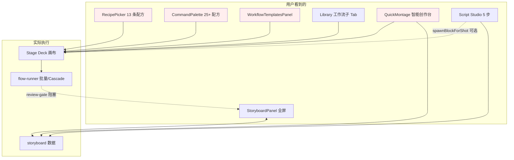
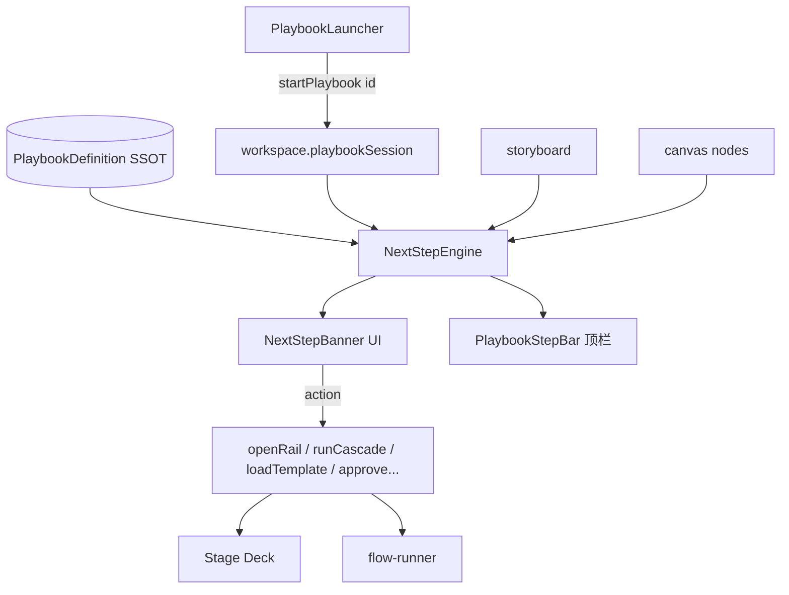

# NX9 生产流程编排与入口收敛规范（可执行版）

> **文档性质**：诊断当前「节点执行不连贯、不知道下一步干什么、入口冗余」三大问题，提出 **Playbook（生产剧本）** 编排体系，并给出强制实现方案、验收测试、Bug 修复、完成定义、可拓展性与使用说明。  
> **读者**：你（选流程、验收体验）+ 实现代码的 AI Agent（按 `WF-xxx` 任务 ID 施工）。  
> **审计基线**：2026-07-09 · 基于仓库实际代码  
> **关联**：`docs/NX9-CAPABILITY-AUDIT-SPEC.md` · `docs/NX9-13STEP-PRODUCTION-PIPELINE-SPEC.md` · `docs/NX9-PIPELINE-CANVAS-FLOW-SPEC.md` · `docs/NX9-PRODUCT-REFACTOR-SPEC.md` · `packages/shared/src/data/workflow-templates.ts` · `packages/shared/src/utils/stage-readiness.ts`

---

## 0. 如何使用本文档

### 0.1 给你（人类）

1. 先看 **§1 问题诊断** — 理解为什么「做了配方还是不知道下一步」。  
2. 看 **§2 解决方案总览** — Playbook 与 Recipe 的分工、入口收敛地图。  
3. 按业务选 **§4 标准生产剧本**（AI 漫剧 3D/真人、爆款短视频…）— 每套剧本有逐步操作说明。  
4. **§5 任务清单** — 排期给 AI；**§6 测试** — 自测通过后再手动走一遍。

### 0.2 给 AI（强制）

```text
开工前必须：
  1. 读 §1.3 入口冗余表 + §3 数据契约
  2. 只改 §5 该任务列出的文件（最小 diff）
  3. 完成后跑 §6 对应 TEST-WF ID + ST-0 typecheck
  4. 在 docs/test-reports/ 写 PASS/FAIL 报告
  5. 更新 §5 任务状态列

禁止：
  - 新增第 6 个「加载模板」入口而不删旧入口
  - Playbook 步骤只写 UI 文案不绑 readiness 检测
  - 把 Recipe 当 Playbook 直接展示给用户（Recipe 是内部连线）
```

---

## 1. 问题诊断

### 1.1 用户感知（你描述的问题）

| 现象 | 根因（代码级） |
|------|----------------|
| 选完配方后不知道下一步 | `RecipePickerOverlay` / `CommandPalette` 只 **加载节点图**，无步骤向导、无「下一步 CTA」 |
| 做完整 AI 漫剧/爆款短视频无路径感 | 能力散落在 Script Studio、QuickMontage、shot-script、多个 tpl-*，**无端到端 Playbook** |
| 同一功能多个入口，点哪都一样又好像不一样 | 至少 **7 处** 可加载 Recipe / 写故事板 / 开成片，行为不一致（merge vs replace） |
| Pipeline 五圆点帮不上忙 | `PipelineCapsule` 仅 **被动检测** 产物是否存在，fix 动作是「再加载一个配方」，与当前画布无关 |
| 一键开拍后链断 | `ShotScriptBlock.startProduction` 只 spawn `director-desk`，**不连边、不跑 cascade、不绑 shot** |

### 1.2 当前架构断层



**断层**：上层入口都通向「局部动作」，中间缺少 **Playbook Session**（当前进行哪套流程、第几步、下一步是什么）。

### 1.3 入口冗余表（SSOT · 必须收敛）

| 功能 | 当前入口 | 文件 | 问题 | 收敛后唯一入口 |
|------|----------|------|------|----------------|
| 选生产流程 | RecipePickerOverlay | `RecipePickerOverlay.tsx` | 展示 raw Recipe，无步骤 | **PlaybookLauncher**（空画布） |
| 选生产流程 | CommandPalette recipe 段 | `CommandPalette.tsx` | 25+ 条，与 Launcher 重复 | 仅 **Playbook** + 搜索「进阶 Recipe」 |
| 选生产流程 | WorkflowTemplatesPanel | `WorkflowTemplatesPanel.tsx` | 顶栏侧栏第 4 份列表 | **删除**，迁到 Library › 进阶配方 |
| 选生产流程 | LibraryWorkflowSubPanel | `LibraryWorkflowSubPanel.tsx` | 与上重复 | 保留：**进阶配方 + ZIP 导入导出** |
| 选生产流程 | RecipeSpawnBlock | `RecipeSpawnBlock.tsx` | 画布内再选配方 | 保留为 **进阶/concealed** |
| 小说→分镜 | Script Studio Rail | `ScriptStudioPanel.tsx` | 5 步完整但未绑 Playbook | Playbook 步骤驱动 |
| 小说→分镜 | shot-script AI 拆镜 | `ShotScriptBlock.tsx` | 与 Studio 重复 | Playbook 内 **二选一**，默认 Studio |
| 小说→分镜 | tpl-novel-import + chat-model | `workflow-templates.ts` | 画布节点版，无引导 | Playbook 内部自动 merge |
| 爆款短视频 | QuickMontagePanel | `QuickMontagePanel.tsx` | 独立侧栏，加载 tpl 不一致 | Playbook **PB-VIRAL-SHORT** |
| 爆款复刻 | tpl-link-replicate ×2 | `workflow-templates.ts` | **重复 id BUG** | 合并为一个 tpl |
| 故事板 | StoryboardPanel 全屏 | `StoryboardPanel.tsx` | 与 Rail storyboard Tab 双 UI | Rail 为主，全屏 **仅从 Rail 打开** |
| 故事板 | StoryboardRailPanel | `StoryboardRailPanel.tsx` | 功能重叠 | **主入口** |
| 成片 | EpisodeStudioPanel | `EpisodeStudioPanel.tsx` | 与 QuickMontage 命名混淆 | Playbook 导出步骤统一打开 |
| 成片 | StudioOverflow「智能创作台」 | `StudioOverflowMenu.tsx` | 与 Episode 并列 | 改名为「快捷剧本」，或并入 Playbook |
| 批量运行 | 顶栏 Run | `StudioTopBar.tsx` | 无上下文，跑全图 | Playbook 步骤内 **Run 本步** |
| 进度 | PipelineCapsule | `PipelineCapsule.tsx` | 与 Playbook 步骤无关 | 改为 **Playbook 步骤条** 或双轨显示 |

### 1.4 Recipe 与 Playbook 的本质区别

| 维度 | Recipe（配方） | Playbook（生产剧本） |
|------|----------------|----------------------|
| 是什么 | 画布上 **节点 + 连线** 的静态模板 | **端到端用户任务** 的状态机 |
| 用户是否直接选 | 否（进阶用户） | **是**（默认入口） |
| 是否含 UI 步骤 | 否 | **是**（第 N 步 / 下一步 CTA） |
| 是否跨模块 | 通常仅画布 | 画布 + 故事板 + Rail + 成片 Studio |
| 数据存放 | `WORKFLOW_TEMPLATES.build()` | `PlaybookDefinition` + `workspace.playbookSession` |
| 例子 | `tpl-picture-gen` 三节点链 | 「AI 漫剧·3D 单集」12 步 |

### 1.5 已知 Bug（编排相关 · P0）

| Bug ID | 描述 | 文件 |
|--------|------|------|
| BUG-WF-001 | `tpl-link-replicate` **重复定义两次**（后者覆盖前者，行为不确定） | `workflow-templates.ts` L95 & L334 |
| BUG-WF-002 | `startProduction` 不连接 `shot-script → director-desk` 边 | `ShotScriptBlock.tsx` |
| BUG-WF-003 | `PipelineCapsule` generate 阶段 fix 加载「角色出图」与漫剧流程无关 | `stage-readiness.ts` |
| BUG-WF-004 | QuickMontage 成功加载 `tpl-batch-pictures`，与「爆款」语义不符 | `QuickMontagePanel.tsx` |
| BUG-WF-005 | Script Studio `materialize` 后无 Playbook 级「继续生成」引导 | `ScriptStudioPanel.tsx` |

---

## 2. 解决方案总览

### 2.1 目标体验（完成后用户路径）

```text
打开 NX9 → 空画布 PlaybookLauncher（6 张卡片）
  → 选「AI 漫剧 · 3D」
  → 顶栏出现步骤条：① 输入素材 ② 分镜 ③ 线稿 … ⑫ 导出
  → 右侧 Rail 顶部 NextStepBanner：「下一步：粘贴小说并生成分镜表 [开始]」
  → 点 [开始] 自动：打开 Script Tab → 预填 Playbook 提示 → 完成后高亮下一步
  → 到「批量生成」步：自动 focus 画布节点 + Composer「运行本步」
  → review-gate：自动切审片模式 + 故事板网格（已有 review-gate-session）
  → 最后一步：打开 Episode Studio + export-pack 预填
```

### 2.2 架构（新增层）



### 2.3 入口收敛原则

1. **用户只选 Playbook**（6–8 套）；Recipe 降级为 Playbook 内部 `loadTemplate` 动作。  
2. **全屏 Panel 收敛**：Storyboard / Episode / Settings 保留；WorkflowTemplatesPanel、QuickMontagePanel **废弃或合并**。  
3. **单一故事板入口**：Context Rail › storyboard Tab；全屏 StoryboardPanel 仅作「展开编辑」。  
4. **顶栏双轨**：`PlaybookStepBar`（主）+ `ModeCapsule`（探索/生产/审片）；`PipelineCapsule` 降为 Playbook 内子状态或移除。

---

## 3. 数据契约（强制）

### 3.1 PlaybookDefinition

**文件（新建）**：`packages/shared/src/data/playbook-definitions.ts`

```typescript
export type PlaybookId =
  | 'pb-ai-comic-3d'
  | 'pb-ai-comic-live'
  | 'pb-viral-short'
  | 'pb-line-art-episode'
  | 'pb-character-ip'
  | 'pb-voice-drama'
  | 'pb-seedance-sclass'
  | 'pb-blank-advanced';

export type PlaybookStepAction =
  | { type: 'open_rail'; tab: 'script' | 'storyboard' | 'inspector' | 'library'; sub?: string }
  | { type: 'open_panel'; panel: 'storyboard-full' | 'episode-studio' | 'director-3d' }
  | { type: 'load_template'; templateId: string; mode: 'merge' | 'replace' }
  | { type: 'focus_block'; kind: string; spawnIfMissing?: boolean }
  | { type: 'run_cascade'; fromKind: string }
  | { type: 'run_batch'; blockKinds?: string[] }
  | { type: 'storyboard_action'; action: 'approve_all_pending' | 'batch_line_art' }
  | { type: 'set_view_mode'; mode: 'explore' | 'produce' | 'review' }
  | { type: 'wait_user'; hint: string }; // 仅标记需人工确认

export interface PlaybookStepDef {
  id: string;
  label: string;
  description: string;
  /** readiness 函数名，对应 playbook-readiness.ts */
  readinessKey: string;
  primaryAction: PlaybookStepAction;
  secondaryActions?: PlaybookStepAction[];
  /** 本步关联的 Recipe（内部，不对用户展示） */
  templateIds?: string[];
  /** 手动测试检查点 */
  verifyHint: string;
}

export interface PlaybookDefinition {
  id: PlaybookId;
  label: string;
  subtitle: string;
  icon: string; // lucide 名
  category: 'episode' | 'short' | 'asset' | 'advanced';
  estimatedMinutes: number;
  featured: boolean;
  steps: PlaybookStepDef[];
  /** 开始时默认加载的模板（合并） */
  bootstrapTemplates: { templateId: string; mode: 'merge' | 'replace' }[];
}
```

### 3.2 PlaybookSession（持久化到 workspace）

**扩展** `packages/shared/src/types/workspace.ts`：

```typescript
export interface PlaybookSession {
  playbookId: PlaybookId;
  startedAt: string;
  currentStepId: string;
  completedStepIds: string[];
  dismissed?: boolean; // 用户切到「自由模式」
}
```

`WorkspacePayload` 增加：`playbookSession?: PlaybookSession | null`。

### 3.3 NextStepEngine

**文件（新建）**：`packages/shared/src/utils/playbook-readiness.ts`

```typescript
export function evaluatePlaybookStep(
  step: PlaybookStepDef,
  ctx: PlaybookReadinessContext,
): { ready: boolean; blockReason?: string };

export function resolveNextStep(
  playbook: PlaybookDefinition,
  session: PlaybookSession,
  ctx: PlaybookReadinessContext,
): { step: PlaybookStepDef; index: number; allDone: boolean };
```

`PlaybookReadinessContext` 包含：`storyboard`, `voice`, `nodes`, `scriptPlan?`, `playbookSession`。

**readinessKey 标准实现（节选）**：

| readinessKey | ready 条件 |
|--------------|------------|
| `has_source_text` | scriptPlan.sourceText 或 storyboard.title 非空 |
| `has_storyboard_shots` | shots.length >= 1 |
| `has_line_art_thumbnails` | ≥50% shots 有 firstFrameAssetId |
| `all_shots_approved` | shots 全部 approved |
| `has_video_takes` | ≥1 shot 有 approved take 或节点 clip-gen done |
| `canvas_node_done` | 指定 kind 节点 status=done |
| `review_gate_passed` | review-gate 节点最近一次非 blocked |

---

## 4. 标准生产剧本（Playbook）

> 每套剧本：**用户怎么用** + **内部 Recipe 组合** + **步骤表**（AI 实现 SSOT）

---

### 4.1 PB-AI-COMIC-3D · AI 漫剧（3D 预演 → 出图 → 出片）

**适用**：3D 机位预演、线稿分镜、Seedance 动效、审阅交付。  
**参考 Recipe**：`tpl-3d-preview` + `tpl-line-art-storyboard` + `tpl-sclass-seedance`（分阶段 merge）。

| 步 | id | 用户做什么 | 系统自动 | readinessKey |
|----|-----|-----------|----------|--------------|
| 1 | input | Script Tab 粘贴小说/剧本 | open_rail script | has_source_text |
| 2 | skeleton-table | 点「生成分镜表」→ 写入故事板 | — | has_storyboard_shots |
| 3 | line-art | 故事板批量 AI 线稿 / 上传 | open_rail storyboard | has_line_art_thumbnails |
| 4 | approve-sketch | 网格审阅线稿 | set_view_mode review | all_shots_approved |
| 5 | load-3d | 加载 3D 预演链 | load_template tpl-3d-preview | canvas_node_done director-3d |
| 6 | blocking | Director3D 摆机位 | open_panel director-3d | canvas_node_done director-3d |
| 7 | picture | 相机参数 → picture-gen 出关键帧 | run_cascade picture-gen | has_generate_assets |
| 8 | motion | motion-story S-Class 分组生成 | load_template tpl-sclass-seedance | canvas_node_done motion-story |
| 9 | batch-run | Composer「运行本步」至 review-gate | run_batch | review_gate_passed |
| 10 | review-video | 审片模式批审 Take | set_view_mode review | all_shots_approved |
| 11 | episode | Episode Studio 预览时间线 | open_panel episode-studio | has_video_takes |
| 12 | export | export-pack 四模式之一 | focus_block export-pack | canvas_node_done export-pack |

**怎么用（人类）**：
1. 新建工作区 → 选 **AI 漫剧 · 3D**。  
2. 跟顶栏步骤条走；每步右侧 Banner 有蓝色 **[执行下一步]**。  
3. 线稿未齐不能进 3D 步（Banner 说明缺什么）。  
4. 第 9 步批量运行会在 review-gate 停住 — 去故事板网格批审后继续。  
5. 第 12 步在 export-pack 选 FFmpeg 或 ZIP。

**可拓展**：增加「纯 3D 预览不出片」短路径（skip 8–11）；接入 HyperFrames 精美包装（见 CAPABILITY-AUDIT RM-HF）。

---

### 4.2 PB-AI-COMIC-LIVE · AI 漫剧（真人/电影感）

**适用**：电影感分镜宫格、角色一致性、图生视频、配音、竖屏/export。  
**Recipe 组合**：`tpl-toonflow-lite` → merge `tpl-reference-picture` → merge `tpl-vertical-episode`。

| 步 | id | 说明 | readinessKey |
|----|-----|------|--------------|
| 1 | input | Script Studio 完整 5 步或快捷「分镜表」 | has_source_text |
| 2 | storyboard | 写入故事板 + 关联角色 Backlot | has_storyboard_shots |
| 3 | characters | 从剧本提取角色 → character-sheet 出参考图 | has_character_refs |
| 4 | grid | story-grid 电影感宫格 → grid-split | has_line_art_thumbnails |
| 5 | approve | 批审分镜 | all_shots_approved |
| 6 | clip-gen | 图生视频链 clip-gen | has_video_takes |
| 7 | voice | dialogue-sheet → voice-cast → sound-gen | has_voice_lines |
| 8 | mix | audio-mix + clip-editor | canvas_node_done audio-mix |
| 9 | episode | Episode Studio FFmpeg 合成 | has_video_takes |
| 10 | export | export-pack | canvas_node_done export-pack |

**简易逻辑现状**：角色提取已有 API，但 **未强制进入 Playbook 第 3 步**；图→视链依赖用户手动连边。

**加强点**：Playbook 第 6 步 `run_cascade` 从 `picture-gen` 开始且 **自动 linkedShotId**（CAP-MST-001）。

---

### 4.3 PB-VIRAL-SHORT · 爆款短视频（≤60s）

**适用**：链接复刻、热点二创、竖屏快发。  
**合并** QuickMontage + tpl-link-replicate → 单一 Playbook。

| 步 | id | 说明 | readinessKey |
|----|-----|------|--------------|
| 1 | source | **二选一**：粘贴视频链接 **或** 输入主题（原 QuickMontage） | has_source_text |
| 2 | analyze | API replicateVideo / quickMontage → 分镜 Markdown | has_storyboard_shots |
| 3 | refine | Script Tab 微调分镜表 | has_storyboard_shots |
| 4 | load-chain | merge tpl-link-replicate（修复后唯一版本） | canvas_node_done link-parser |
| 5 | generate | clip-gen 生成（竖屏 9:16 预设） | has_video_takes |
| 6 | polish | subtitle-burn 可选 | wait_user |
| 7 | export | export-pack ffmpeg-episode | canvas_node_done export-pack |

**入口收敛**：删除顶栏「智能创作台」独立 Panel；功能迁入 Playbook 第 1 步 UI（Tab：链接 | 主题）。

---

### 4.4 PB-LINE-ART-EPISODE · 线稿分镜单集

**Recipe**：`tpl-line-art-storyboard` + review + picture-gen/clip-gen 分支。

| 步 | 要点 |
|----|------|
| 1–4 | shot-script → story-grid line-art → grid-split → 批审 |
| 5–7 | picture-gen 或 clip-gen → review-gate → export |

**与 4.1 区别**：无 3D；更快，适合 story-first 团队。

---

### 4.5 PB-CHARACTER-IP · 角色 IP 设定

**Recipe**：`tpl-nx9-character-pipeline` + `tpl-character-turnaround`。

| 步 | 要点 |
|----|------|
| 1 | Backlot 新建角色 |
| 2 | character-sheet 六层设定 |
| 3 | 三视图 turnaround |
| 4 | continuity-check |
| 5 | 导出 ZIP / 写入 Backlot |

**现状**：Recipe 已有，缺 Playbook 步骤与 Backlot 联动 CTA。

---

### 4.6 PB-VOICE-DRAMA · 声音剧

**Recipe**：`tpl-voice-drama`。

| 步 | dialogue-sheet → voice-cast → 批 TTS → audio-mix → export |

---

### 4.7 PB-SEEDANCE-SCLASS · Seedance 连续镜头

**Recipe**：`tpl-sclass-seedance`（已有最完整审阅链）。

| 步 | shot-script → director-desk → motion-story → review-gate → export |

**加强**：与故事板 shot 双向绑定（BUG-MST-001）。

---

### 4.8 PB-BLANK-ADVANCED · 自由模式

**行为**：不加载 PlaybookSession；显示 Dock + CommandPalette 进阶 Recipe。  
**用途**：老用户 / 自定义链。

---

## 5. 实现任务清单

### 5.1 P0 — 流程可感知（必须先做）

| 任务 ID | 内容 | 强制方案 | 关键文件 | 完成定义 |
|---------|------|----------|----------|----------|
| **WF-001** | PlaybookDefinition SSOT | 实现 §3.1 八套 Playbook（4.1–4.8） | `playbook-definitions.ts` · export index | 每 playbook ≥6 步；`npm run build -w @nx9/shared` 通过 |
| **WF-002** | PlaybookSession 持久化 | workspace v4 迁移；读写 hook | `workspace.ts` · `workspace-document.ts` | 刷新页面步骤不丢 |
| **WF-003** | playbook-readiness | 实现 §3.3 全部 readinessKey | `playbook-readiness.ts` | 单元测试 TEST-WF-001~010 |
| **WF-004** | NextStepEngine | `resolveNextStep` + `executeStepAction` | `playbook-runner.ts`（web） | 每 action type 有 switch case |
| **WF-005** | NextStepBanner | Rail 顶部固定 Banner + CTA | `NextStepBanner.tsx` · `ContextRail.tsx` | 有 playbook 时始终可见 |
| **WF-006** | PlaybookStepBar | 顶栏替代/并列 PipelineCapsule | `PlaybookStepBar.tsx` · `StudioTopBar.tsx` | 显示 当前步/总步；点击跳转 |
| **WF-007** | PlaybookLauncher | 替换 RecipePicker 卡片为 6–8 Playbook | `PlaybookLauncherOverlay.tsx` | 空画布只显示 Playbook |
| **WF-008** | startPlaybook | Launcher 选后：写 session + bootstrapTemplates | `FlowSurface.tsx` | 画布自动 merge 首段模板 |
| **WF-009** | BUG-WF-001 | 删除重复 tpl-link-replicate，保留完整版 | `workflow-templates.ts` | WORKFLOW_TEMPLATES id 唯一 |
| **WF-010** | BUG-WF-002 | startProduction 连边 + 写 linkedBlockId | `ShotScriptBlock.tsx` · flow-commands | 一键后 director-desk 有入边 |

### 5.2 P1 — 入口收敛

| 任务 ID | 内容 | 强制方案 | 完成定义 |
|---------|------|----------|----------|
| **WF-011** | 废弃 WorkflowTemplatesPanel | 从 AppShell 移除；顶栏菜单改「进阶配方」→ library/workflow | 全项目仅 1 处「全部 Recipe 列表」 |
| **WF-012** | QuickMontage 并入 PB-VIRAL-SHORT | 删除 Panel 或改为 Playbook 内嵌 Step1 UI | 顶栏无「智能创作台」 |
| **WF-013** | CommandPalette Recipe 降级 | recipe 段改为 playbook 段 + `advanced-recipe-*` | 默认排序 Playbook 优先 |
| **WF-014** | Script Studio CTA | materialize 成功后 `advancePlaybookStep()` | 不再 dead-end |
| **WF-015** | PipelineCapsule 双轨 | 有 playbook 显示 StepBar；无 playbook 显示原五阶段 | 不重复占顶栏空间 |
| **WF-016** | StageDeckTour 更新 | 第 5 步改为 Playbook 引导 | localStorage key v2 |

### 5.3 P2 — 执行连贯

| 任务 ID | 内容 | 强制方案 |
|---------|------|----------|
| **WF-017** | Composer「运行本步」 | 只跑当前 playbook 步关联 blockKinds | 
| **WF-018** | review-gate 自动 advance | 全部 approved 后 `advancePlaybookStep` | 
| **WF-019** | Playbook 完成页 | 最后一步 done → 庆祝 + 导出清单 +「新 Playbook」 | 
| **WF-020** | 自由模式切换 | Banner「退出向导」写 dismissed | 
| **WF-021** | playbook 单元测试 E2E | E2E-WF-001 走 PB-LINE-ART 最短路径 | 

---

## 6. 测试要求

### 6.1 假数据 SSOT

**扩展** `apps/server/test/fixtures.ts`：

```typescript
export const FIXTURE_PLAYBOOK_SESSION_LINE_ART = {
  playbookId: 'pb-line-art-episode',
  startedAt: '2026-07-09T12:00:00Z',
  currentStepId: 'line-art',
  completedStepIds: ['input', 'skeleton-table'],
};

export const FIXTURE_PLAYBOOK_CTX = {
  storyboard: FIXTURE_STORYBOARD_WITH_SKETCHES,
  voice: { lines: [] },
  nodes: [/* shot-script done, story-grid idle */],
};
```

### 6.2 单元测试 ID

| TEST ID | 断言 |
|---------|------|
| TEST-WF-001 | `resolveNextStep` 第一步 input 当 session 空 |
| TEST-WF-002 | step ready 时 advance 写入 completedStepIds |
| TEST-WF-003 | `has_line_art_thumbnails` 50% 阈值 |
| TEST-WF-004 | `executeStepAction load_template` 调用 requestLoadTemplate |
| TEST-WF-005 | WORKFLOW_TEMPLATES 无重复 id |
| TEST-WF-006 | workspace 迁移 v3→v4 playbookSession 保留 |
| TEST-WF-007 | dismissed session 不显示 Banner |

### 6.3 AI 自测门禁

```text
ST-0: build shared + typecheck web + build server
ST-1: vitest apps/server/test/test-wf.test.ts（新建）
ST-2: vitest playbook-readiness 纯函数
ST-3: 手动脚本 §6.4 任一条 Playbook
报告: docs/test-reports/TEST-WF-RUN-{timestamp}.md
```

### 6.4 人工验收脚本（Playbook 专项）

**脚本 A — 线稿单集（最短，30 min）**

```text
1. 新建工作区 → PlaybookLauncher 选「线稿分镜单集」
2. 确认顶栏步骤条出现；Rail Banner 显示步骤 1
3. Script Tab 粘贴 FIXTURE_NOVEL_500字 → 生成分镜表 → 写入故事板
4. Banner 自动变为步骤 3（线稿）；批量 AI 线稿 ≥1 镜
5. 网格全 approved；步骤 5 可 run_batch
6. review-gate 阻塞 → 审片 → 继续 → export-pack 下载
7. 刷新页面：步骤进度保留
PASS: 全程无需 CommandPalette 找配方
```

**脚本 B — 爆款短视频（20 min）**

```text
1. 选 PB-VIRAL-SHORT → 步骤 1 选「主题」输入「夏日饮品」
2. 分镜导入故事板；画布 merge link-parser 链
3. clip-gen 竖屏生成 1 段；export ffmpeg-episode
PASS: 顶栏无「智能创作台」入口
```

**脚本 C — AI 漫剧 3D（45 min，P1 后测）**

```text
1. PB-AI-COMIC-3D 完整 12 步走通
2. Director3D 打开一次；motion-story 与 shot 关联
PASS: 无 dead-end 步骤
```

### 6.5 一键测试扩展

`scripts/nx9-test-all.ps1` 增加：

```powershell
npm run test -w @nx9/server -- test-wf.test.ts
```

---

## 7. Bug 修复规范（编排域）

| 流程 | 要求 |
|------|------|
| 复现 | 写明 PlaybookId、currentStepId、画布节点 kinds、故事板 shots 数 |
| 根因 | 区分 **Playbook 逻辑** / **Recipe 连线** / **runner** / **入口重复** |
| 修复 | 优先修 readiness 误判，而非跳过步骤 |
| 回归 | 补 TEST-WF-xxx；更新 §5 任务状态 |

**编排域常见 Bug 模式**：

1. **步骤 advance 过早** — readiness 条件过松 → 加 TEST-WF 断言。  
2. **action 未执行** — `executeStepAction` 漏 case → typecheck + 单测。  
3. **双入口行为不一致** — merge vs replace 不统一 → Playbook bootstrap 写死 mode。  
4. **review-gate 后 Playbook 卡住** — 未监听 approved 事件 → WF-018。

---

## 8. 完成定义（本 Spec 整体）

| # | 标准 | 当前 | 目标 |
|---|------|------|------|
| 1 | 空画布默认 **PlaybookLauncher**（非 raw Recipe 墙） | ✅ PlaybookLauncher | ✅ WF-007 |
| 2 | ≥6 套标准 Playbook 可逐步走通 | ✅ 8 套（含自由模式） | ✅ §4 |
| 3 | 任一步有 **NextStepBanner CTA** | ✅ Rail Banner + StepBar | ✅ WF-005+006 |
| 4 | Recipe 加载入口 ≤2（Launcher bootstrap + Library 进阶） | ✅ 2 | ✅ WF-011~013 |
| 5 | QuickMontage / WorkflowTemplates 顶栏入口移除 | ✅ 已移除 | ✅ WF-011~012 |
| 6 | playbookSession 持久化 | ✅ workspace v4 | ✅ WF-002 |
| 7 | TEST-WF-001~007 PASS | ✅ 57 测试全绿 | ✅ §6 |
| 8 | 人工脚本 A PASS | ❌ 需手动 | ✅ |

**整体完成度**：**7/8**（人工验收脚本待执行）

---

## 9. 可拓展性

| 方向 | 做法 |
|------|------|
| 新 Playbook | 在 `playbook-definitions.ts` 加定义 + readinessKey + bootstrapTemplates；**不改** Launcher 硬编码 |
| 新步骤动作 | 扩展 `PlaybookStepAction` union + `executeStepAction` + 单测 |
| 行业模板 | 社区分享 `PlaybookDefinition` JSON import（P3） |
| 与 Agent 结合 | Canvas Agent 读 `playbookSession` 只建议当前步允许的操作 |
| 与测试体系 | 每 Playbook 一条 E2E-WF-xxx（见 NX9-CAPABILITY-AUDIT §5） |
| Recipe 版本升级 | Playbook 引用 templateId 不嵌入节点坐标；Recipe 可独立迭代 |

---

## 10. 使用说明（收敛后 · 给用户）

### 10.1 我该从哪开始？

| 你想做 | 选 Playbook |
|--------|-------------|
| 3D 预演 + 动效漫剧 | **AI 漫剧 · 3D** |
| 电影感真人短剧 | **AI 漫剧 · 真人** |
| 60 秒内爆款 / 链接二创 | **爆款短视频** |
| 线稿分镜快产 | **线稿分镜单集** |
| 只做角色设定 | **角色 IP** |
| 播客/有声剧 | **声音剧** |
| Seedance 长镜头 | **Seedance 连续镜头** |
| 自己搭节点 | **自由模式** |

### 10.2 界面速查

| 区域 | 作用 |
|------|------|
| 顶栏 **步骤条** | 当前 Playbook 进度；点击回看已完成步 |
| 右侧 **NextStepBanner** | **最重要** — 蓝色按钮执行下一步 |
| Context Rail **script** | 编剧 / 分镜表 |
| Context Rail **storyboard** | 镜头列表 / 网格批审 |
| Composer Deck（底） | 运行当前步关联节点 |
| Library › 工作流 | 进阶 Recipe、ZIP 导入导出（非默认路径） |
| CommandPalette `⌘K` | 搜 Playbook、模块、命令 |

### 10.3 不要再用（收敛后）

- ~~顶栏「工作流模板」侧栏~~ → Library › 工作流  
- ~~「智能创作台」~~ → Playbook「爆款短视频」  
- ~~空画布 13 条 Recipe 卡片~~ → 6–8 张 Playbook 卡片  

---

## 11. AI 施工模板

```text
任务: WF-00X
Playbook: pb-xxx（若相关）
必读: §3 契约 + §5 该任务行 + §6 TEST-WF-xxx
步骤:
  1. 读关键文件
  2. 实现（最小 diff）
  3. npm run build -w @nx9/shared && npm run typecheck -w @nx9/web
  4. vitest test-wf.test.ts
  5. docs/test-reports/TEST-WF-RUN-*.md
  6. 更新 §5 状态 + §8 完成度表
验收: §6.4 对应人工脚本
```

---

## 12. 与 CAPABILITY-AUDIT 交叉引用

| CAPABILITY 任务 | 本 Spec 关系 |
|-----------------|--------------|
| CAP-SCR-001 Script Studio | PB-AI-COMIC-* 步骤 1–2 依赖 |
| CAP-STB-001 线稿 | PB-LINE-ART / PB-AI-COMIC-3D 步骤 3 |
| CAP-MST-001 motion-story | PB-SEEDANCE / PB-AI-COMIC-LIVE 步骤 8 |
| CAP-EXP-001 export-pack | 所有 Playbook 最后一步 |
| CAP-RAIL-001 UI 收敛 | WF-005 Banner + WF-011 入口合并 |

---

## 13. 优先级路线图

```text
Week 1 (P0): WF-001~010 — Playbook 核心 + Launcher + Bug 修复
Week 2 (P1): WF-011~016 — 入口收敛 + Tour 更新
Week 3 (P2): WF-017~021 — 运行本步 + E2E + 完成页
```

---

## 14. 与 13 步管线文档分工

| 文档 | 职责 |
|------|------|
| **本文** | Playbook 引擎、入口收敛、WF-xxx |
| `NX9-13STEP-PRODUCTION-PIPELINE-SPEC.md` | **13 步业务语义、逐步缺口、PIPE-xxx 功能实现** |

实施时：**先读 13 步文档补功能缺口（PIPE-201/501/801）→ 再按本文 WF-xxx 接 Playbook UI**。

---

**文档版本**：v1.0 · 2026-07-09
